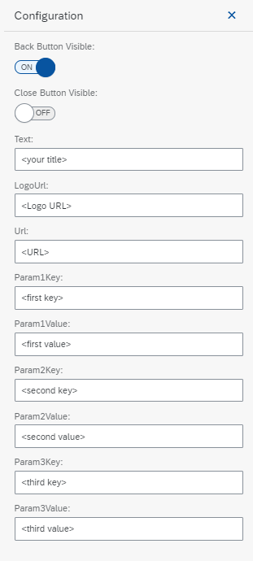

# 1-Create-a-Generic-Button-And-Register-As-Custom-POD-Plugin
## Description
This custom plugin provides the sample implementation of a generic button which can be used in the POD Designer. When the user clicks the button in the POD, a URL will be called and parameters can be passed to the target application. The button has the following configuration parameter, where you provide the parameter value and key you want to pass to the external application.

To dynamically set the SFC or shop order number, the following parameter key/value pair can be used. The sample code will than dynamically pass the values of the current selected SFC.

### SFC
__key:__ input_sfc        
__value:__ <>

### Order Number
__key:__ input_orderid
__value:__ <>

## Prerequisites
### System
* SAP Cloud Plattform Account - Trial account is sufficient
* SAP Digital Cloud Tenant with sample data to run execution

### Skills:
* SAPUI5
* SAP Digital Manufacturing Cloud implementation knowledge 
If you are new to SAP Digital Manufacturing Cloud the Implementation Starter Kit can be of great help. Please check the __Implement__ Section at [SAP Help Portal - Digital Manufacturing Cloud](https://help.sap.com/viewer/product/SAP_DIGITAL_MANUFACTURING_CLOUD/latest/en-US?task=implement_task "SAP Help Portal - Digital Manufacturing Cloud") 

## Getting Started
Please check [SAP Help Portal - Digital Manufacturing Cloud](https://help.sap.com/viewer/product/SAP_DIGITAL_MANUFACTURING_CLOUD/latest/en-US?task=develop_task "SAP Help Portal - Digital Manufacturing Cloud"). In the __Develop__ section you will find the Production Operator Dashboard (POD) Plugin Developer's Guide, which explains in detail how to develop plugins for display and execution in the POD. 

The major steps are:
#### 1. Prepare your SAP Cloud Platform Web IDE - create an Multi Target Application including a HTML5 Module (MTA)
Follow the Production Operator Dashboard (POD) Plugin Developer's Guide. Special focus on chapter 6 which explains how to create and deploy the required application.
#### 2. Import the sample code into your WebIDE and copy relevant section to the new created project
Copy the sample code into the respective folder as described in guide.
#### 3. Register your custom plugin 
#### 4. Create a new POD in the POD Designer
Open the POD Designer app. Your custom plugin should be visible in the POD Designer in the Plugins area. All custom plugins are marked with a small star. Create your own POD including your plugin.
#### 5. Execute an order using your new POD

## How to obtain support
If you have issues with this sample, please open a report using [GitHub issues](../../../../../issues).

## License
Copyright © 2020 SAP SE or an SAP affiliate company. All rights reserved.
This file is licensed under the SAP Sample Code License except as noted otherwise in the [LICENSE file](../../../LICENSE).
