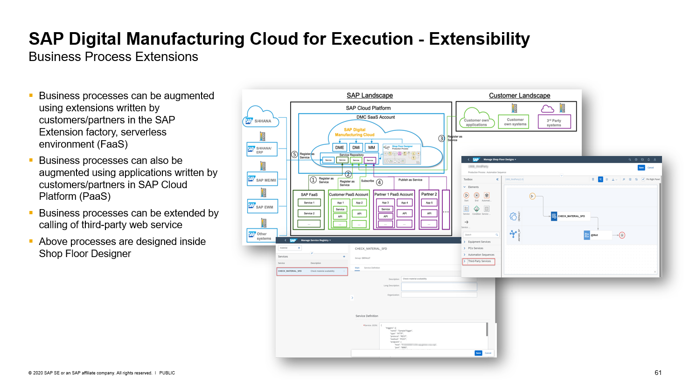

# SAP Digital Manufacturing Extension Samples
SAP Digital Manufacturing provides an out-of-the-box Manufacturing Execution System (MES) to run production on the shop floor. However, based on the experience gained from customer and partner projects, we also know that a successful MES must have the capability to be extended. With the new releases of Digital Manufacturing Cloud, the options for extensibility have made a significant step forward. Using the sample extensions provided will allow you to learn and understand how to build your own extensions to use with SAP Digital Manufacturing Cloud.

## Description
In SAP Digital Manufacturing we distinguish between the following major areas for extensions:

#### Business Process Extensions

#### UI Extensions

Each extension area has a folder in which you can find different sample code according to scenario and to the implementation technology used.

For more information, please check the readme files in the different folders.

## Scenario Overview

| Category      | Scenario      | Overview      | Link          |
| ------------- | ------------- | ------------- | ------------- |
| Business Process Extension | Get Custom Fields from Order Data | In this example we demonstrate how to retrieve order-specific custom data depending on the current material (SFC) that is being worked on. This data can then be passed to external systems to trigger additional processes or to validate that certain conditions are met. | [Get-Custom-Fields-From-Order-Data-Using-SFC](DMC_BusinessProcesses/1-Get-Custom-Fields-From-Order-Data-Using-SFC)  |
UI Extension | Custom Plugin for DMC PODs  | This custom plugin provides the sample implementation of a generic button which can be used in the POD Designer. When the user clicks the button in the POD, a URL will be called and parameters can be passed to the target application. | [Custom-Plugin-for-DMC-PODs](DMC_UX/1-Create-a-Generic-Button-And-Register-As-Custom-PoD-Plugin/CustomPodPlugin)  |

## How to obtain support
If you have issues with a sample, please open a report using [GitHub issues](../../issues).

## License
Copyright © 2020 SAP SE or an SAP affiliate company. All rights reserved. This project is licensed under the Apache Software License, v2.0 except as noted otherwise in the [LICENSE file](LICENSE).
