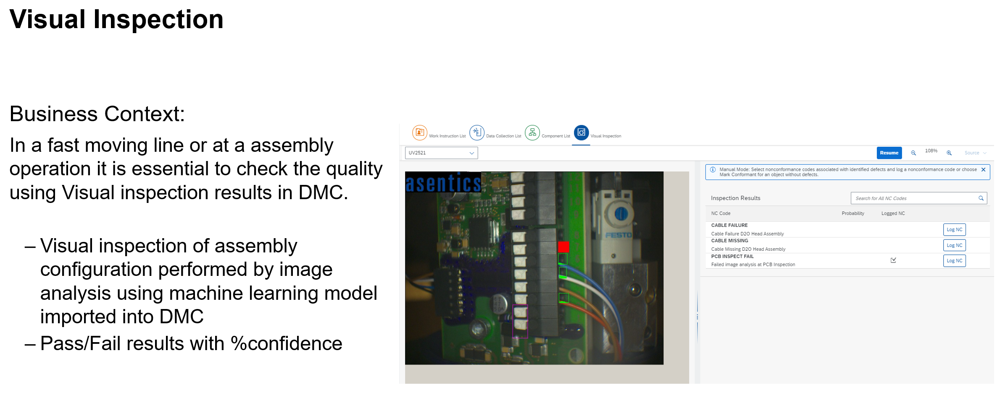

# SAP Digital Manufacturing Extension Samples
SAP Digital Manufacturing provides an out-of-the-box Manufacturing Execution System (MES) to run production on the shop floor. However, based on the experience gained from customer and partner projects, we also know that a successful MES must have the capability to be extended. With the new releases of Digital Manufacturing, the options for extensibility have made a significant step forward. Using the sample extensions provided will allow you to learn and understand how to build your own extensions to use with SAP Digital Manufacturing.

## Description
In SAP Digital Manufacturing we distinguish between the following major areas for extensions:
- POD Plugin Extension
- Side by side Extension
- Core Plugin Extension
- Integration Extension
- In-App Service Extension
- ML Extension

## Sample Extensions
| Name                                                                                                                           | Description                                                                                                                                                           |
| ------------------------------------------------------------------------------------------------------------------------------ | --------------------------------------------------------------------------------------------------------------------------------------------------------------------- | 
| [Sample Execution Plugin](./dm-podplugin-extensions/PodPlugin_ExamplePlugin/exampleplugins/webapp/exampleExecutionPlugin/) | This sample demonstrates how to implement a Execution type plugin | 
| [Sample View Plugin](./dm-podplugin-extensions/PodPlugin_ExamplePlugin/exampleplugins/webapp/exampleViewPlugin/) | This sample demonstrates how to implement a View type plugin | 
| [View POD Plugin Template ](./dm-podplugin-extensions/ViewPodPluginTemplate_And_Example/) | This sample demonstrates how to build a sample view plugin from scratch |  
| [Execution POD Plugin Template ](./dm-podplugin-extensions/ExecutionPodPluginTemplate_and_Example/) | This sample demonstrates how to build a sample execution plugin from scratch |  
| [Core Assembly Plugin Extension](./dm-coreplugin-extensions/plugins/webapp/assemblyPointExtensionProvider/) | This sample demonstrates how to extend standard assembly plugin and apply different focus behavior on the input fields |  
| [Core Component List Plugin Extension](./dm-coreplugin-extensions/plugins/webapp/componentListExtensionProvider/) | This sample demonstrates how to extend standard Component List plugin | 
| [Core Data Collection List Plugin Extension](./dm-coreplugin-extensions/plugins/webapp/dataCollectionListExtensionProvider/) | This sample demonstrates how to extend standard Data Collection List plugin | 
| [Core Data Collection Entry Plugin Extension](./dm-coreplugin-extensions/plugins/webapp/dataCollectionEntryExtensionProvider/) | This sample demonstrates how to extend standard Data Collection Entry plugin | 
| [Core Downtime Plugin Extension](./dm-coreplugin-extensions/plugins/webapp/downtimeExtensionProvider/) | This sample demonstrates how to extend the standard downtime plugin by modifying the view to support larger controls | 
| [Core Guided Steps Plugin Extension](./dm-coreplugin-extensions/plugins/webapp/guidedStepsExtensionProvider/) | This sample demonstrates how to extend Guided steps plugin and add additional prompt messages in navigation | 
| [Core Order Selection list Plugin Extension](./dm-coreplugin-extensions/plugins/webapp/orderListExtensionProvider/) | This sample demonstrates how to extend the standard Order Selection list plugin and adding an additional column with custom data | 
| [Core Worklist Plugin Extension](./dm-coreplugin-extensions/plugins/webapp/worklistExtensionProvider/) | This sample demonstrates how to extend the standard worklist plugin and adding an additional column with calculation values | 
| [Core Packing Plugin Extension](./dm-coreplugin-extensions/plugins/webapp/packingExtensionProvider/) | This sample demonstrates how to extend Packing plugin and add custom logic for Pack/Unpack actions. | 
| [Core Resource Status Plugin Extension](./dm-coreplugin-extensions/plugins/webapp/resourceStatusExtensionProvider/) | This sample demonstrates how to extend the standard Resource Status plugin to modify the view controls. | 
| [Core SFC Card Plugin Extension](./dm-coreplugin-extensions/plugins/webapp/sfcCardExtensionProvider/) | This sample demonstrates how to extend the standard SFC Card plugin to modify the view to add a button to the toolbar and custom information to the information area. | 
| [Core Work Instruction Viewer Plugin Extension](./dm-coreplugin-extensions/plugins/webapp/workInstructionViewerExtensionProvider/) | This sample demonstrates how to extend the standard Work Instruction Viewer plugin to show custom work instructions. |
| [Core Work Instruction List Plugin Extension](./dm-coreplugin-extensions/plugins/webapp/workInstructionListExtensionProvider/) | This sample demonstrates how to extend the standard Work Instruction List plugin to show custom work instructions. |
| [Inbound Integration Extension with XSLT](./dm-integration-extensions/)                       | Sample XSLT to map custom fields for Production Order                                              | 
| [Outbound Integration Extension with customized workflows](./dm-integration-extensions/)                                          | This sample demonstrates using customized CPI workflow to pass additional information from DM to ERP                                                                         | 
| [Next Number Extension with Mongo DB ](./dm-nextnumber-extensions/batch-nn-mongo-db/)                               | This sample demonstrates how to build write an extension function to generate next numbers using Mongo DB                                                     | 
| [Next Number Extension with Postgres](./dm-nextnumber-extensions/batch-nn-postgresql/) | This sample demonstrates how to build write an extension function to generate next numbers using Postgres | 
| [DM Execution - storing temporary process variables in MSSQL](./dm-proess-extensions/api-mssql-nodejs/) | This sample demonstrates how to store variables from DM execution in an external DB managed from kyma |
| [Custom URL Integration POD plugin](./dm-ui-extensions/PodPlugin_UrlIntegration/) | This sample demonstrates how to build a sample custom plugin for URL Integration |  
| [Custom Scrap Confirmation with PPD](./dm-ui-extensions/PodPlugin_CustomScrapConfirmation/) | This sample demonstrates how to build a sample custom plugin for Scrap Confirmation |  
| [Custom Assembly POD](./dm-ui-extensions/SideBySide_AssemblyPOD_CF/) | This sample demonstrates how to build a side by side extension for Assembly using DM public APIs |  
| [Side by side Extension Template on Kyma](./dm-ui-extensions/SideBySide_UI5/) | This sample demonstrates how to build a side by side extension in Kyma | 
| [Custom AuditLog App](./dm-ui-extensions/AuditlogUIExtension/) | This sample demonstrates how to build a side by side extension for customized auditlog app |

## Reference Blogs

### Overview
- [SAP Digital Manufacturing Cloud – Ready for Extensions](https://blogs.sap.com/2020/04/16/sap-digital-manufacturing-cloud-ready-for-extensions/)
### Landscape
- [How To Copy SAP DMC POD Across Tenants, Plants](https://blogs.sap.com/2022/09/02/how-to-copy-sap-dmc-pod-across-tenants-plants/)
- [QA Environment Setup with a Single SAP Cloud Platform Integration Bridging a 3-Tier SAP ERP Landscape to a 2-Tier SAP Digital Manufacturing Cloud Landscape](https://blogs.sap.com/2022/10/25/sap-digital-manufacturing-qa-environment-setup-with-a-single-sap-cloud-platform-integration-bridging-a-3-tier-sap-erp-landscape-to-a-2-tier-sap-digital-manufacturing-cloud-landscape/)
### Integration Extensions
- [SAP Digital Manufacturing Cloud Integration Extension](https://blogs.sap.com/2021/08/24/sap-digital-manufacturing-cloud-integration-extension/)
- [SAP Digital Manufacturing Cloud Integration Extension Part II](https://blogs.sap.com/2021/09/21/sap-digital-manufacturing-cloud-integration-extension-part-ii/)
- [Custom Plugin to display operation long text](https://blogs.sap.com/2023/01/03/sap-digital-manufacturing-cloud-custom-plugin-to-display-operation-long-text/)
- [Extending the Process Order Goods Issue Workflow with Stock Type Inquiry from S/4 HANA](https://blogs.sap.com/2023/02/08/unleashing-the-power-of-sap-digital-manufacturing-cloud-extension-capabilities-extending-the-process-order-goods-issue-workflow-with-stock-type-inquiry-from-s-4-hana/)
### Process Extensions
- [Process Extension Integrated with SAP Workflow Management](https://blogs.sap.com/2022/07/22/sap-digital-manufacturing-cloud-process-extension-integrated-with-sap-workflow-management/)
- [How to achieve an Activity Hook in SAP Digital Manufacturing Cloud (DMC)](https://blogs.sap.com/2023/02/06/achieve-activity-hook-in-sap-digital-manufacturing-cloud-dmc/)

### Machine Connectivity
- [Integrating Mettler Toledo Weigh Scales to SAP Digital Manufacturing Cloud Part 1](https://blogs.sap.com/2021/09/27/integrating-mettler-toledo-weigh-scales-to-sap-digital-manufacturing-cloud-part-1/)
- [Integrating Mettler Toledo Weigh Scales to SAP Digital Manufacturing Cloud Part 2](https://blogs.sap.com/2021/10/04/integrating-mettler-toledo-weigh-scales-to-sap-digital-manufacturing-cloud-part-2/)
### POD Plugins
- [Building a custom Digital Manufacturing Cloud POD Plugin the easy way](https://blogs.sap.com/2022/04/11/building-a-custom-digital-manufacturing-cloud-pod-plugin-the-easy-way/)
### Microsoft Team Integration
- [Integrating Microsoft Teams with SAP Digital Manufacturing Cloud](https://blogs.sap.com/2021/09/17/integrating-microsoft-teams-with-sap-digital-manufacturing-cloud/)
- [SAP Digital Manufacturing: Notify workers via Microsoft Teams Integration](https://blogs.sap.com/2023/03/13/sap-digital-manufacturing-notify-workers-via-microsoft-teams-integration/)
### Visual Inspection
- [AI/ML Solution for Visual Inspection overview: How to close the production gap for machine learning](https://blogs.sap.com/2020/12/14/ai-ml-solution-for-visual-inspection-overview-how-to-close-the-production-gap-for-machine-learning/)
- [Visual Inspection with SAP Digital Manufacturing Cloud](https://blogs.sap.com/2021/05/25/visual-inspection-with-sap-digital-manufacturing-cloud/)
- [Visual Inspection when production orders and routings are imported from ERP](https://blogs.sap.com/2022/11/21/how-to-setup-visual-inspection-when-production-orders-and-routings-are-imported-from-erp/)
- [End-to-end-ai-ml-scenario-configuration-in-sap-dmc](https://blogs.sap.com/2022/07/10/end-to-end-ai-ml-scenario-configuration-in-sap-dmc/)
### KPIs
- [Embedding SAP Analytics Cloud (SAC) Stories](https://blogs.sap.com/2021/11/16/dashboard-designer-embedding-sap-analytics-cloud-sac-stories-into-sap-digital-manufacturing-cloud-dmc-dashboards/)

## Note
Our recommended extensibility platform for DMC is Kyma, however, it can be use case specific which may lead into different recommendations. Please know that DMC extensions can also be done with Cloud Foundry using a PaaS environment (or hyperscaler options which have not been fully explored).  The main difference picking between these two options, outside of our recommendation, is the lifecycle and costs. Kyma takes care of the lifecycle, scalability, monitoring, deployment, etc. of the extensions but is more expensive while Cloud Foundry/PaaS will have lower upfront costs but can be costly in terms of complexity, time, etc. to implement lifecycle management separately.

## Few Real World Customer Examples

Each extension area has a folder in which you can find different sample code according to scenario and to the implementation technology used.

For more information, please check the readme files in the different folders.

## How to obtain support
If you have issues with a sample, please open a report using [GitHub issues](../../issues).

## License
Copyright © 2020 SAP SE or an SAP affiliate company. All rights reserved. This project is licensed under the Apache Software License, v2.0 except as noted otherwise in the  [LICENSE](LICENSES/Apache-2.0.txt).
