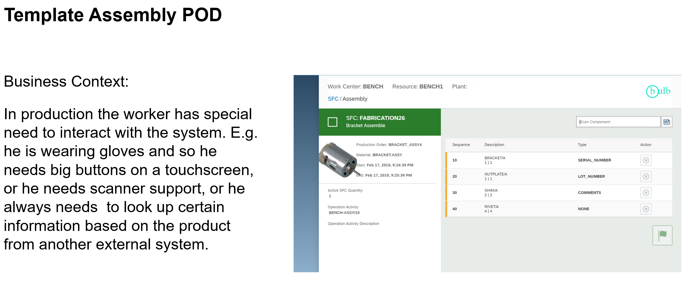

# SAP Digital Manufacturing Extension Samples
SAP Digital Manufacturing provides an out-of-the-box Manufacturing Execution System (MES) to run production on the shop floor. However, based on the experience gained from customer and partner projects, we also know that a successful MES must have the capability to be extended. With the new releases of Digital Manufacturing, the options for extensibility have made a significant step forward. Using the sample extensions provided will allow you to learn and understand how to build your own extensions to use with SAP Digital Manufacturing.

## Description
The [POD Plugins Developer Guide](https://help.sap.com/docs/sap-digital-manufacturing/pod-plugin-developer-s-guide/introduction) provides more details on developing custom plugins. Some of the templates can be referred as following code snippets.

- POD Plugin Extension
- Core Plugin Extension
- Side by side Extension
- Integration Extension
- In-App Service Extension
- ML Extension

## Sample Extensions
| Name                                                                                                                           | Description                                                                                                                                                           |
| ------------------------------------------------------------------------------------------------------------------------------ | --------------------------------------------------------------------------------------------------------------------------------------------------------------------- | 
| [Sample Execution Plugin](./dm-podplugin-extensions/PodPlugin_ExamplePlugin/exampleplugins/webapp/exampleExecutionPlugin/) | This sample demonstrates how to implement a Execution type plugin | 
| [Sample View Plugin](./dm-podplugin-extensions/PodPlugin_ExamplePlugin/exampleplugins/webapp/exampleViewPlugin/) | This sample demonstrates how to implement a View type plugin | 
| [View POD Plugin Template ](./dm-podplugin-extensions/ViewPodPluginTemplate_And_Example/) | This sample demonstrates how to build a sample view plugin from scratch |  
| [Execution POD Plugin Template ](./dm-podplugin-extensions/ExecutionPodPluginTemplate_and_Example/) | This sample demonstrates how to build a sample execution plugin from scratch |  
| [Inbound Integration Extension with XSLT](./dm-integration-extensions/)                       | Sample XSLT to map custom fields for Production Order                                              | 
| [Outbound Integration Extension with customized workflows](./dm-integration-extensions/)                                          | This sample demonstrates using customized CPI workflow to pass additional information from DM to ERP                                                                         | 
| [Next Number Extension with Mongo DB ](./dm-inapp-service-extensions/dm-nextnumber-extensions/batch-nn-mongo-db/)                               | This sample demonstrates how to build write an extension function to generate next numbers using Mongo DB                                                     | 
| [Next Number Extension with Postgres](./dm-inapp-service-extensions/dm-nextnumber-extensions/batch-nn-postgresql/) | This sample demonstrates how to build write an extension function to generate next numbers using Postgres | 
| [DM Execution - storing temporary process variables in MSSQL](./dm-inapp-service-extensions/api-mssql-nodejs/) | This sample demonstrates how to store variables from DM execution in an external DB managed from kyma |
| [Custom URL Integration POD plugin](./dm-podplugin-extensions/PodPlugin_UrlIntegration/) | This sample demonstrates how to build a sample custom plugin for URL Integration |  
| [Custom Scrap Confirmation with PPD](./dm-podplugin-extensions/PodPlugin_CustomScrapConfirmation/) | This sample demonstrates how to build a sample custom plugin for Scrap Confirmation |  
| [Custom Assembly POD](./dm-sidebyside-extension/SideBySide_AssemblyPOD_CF/) | This sample demonstrates how to build a side by side extension for Assembly using DM public APIs |  
| [Side by side Extension Template on Kyma](./dm-sidebyside-extension/SideBySide_UI5/) | This sample demonstrates how to build a side by side extension in Kyma | 
| [Custom AuditLog App](./dm-sidebyside-extension/AuditlogUIExtension/) | This sample demonstrates how to build a side by side extension for customized auditlog app |

More samples on core plugin extensions can be found here - [Core Plugin Extension Samples](./dm-coreplugin-extensions/)

## Note
Our recommended extensibility platform for Digital Manufacturing is Kyma, however, it can be use case specific which may lead into different recommendations. Please know that DMC extensions can also be done with Cloud Foundry using a PaaS environment (or hyperscaler options which have not been fully explored).  The main difference picking between these two options, outside of our recommendation, is the lifecycle and costs. Kyma takes care of the lifecycle, scalability, monitoring, deployment, etc. of the extensions but is more expensive while Cloud Foundry/PaaS will have lower upfront costs but can be costly in terms of complexity, time, etc. to implement lifecycle management separately.

## Few Real World Customer Examples

## How to obtain support
If you have issues with a sample, please open a report using [GitHub issues](../../issues).

## License
Copyright © 2020 SAP SE or an SAP affiliate company. All rights reserved. This project is licensed under the Apache Software License, v2.0 except as noted otherwise in the  [LICENSE](LICENSES/Apache-2.0.txt).
