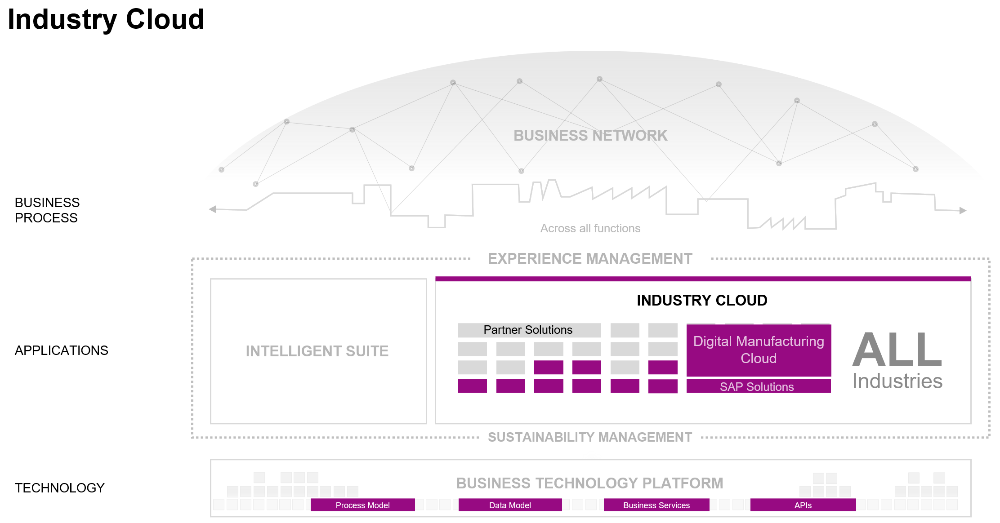
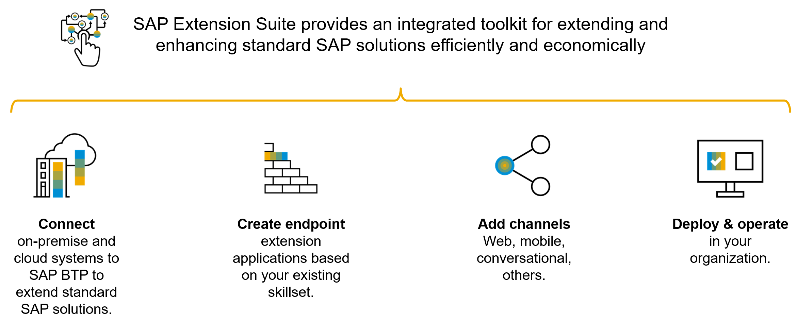

## Why Build Extensions

SAP’s intelligent suite and business networks are a great foundation. They support integrated end-to-end processes for all industries and offer an unparalleled scope of functionality. The concept of an integrated suite always wins – but only when the speed of innovation is compatible with the need for innovation.

Demands for software at the shop floor level are changing, though. Digital technologies, regulations, crises, market entrants, and data-driven business models disrupt carefully balanced supply networks, dissolve markets, and impact opportunities so fast that large-scale enterprise systems are challenged to keep pace.

To address this innovation need, we can build extensions for SAP Digital Manufacturing Cloud using the SAP Business Technology Platform as the foundation.

When a customer wishes to extend their business application environment, be it just SAP or a hybrid environment of SAP and Third Party solutions delivered both on premise and in the cloud the requirements they have typically fall into these 3 pillars. These pillars provide organizations with a holistic set of capabilities that can help them to rapidly build or extend new apps/innovations to tackle the challenges of disruption and change.

Built on a flexible, scalable business Business Technology Platform these pillars are then complemented by:

1. Enterprise grade capabilities and built-in intelligence like AI-enabled bots
2. Best run practices and guidelines
    - At SAP we have what we call the [Discovery Center](https://discovery-center.cloud.sap/): this location enables developers to easily explore, adopt and implement the Integration and Extension Suite services, and provides step-by-step guidance from development to go-live, and access to samples and use cases.
3. Ready to use pre-integrated services and apps to jumpstart your extension development optimized for SAP landscapes (finance, procurement, HR, sales, marketing) – with pre-built/pre-integrated/pre-configured services, API’s and bots  Not to mention an SAP application store and strong partner ecosystem with:
    - Over 1700+ apps available on the SAP App Center
    - 1000s partners building apps or offering to deliver solutions on the SAP Business Technology Platform with roughly 30% building integration/extension scenarios on behalf of customers.

## How to Get Started

In this Bootcamp we will use a trial account to get started experimenting with extension scenarios. However, trial accounts have limited resources and usability which can be upgraded to PAYG or a Cloud Subscription model.

As mentioned, the Extension Suite comes with guidance. While the actual technical guidance is much more detailed, building extensions can be seen as four steps:

1. Connect to existing data source: SAP or non-SAP, API-based or event driven, even data staging (copy business data to SAP HANA on SCP) is no issue.
2. Creating the endpoint is about creating an API and/or event-based backend for a particular extension – tailored to the use case at hand.
3. By Adding Channels, you decide by which digital touchpoints your end-uses should  access the extension: web (portal, launchpad, work zone), mobile apps, conversational UX or others.
4. In the last step, developers deploy their extension to SAP BTP and leverage the operational features to run the extension – automated and ready to scale.

**Here are our deployment options:**

By using the SAP Cloud Platform, Cloud Foundry runtime, you benefit from a high level of abstraction from the underlying infrastructure, and thus a simplified developer experience for business application development.

The SAP Cloud Platform, Kyma runtime provides you with more flexibility and the possibility to use containers and Kubernetes. If you are already familiar with Kubernetes, using Kyma will help to develop a cloud native solution more easily.

Note - in this Bootcamp we are going to use Cloud Foundry and Kyma runtimes to build our extensions.  The ABAP runtime is not the focus of the bootcamp.
