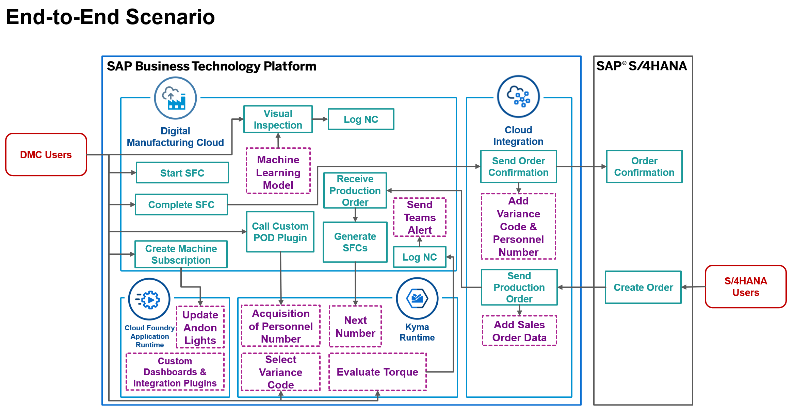
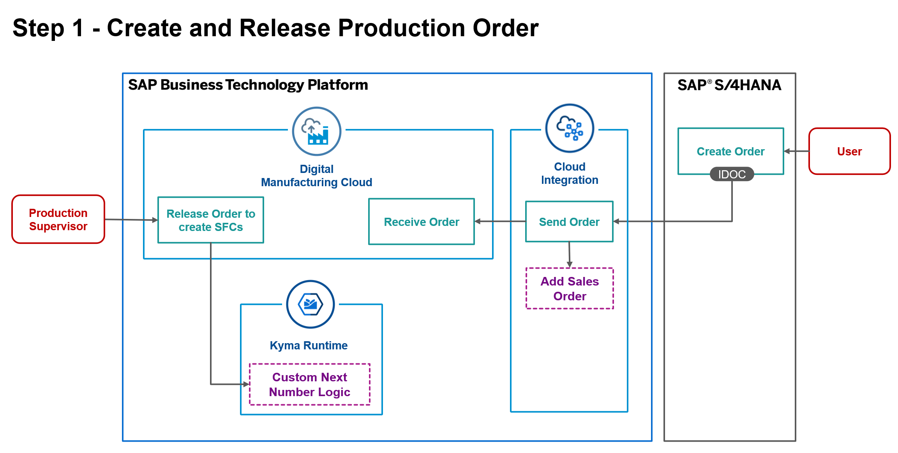
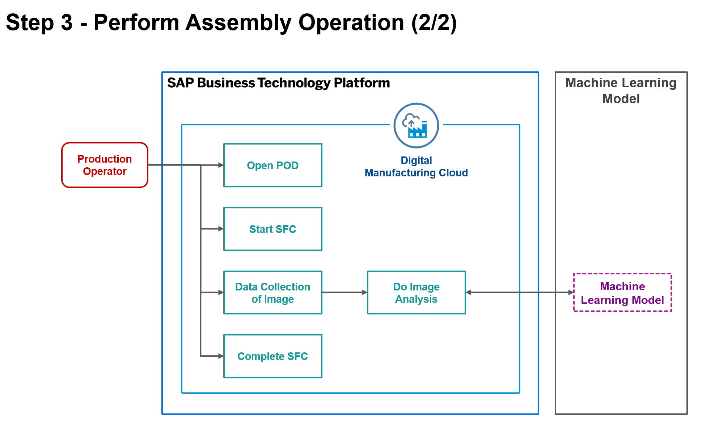
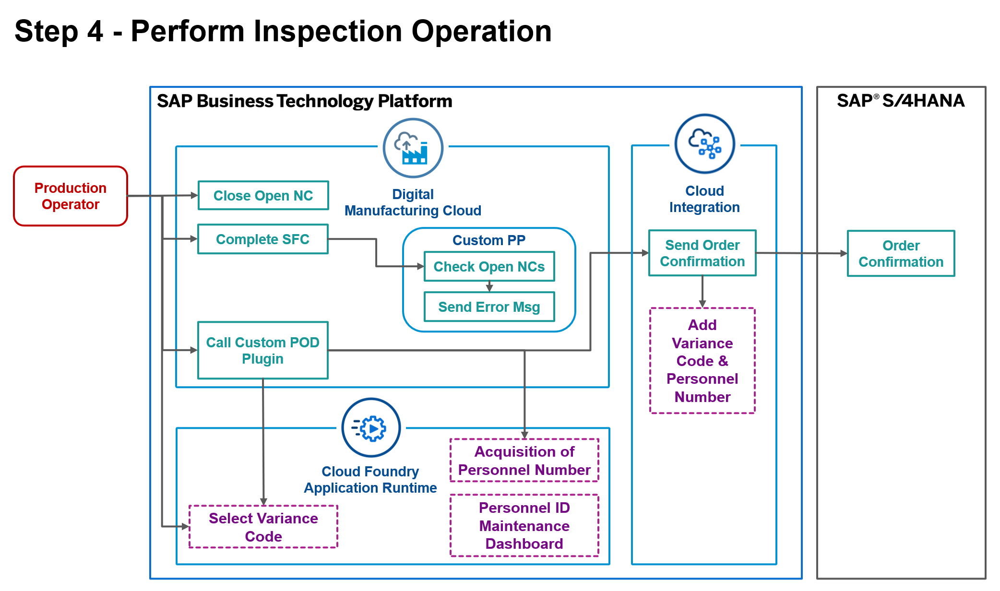
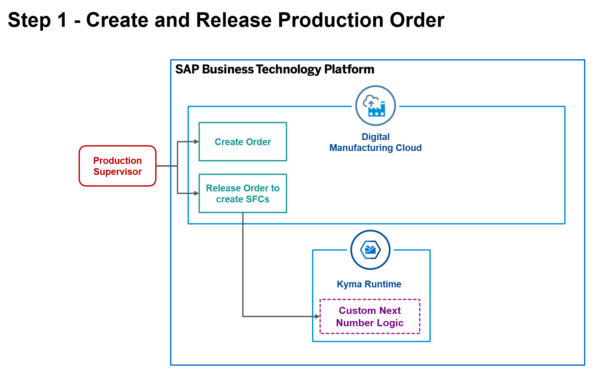

## Business Case
- Lift truck manufacturer producing lifter assemblies.
- Identified gaps in standard solution functionality to be addressed with DMC extensions.
- Simple scenarios for an end-to-end subassembly manufacturing process that highlight different extensibility use cases.

### Identified Gaps

1. SFC numbering scheme must include the Sales Order number as a prefix for each SFC.  Custom Next Number logic is required.

2. The Production Order IDoc must be enhanced to include Sales Order number as a custom field.

3. Missing components detection via trained Machine Learning models to support Nonconformance logging during lifter assembly.

4. Recent torque values during assembly must be recorded and used to inform the Nonconformance process. If the last 3 torque values for a machine are out-of-spec, a Nonconformance must be logged automatically.

5. If the last 3 torque values for a machine are out-of-spec, an alert must be sent to a 3rd party system (MS Teams).

6. Operators must be able to identify and record the reason for the torque variance by selecting a Variance Code that will be recorded on the Production Order in S/4 upon order confirmation.

7. The personnel ID of the operator performing the torque inspection must be recorded on the Production Order in S/4 upon order confirmation.

8. Personnel IDs must be referenced and maintained external to DMC.

9. DMC resources must be conditionally disabled based on machine status tags on the machine controller.

## Scenarios

Our business scenario follows a standard DMC production flow that has been enhanced at several points in the process with DMC extensions to address the above gaps.  The End-to-End scenario assumes a S/4HANA integrated landscape (Scenario 1), however standalone DMC environments can also be used to build and deploy the extensions in this bootcamp that do not rely on S/4 integration (Scenario 2) with some added manual steps.  Other than S/4 integration dependancies, Scenario 1 and 2 are identical.

A machine monitoring scenario separate from the production process is also covered (Scenario 3).

Scenario 1: DMC Production with S/4HANA integration
Scenario 2: Standalone DMC Production
Scenario 3: Machine Monitoring

To use an integrated S/4 environment, participants must either create associated master data in S/4HANA that matches the data provided for the bootcamp, or use their own master and transactional data.  The extensions covered in the business scenario can be applied to any similar, basic data set.

**End-to-End Scenario**

The End-to-End scenario assumes that DMC is integrated with S/4HANA (Scenario 1).  We will be executing a simple production order for a lifter assembly with only 2 operations - Assembly and Inspection.

1. The process begins with the release of a Production Order in S/4 and standard IDoc integration to DMC through CPI.  The inbound Production Order message is enhanced during integration to include Sales Order information.

2. The Production Order is automatically released in DMC and SFCs are generated by custom Next Number logic that include the Sales Order prefix scheme.

3. The operator starts an SFC at the first routing operation - Assembly.

4. During assembly, torque data and assembly image data are captured.

5. The assembly is visually inspected using the captured image data and a pre-trained ML model to calculate the probability of incorrect assembly.

5. A Nonconformance may be logged by the operator based on the output of the model analysis.

6. The SFC is completed at the Assembly operation and started at the Inspection operation.

7. The operator initiates a torque evaluation to check for a recent trend of out-of-spec torque values.  If a series of 3 consecutive violations is discovered, the SFC is deemed nonconformant and the custom production process automatically creates an NC and sends an alert to an external system, MS Teams.

8. The operator closes all open NCs and completes the final operation by selecting a Variance Code and inputing Personnel ID.

9. The SFC is completed and a production confirmation message is generated for the order.  The supplied Variance Code and Personnel ID are added to the confirmation message.

10. The production confirmation is received to the production order in S/4HANA and the additional data is recorded.

Scenario 3 is a Machine Monitoring process that simulates machine status and updates corresponding DMC work center resources to reflect down and up events. The basic process is as follows:

1. Monitored machine controller status tag satisfies condition for an event change.

2. Corresponding DMC resource is disabled or enabled based on message type.

3. Monitoring dashboard andon light is updated to reflect new machine status.

**Scenario 1 - Integrated with SAP S/4HANA**

Scenario 1 follows a DMC solution that is integrated with S/4HANA for master data (materials, BOMs, routings, work centers, etc.) and transactional data (sales & production orders).  In Scenario 1, production orders will be created in S/4 and sent to DMC through standard integration IDocs.  The production order message will be enhanced through integration extensions to add the sales order data as required.  Plant Connectivity is shown for some processes in the block diagrams but is simulated at the ingestion point in DMC.  PCo is not required to follow this scenario and is not covered in the exercises, however participants with fully integrated PCo environments can leverage the functionality if they choose to do so.

Create and Release Production Order

1. Create Production Order - With custom fields such as sales order

2. Process Production Order (Integration) - Integration Extension - with custom fields

3. Receive Order - Custom Fields Extension

4. Release Shop Order - Generate SFC - In-App Extension; Custom Next Number Logic

Perform Assembly Operation

1. Start SFC - With a Production Process

2. Autoassemble from Production Process

3. Perform Automated Data Collection

4. Evaluate the Parameter Limits (torque)

Evaluate Torque -> Read 2 Torque values (Left Torque, Right Torque) -> Data Collection -> Pass an Array of objects (value, lower range and upper range ) to Extension.

5. If outside of Parameter Limits, automatically create a Nonconformance

Perform Assembly Operation - Visual Inspection

1. Manual Data Collection of Image

2. Visual Inspector Plugin, Do Image Analysis

3. Complete SFC

Attempt 1 - Complete SFC - With a Production Process

1. Check for Open NCs

2. If Open NC's, send error message

3. Close Open NC - Manually

Attempt 2 - Complete SFC - With a Production Process

1. Check for open NCs

2. If No Open NC's, Operator Prompted with Variance Code Screen (POD Plugin) via Guided Execution, include acquisition of Personnel Number -> BTP Storage of lookup table USER ID & Personnel Number - Side by Side Extension)

3. Open NC Check will pass 

4. Variance Reason Code (Fixed list in the custom POD Plugin UI) and Personnel Number should be passed to CPI and S/4 Layer as part of the order confirmation  (New iFlow - handles input and output)

**Scenario 2 - No integration with SAP S/4HANA**

Scenario 2 follows a DMC solution that is not integrated with S/4HANA and requires that all data otherwise originating in S/4 in Scenario 1 instead be entered or generated manually in DMC.  Integration extensions are not included in this scenario.

Create and Release Production Order

1. Create Production Order - With custom fields such as sales order

2. Process Production Order (Integration) - Integration Extension - with custom fields

3. Receive Order - Custom Fields Extension

4. Release Shop Order - Generate SFC - In-App Extension; Custom Next Number Logic

Perform Assembly Operation

1. Start SFC - With a Production Process

2. Autoassemble from Production Process

3. Perform Automated Data Collection

4. Evaluate the Parameter Limits (torque))

Complete Assembly Operation -> Read 2 Torque values (Left Torque, Right Torque) -> Data Collection -> Pass an Array of objects (value, lower range and upper range ) to Extension.

5. If outside of Parameter Limits, automatically create a Nonconformance

Perform Assembly Operation - Visual Inspection

1. Manual Data Collection of Image

2. Visual Inspector Plugin, Do Image Analysis

3. Complete SFC

Perform Inspection Operation

Attempt 1 - Complete SFC - With a Production Process

1. Check for Open NCs

2. If Open NC's, send error message

3. Close Open NC - Manually

Attempt 2 - Complete SFC - With a Production Process

1. Check for open NCs

2. If No Open NC's, Operator Prompted with Variance Code Screen (POD Plugin) via Guided Execution, include acquisition of Personnel Number -> BTP Storage of lookup table USER ID & Personnel Number - Side by Side Extension)

3. Open NC Check will pass 

4. Variance Reason Code (Fixed list in the custom POD Plugin UI) and Personnel Number should be passed to CPI and S/4 Layer as part of the order confirmation  (New iFlow - handles input and output)

**Scenario 3 - Machine Monitoring**

Scenario 3 is a Machine Monitoring scenario that simulates machine status change events and updates DMC resources conditionally.  Plant Connectivity is shown for some processes in the block diagrams but is simulated at the ingestion point in DMC.  PCo is not required to follow this scenario and is not covered in the exercises, however participants with fully integrated PCo environments can leverage the functionality if they choose to do so. 

Machine Monitoring

1. Create a subscription on a tag value in PCO (Configuration) -> machine status 0, 1, 2, 3, 4, 5, 6 -> Change resource status.​
2. Step 2 - Create an Alert for production supervisor. (Configuration) -> Manager Alert ->  EHS Request​
3. Send Status Change to Andon Lights - (Outbound Web Service call to Side by Side Extension)

## Data Load
- Plant: EBC200
- Work Center: WC-LIFT
- Operations: LA-ASSEMBLY, LA-INSPECTION
- Resources: DEFAULT
- Material: LIFTER-ASSY
- Component: LIFTER-FRAME
- NC Groups: PRIMARY, MISSING_SCREW
- NC Codes: ASSEMBLY_TORQUE, SCREW_LEFT, SCREW_RIGHT
