# Exercise 2.1 - Evaluate Torque Value

## Overview
In this exercise, we would like to show you how to write your own business application with persistence layer and exposed as an API in the SAP BTP, Kyma Runtime, how to extend your production process with your own business extensions in SAP DM Production Process Designer and how to trigger your production process from your POD.

## Prerequisites

- SAP BTP, Kyma runtime instance
- [kubectl cli](https://kubernetes.io/docs/tasks/tools/install-kubectl/), install it. 
- (Optional) [Docker](https://www.docker.com/), create an account and install the tool

## Step 0: Understand the Functionality and Prepare Sample Data
For production operators, they will use the customized "DMC BOOTCAMP POD" to collect data in the manufactoring process, typically the Operation Activities for certain Materials. And after the data gathering of materials with the torque values, they will need to validate if the torque values are within standard range. The trigger of the extension is done by clicking the Validate button in the customized POD. 

In the last exercise you might have created a Production Order (from ERP system or in SAP DM) and released SFC. In case you don't have one, you can follow these steps to prepare the SFC number needed in this exercise. Go to "Manage Orders" app > click "create" > give a randam "O" > for Material choose "LIFTER-ASSY" > for Quantity set 100 > create and release. In that case the SFC will be released to Work Center "WC-LIFT (Lifter Work Center)", with the Resource "TORQUE-5" and containing Operation Activity "LA-ASSEMBLY".

Go to your POD created during the preparation session, and select an SFC (e.g. the one you released in exercise 1.2), and make sure th corresponding Data Collection Group of it is `Torque`. Note down the SFC number for later use as sample data. 

## Step 1: Set up your kyma environment 
1. Open your trial account [https://cockpit.hanatrial.ondemand.com/trial/#/home/trial](https://cockpit.hanatrial.ondemand.com/trial/#/home/trial), and access to your Kyma Dashboard.
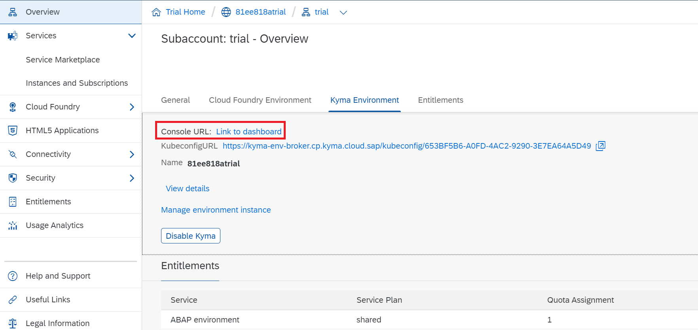

2. Under the "Namespaces" section, click the "Create Namespace" button to create a new namespace. 

3. Enter the name of your namespace, e.g dm-extension.

4. Under the "Namespaces" section, select the newly created namespace to access that.

5. Download the cluster's `KUBECONFIG` file. 

## Step 2: Set up locally

1. On your local machine, configure to use the `KUBECONFIG` file downloaded from the BTP Kyma runtime. You can refer to SAP Tutorial to Set up the kyma runtime kubeconfig. [https://developers.sap.com/tutorials/cp-kyma-download-cli.html](https://developers.sap.com/tutorials/cp-kyma-download-cli.html)

		mv ~/Downloads/<kubeconfig-file>.yaml ~/.kube/config

2. Download the sample code [digital-manufacturing-extension-samples
/dm-inapp-service-extensions/api-mssql-nodejs](https://github.com/SAP-samples/digital-manufacturing-extension-samples/tree/main/dm-inapp-service-extensions/api-mssql-nodejs) from DM Extensibility Bootcamp Github Samples.

	You can donwload the git repo by `git clone https://github.com/SAP-samples/digital-manufacturing-extension-samples.git`. 

3. Open the folder "api-mssql-nodejs" which is under "dm-process-extensions" in the Visual Studio Code.

	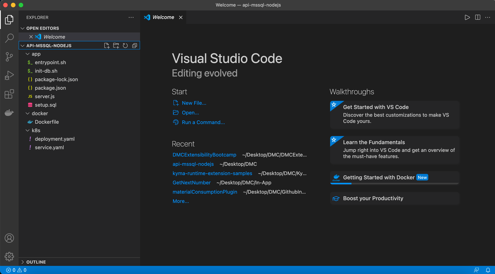

## (Optional) Step 3: Docker image

If you choose to use the provided docker image, please skip this step, and directly go to Step 3. 

If you wish to build your docker image, please continue. 

### Build your docker image
 
1. Build and push the image to your Docker repository. This step may take a long time, you can skip it.
	
		docker build -t {your-docker-account}/mssqlnodejs -f docker/Dockerfile .
	
		docker push {your-docker-account}/mssqlnodejs

2. Replace the image name with your docker account in the /k8s/deployment.yaml file.
	

### Run and test the Docker image locally 

This step is to help you test the code locally and get a better understanding of the architecture and logic. You can skip it if you don't have enough time.

> Note: The docker image we use here, mcr.microsoft.com/mssql/server:2017-CU24-ubuntu-16.04, supports amd64 processors only (if you want to try it locally, first check your computer CPU architecture). 

1. Replace the database records with your SFC.

	In "setup.sql" file under "app" folder, replace the first attribute in each record with your SFC value.

		INSERT INTO DCs
			(SFC, TorqueLeftValue, TorqueLeftLowerValue, TorqueLeftUpperValue, TorqueRightValue, TorqueRightLowerValue, TorqueRightUpperValue, Evaluation, Count)
		VALUES("{your-sfc-1}", 20, 40, 60, 88, 20, 80, 0, 1)
		INSERT INTO DCs
			(SFC, TorqueLeftValue, TorqueLeftLowerValue, TorqueLeftUpperValue, TorqueRightValue, TorqueRightLowerValue, TorqueRightUpperValue, Evaluation, Count)
		VALUES("{your-sfc-2}", 19, 40, 60, 89, 20, 80, 0, 2)
		GO

2. To run the Docker image locally.

		docker run -e ACCEPT_EULA=Y -e SA_PASSWORD=DMC_Bootcamp123 -p 1433:1433 -p 8080:8080 --name sql1 -d {docker id}/mssqlnodejs

2. To run the database SQL.
		
		docker exec -it sql1 "bash"
		/opt/mssql-tools/bin/sqlcmd -S localhost -U SA -P DMC_Bootcamp123
		>USE BootcampDB SELECT * FROM DCs
		>GO
	
	You will see two DB records are returned initially.

3. To test the API locally, you can use Postman to send a POST request to [http://localhost:8080/api/v1/dcs](http://localhost:8080/api/v1/dcs) with the below sample JSON content in the body.

		{
		    "SFC": "{your-sfc}",
		    "TorqueLeftValue": 50,
		    "TorqueLeftLowerValue": 40,
		    "TorqueLeftUpperValue": 60,
		    "TorqueRightValue": 60,
		    "TorqueRightLowerValue": 20,
		    "TorqueRightUpperValue": 80
		}

## Step 4: Build your own business application on kyma

1. Apply the Deployment. The command means to deply using the configuration in the file `deployment.yaml` onto the namespace `dm-extension`.

		kubectl -n dm-extension apply -f ./k8s/deployment.yaml

2. Apply the Service.

		kubectl -n dm-extension apply -f ./k8s/service.yaml

3. Verify that the Pod is up and running:

		kubectl -n dm-extension get po

	The expected result shows that the Pod for the `mssqlnodejs mssql` Deployment is running:

	
		NAME                                READY   STATUS    RESTARTS   AGE
		mssqlnodejs-5d4bbb47b5-7hjsr        2/2     Running   0          93s
	
4. In the Kyma Dashboard, in the namespace `dm-extension`, under the tab "Discovery and Network", click "API Rules" and click "+ Create API Rule". 
- You can generate a randum name. 
- Under "Service" section, for the field "Service Name", choose from the drop down list `mssqlnodejs-service` service, and input for the field "Port" value `80`. 
- Under "Gateway" section, for the field "Host", choose from the dropdown list `*.<your-cluster-id>.kyma.ondemand.com`. Note the assertion message "Host can not be a wildcard, replace * with subdomain name", so replace the asterisk mark with a subdomain name, e.g. `dmc-bp-nodejs-api`. Note the folded fields here are "Namespace" and "Name", these have assigned the default value `kyma-system` and `kyma-gateway`, so we can leave them as they are.
- leave the rest as as they are, and click "Create" button to create API rule for the service.

	| Field |  Value  |
	| :----- | :-------- |
	| Name   | randomly generated |
	| Service Name | `mssqlnodejs-service` |
	| Port | `80` |
	| Host | e.g. `<subdomain>.<your-cluster-id>.kyma.ondemand.com` |

	

5. Enter the name (e.g `dmc-bp-nodejs-api`) and Subdomain name (unique one, e.g `dmc-bp-nodejs-api`) to create API rule.
	

6. To test the API, you can use Postman to send a POST request to `https://<API_URL>:<API_PORT>/api/v1/dcs` with the below sample JSON content in the body.

		{
		    "SFC": "{your-sfc}",
		    "TorqueLeftValue": 50,
		    "TorqueLeftLowerValue": 40,
		    "TorqueLeftUpperValue": 60,
		    "TorqueRightValue": 60,
		    "TorqueRightLowerValue": 20,
		    "TorqueRightUpperValue": 80
		}

	> Note: you should use port 443 for HTTPS.

	The attributes here, "TorqueLeftValue" means the value of Left Torque, "TorqueLeftLowerValue" means the minimun value of Left Torque, "TorqueLeftUpperValue" means the maximum value of Left Torque, and the right values are similar.

## Step 5: Create Web Server in SAP DM

1. Open "Manage Web Servers" App in SAP DM.

2. Click "Create" Button.

3. Under "Header" tab, enter the Web Server name (e.g. DMC_Bootcamp_EvaluateTorque).

4. Under "Header" tab, select the specific plant (e.g. EBC400).

5. Under "Server Details" tab, select the server type, which is "Cloud services".

6. Under "Server Details" tab, enter the Host URL, which is the API end point in the Kyma.
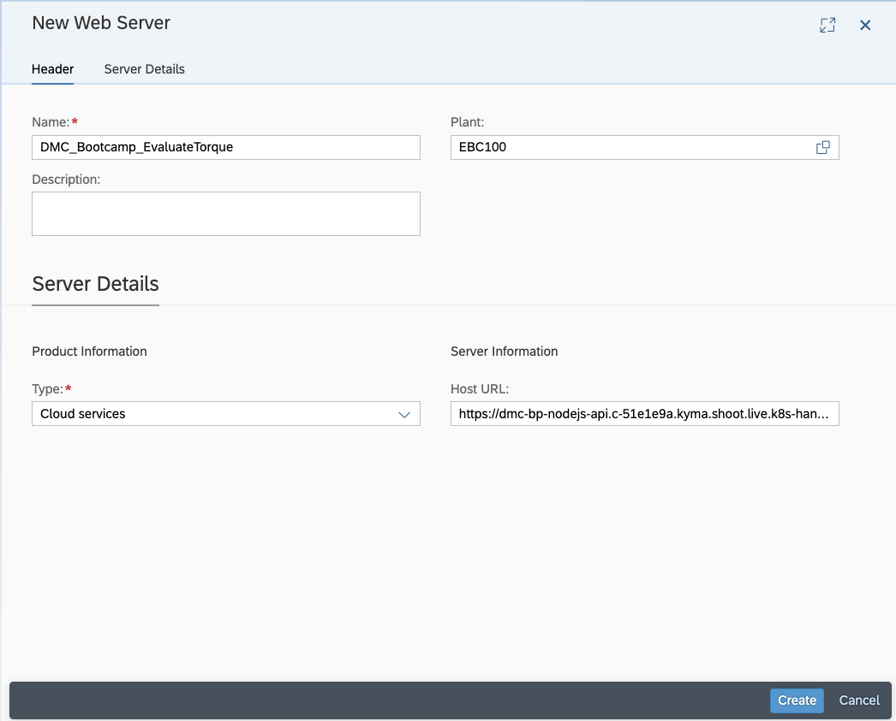

7. Click the "Create" button.

8. Select the "DMC_Cloud" Web Server in the "Manage Web Servers" app.

9. Under the "Connections" tab, click "Create" Button.

10. Select the "DMC_Bootcamp_EvaluateTorque" Web Server.

## Step 6: Register your service in SAP DM
1. Open "Manage service registry" App in SAP DM.

2. Click "Create" Button.
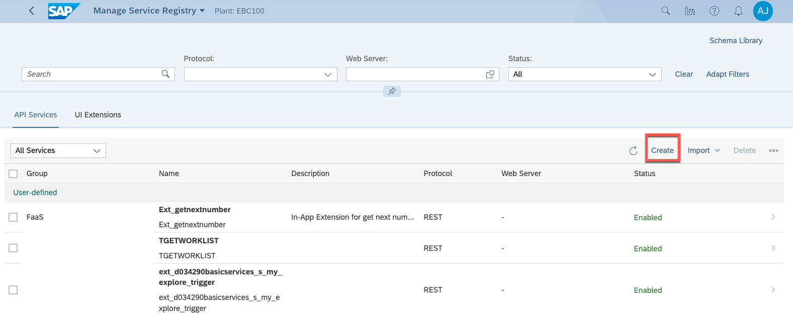

3. Under "Header" tab, for the "service name" parameter, enter "Ext_Evaluate_Torque".

4. Under "Header" tab, for the "Status" parameter, enable that.

5. Under "Header" tab, for the "Group" parameter, select "BusinessProcessExtensions".

6. Under "General Information" tab, for the "Protocol" parameter, select "REST".

7. Under "General Information" tab, for the "Method" parameter, select "POST".

8. Under "General Information" tab, for the "Web Server" parameter, select "DMC_Bootcamp_EvaluateTorque".

9. Under "General Information" tab, for the "URL / Path" parameter, enter `/api/v1/dcs`.

10. Under "Request Body" tab, for the "Request Body" parameter, enable that.

11. Under "Request Body" tab, for the paramter "Required", select "Yes".

12. Under "Request Body" tab, click "Add" button to add "application/json" content type.

13. Under "Request Body" tab, select the Schema of "application/json" content type and click "Define Inline Schema".
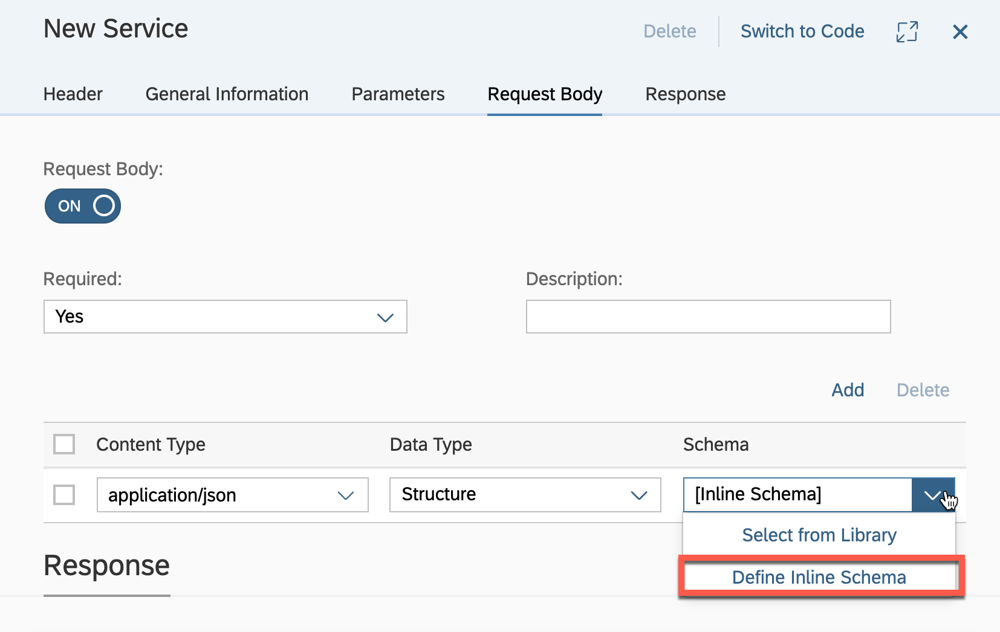

14. Define the inline scheme as following.

		{
		    "type": "object",
		    "required": [
		        "SFC",
		        "TorqueLeftValue",
		        "TorqueLeftLowerValue",
		        "TorqueLeftUpperValue",
		        "TorqueRightValue",
		        "TorqueRightLowerValue",
		        "TorqueRightUpperValue"
		    ],
		    "properties": {
		        "SFC": {
		            "description": "SFC",
		            "type": "string"
		        },
		        "TorqueLeftValue": {
		            "description": "TorqueLeftValue",
		            "type": "number"
		        },
		        "TorqueLeftLowerValue": {
		            "description": "TorqueLeftLowerValue",
		            "type": "number"
		        },
		        "TorqueLeftUpperValue": {
		            "description": "TorqueLeftUpperValue",
		            "type": "number"
		        },
		        "TorqueRightValue": {
		            "description": "TorqueRightValue",
		            "type": "number"
		        },
		        "TorqueRightLowerValue": {
		            "description": "TorqueRightLowerValue",
		            "type": "number"
		        },
		        "TorqueRightUpperValue": {
		            "description": "TorqueRightUpperValue",
		            "type": "number"
		        }
		    }
		}
	
	

15. Under "Response" tab, select Response Code "200" and click "Edit" button.

16. For the "Data Type", select "Structure". For the "Schema", select "Inline Schema" and click "Define Inline Schema".

17. Define the schema as following.

		{
		    "type": "object",
		    "required": [
		        "evaluationCurrent",
		        "evaluationHistory"
		    ],
		    "properties": {
		        "evaluationCurrent": {
		            "description": "evaluationCurrent",
		            "type": "integer"
		        },
		        "evaluationHistory": {
		            "description": "evaluationHistory",
		            "type": "integer"
		        }
		    }
		}
	
	
	
18. Click "Save" Button.

19. Click "Create" Button and your service is registered.

## Step 7: Design your Production Process

1. Open "Design Production Processes" App in SAP DM.

2. Create a new Production Process Design (e.g. DMC_Bootcamp_EvaluateTorque) and create a new cloud type process (e.g. DMC_Bootcamp_EvaluateTorque) inside.

	Remember to turn "Publish to Service Registry" (and "Visible to Production Connector/Plant Connectivity Runtime") on. 

3. Design the Production Process as following.

	If you don't have the time to do this, you can import the [*.dmcbak](./assets/Exercise2.1_DMC_Bootcamp_EvaluateTorque_to_be_imported.dmcbak) file, with the password `BootCamp2023:)`. Please remember to replace the extension service Web Server "DMC_Bootcamp_EvaluateTorque" with yours. 

4. Add the process variables to define the version of your target Operation and Data Collection Group, the Data Collection Parameters Name and Nonconformance Code Name.

	
	|	Name				| Default Value 	|		Type|
	|--|--|--|
	|	InOperationVersion	| ERP001					| String|
	|	InDcGroupVersion	| ERP001					| String|
	|	InDCName_Left		| TORQUE_LEFT 			| String|
	|	InDCName_Right		| TORQUE_RIGHT			| String|
	|	InNCCode			| ASSEMBLY_TORQUE			| String|

	This is related to the corresponding Data Collection's Group of your SFC. 

5. For the "Start" control, define the input parameters as following.

	Input Parameter:

	|  Parameter Name (Data Type)|  Value| 
	|--|--|			 
	|	InOperation (String)		|leave it empty|
	|	InPlant (String)			|leave it empty|
	|	InResource (String)		|leave it empty|
	|	InSFC (String)			|leave it empty|
	|	InWorkcenter (String)		|leave it empty|

6. For the DMC "Retrieve_SFC_DC_Groups" service, define the input and output parameters as following.

	Input Parameter:

	|  Parameter Name|  Value| 
	|--|--|		
	|	operation (String):		|'InOperation'|
	|	plant (String):*		|'InPlant'	|
	|	resource (String):*		|'InResource' |
	|	sfc (String):*			|'InSFC'|
	|	stepId (String):		|leave it empty|
	|	workCenter (String):	|'InWorkcenter'|
	
	Output Parameter:		
	|  Parameter Name|  Value| 
	|--|--|	
	|	httpResponse (StructureArray / GroupsListResponse):		|leave it empty|

	If you want to refer to an existing parameter or variable, you can choose the value for the parameters from the dropdown list, and they will be added in a pair of single quotes (do not leave them out). For instance, the Input Parameter "operation" here gets its value from the Input Parameter of the previous step "Start".
		
7. For the DMC "Get_Logged_Parameters" service, define the input and output parameters as following.

	Input Parameter:

	|  Parameter Name|  Value| 
	|--|--|		
	|	dcGroup.name (String):		|'Retrieve_SFC_DC_Groups#httpResponse[0]["group"]["group"]'|
	|dcGroup.version (String):|'InDcGroupVersion'|
	|operation.name (String):*|'InOperation'|
	|operation.version (String):*|'InOperationVersion'|
	|parameterName (String):|leave it empty|
	|plant (String):*|'InPlant'|
	|resource (String):*|'InResource'|
	|sfcs (StringArray):*|'InSFC'|
					
						
						
	
	Output Parameter:	

	|  Parameter Name|  Value| 
	|--|--|	
	|	httpResponse (StructureArray / LoggedSfcDataResponse):|leave it empty|
				

	Here in the value of Input Parameter "dcGroup.name", `Retrieve_SFC_DC_Groups#httpResponse` means the value is from the Output Parameter "httpResponse" of the previous step "Retrieve_SFC_DC_Groups". 
		
8. For the custom "Get latest collected data by DC Name" Script Task, define the input and output parameters and script as following.

	Input Parameter:

		Parameter Name												Value 
		InDCName_Left (String):*									'InDCName_Left'
		InDCName_Right (String):*									'InDCName_Right'
		InLoggedDCs (StructureArray / LoggedSfcDataResponse):*		'Get_Logged_Parameters#httpResponse'

 	

	Output Parameter:		
		
		Parameter Name				Value
		oDCLeftValue (Double):		leave it empty
		oDCRightValue (Double):		leave it empty
		
	Script:
		
		var dcArray = $input.InLoggedDCs[0].parameters;
		var filterArrayLeft = dcArray.filter(function(e) {
		  return e.measureName == $input.InDCName_Left
		})
		var filterArrayRight = dcArray.filter(function(e) {
		  return e.measureName == $input.InDCName_Right
		})
		var lenLeft = filterArrayLeft.length;
		var lenRight = filterArrayRight.length;
		
		$output.oDCLeftValue = filterArrayLeft[lenLeft-1].actualNumber;
		$output.oDCRightValue = filterArrayRight[lenRight-1].actualNumber;
		
9. For the custom "Get Lower and Upper Value by DC Name" Script Task, define the input and output parameters and script as following.

	Input Parameter:

		Parameter Name											Value 
		InLeftDCName (String):*									'InDCName_Left'
		InRightDCName (String):*								'InDCName_Right'
		InDCGroup (StructureArray / GroupsListResponse):*		'Retrieve_SFC_DC_Groups#httpResponse'

	Output Parameter:		
		
		Parameter Name					Value
		oLeftLowerValue (Double):		leave it empty
		oLeftUpperValue (Double):		leave it empty
		oRightLowerValue (Double):		leave it empty
		oRightUpperValue (Double):		leave it empty
		
	Script:
		
		var dcParameterArray = $input.InDCGroup[0].group.parameters;

		for (var i=0;i<dcParameterArray.length;i++) {
		    if (dcParameterArray[i].parameterName == $input.InLeftDCName) {
		        $output.oLeftLowerValue = dcParameterArray[i].minValue;
		        $output.oLeftUpperValue = dcParameterArray[i].maxValue;
		    } else if (dcParameterArray[i].parameterName == $input.InRightDCName) {
		        $output.oRightLowerValue = dcParameterArray[i].minValue;
		        $output.oRightUpperValue = dcParameterArray[i].maxValue;
		    }
		}
		
10. To use your custom registered in the Step 4, you can click "Select Services" and select your custom Web Server and your custom service. Define the input and output parameters as following.
	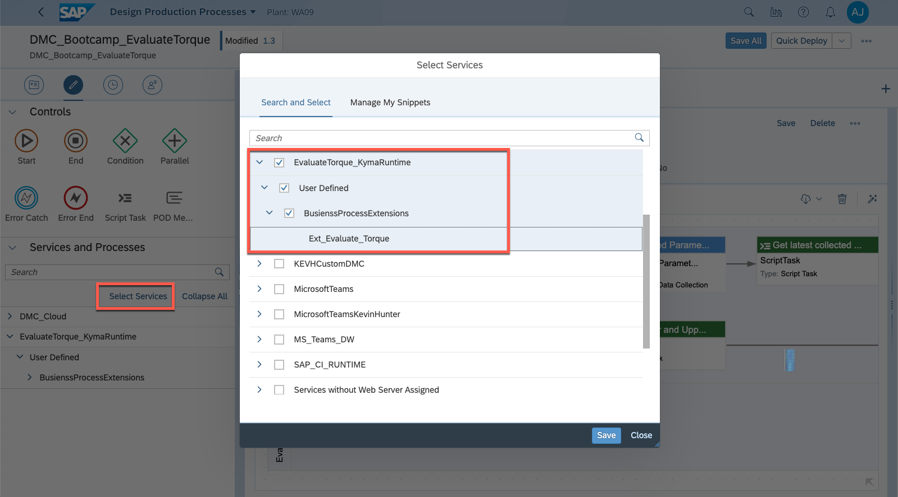
	
	Input Parameter:

		Parameter Name						Value 
		SFC (String):*						'InSFC'
		TorqueLeftLowerValue (Double):*		'ScriptTask_2#oLeftLowerValue'
		TorqueLeftUpperValue (Double):*		'ScriptTask_2#oLeftUpperValue'
		TorqueLeftValue (Double):*			'ScriptTask#oDCLeftValue'
		TorqueRightLowerValue (Double):*	'ScriptTask_2#oRightLowerValue'
		TorqueRightUpperValue (Double):*	'ScriptTask_2#oRightUpperValue'
		TorqueRightValue (Double):*			'ScriptTask#oDCRightValue'

	Output Parameter:		
		
		Parameter Name						Value
		evaluationCurrent (Integer):		leave it empty
		evaluationHistory (Integer):		leave it empty

	Note the actual ID of your three Script Tasks might be different from the sample value here.
		
11. For the "Condition" control, define the evaluation expressions for two branches separately, as following.

	Evaluation Expression:

	| Branch | Evaluation Expression |
	|--|--|
	|(1)|'Ext_Evaluate_Torque#evaluationHistory' == 1|
	|(2)|'Ext_Evaluate_Torque#evaluationHistory' == 0|
	
12. For the DMC "Log_Nonconformances" service, define the input parameters as following.

	Input Parameter:

		Parameter Name										Value 
		code (String):*										'InNCCode'
		dataFields (StructureArray / DataField):			leave it empty
		files (StructureArray / LogNonConformanceFile):		leave it empty
		plant (String):*									'InPlant'
		resource (String):									'InResource'
		sfcs (StringArray):*								['InSFC']
		workCenter (String):								'InWorkcenter'
			
13. For the custom "Generate output message" Script Task, define the input and output parameters and script as following.

	Input Parameter:

		Parameter Name						Value 
		InSFC (String):*					'InSFC'
		InWorkCenter (String):*				'InWorkcenter'

	Output Parameter:		
		
		Parameter Name					Value
		oMessage (String):				leave it empty

	Script:
		
		$output.oMessage = "There is an issue for " + $input.InSFC + " at " + $input.InWorkCenter + ".";

14. Deploy and activate the process after saving it. To test the Production Process directly, you can click the "Run" button and use the following sample data.

	| Name |  Value  |
	|:-----|:--------|
	| InOperation | `LA-ASSEMBLY` |
	| InPlant   | `EBC400` |
	| InResource | `TORQUE-5` |
	| InSFC | `{your-sfc}` |
	| InWorkcenter | `WC-LIFT` |

	Sample inputs are like this:
	
	
15. To check the testing result, you can go to "Monitor Production Processes" App to see the details of running results.
	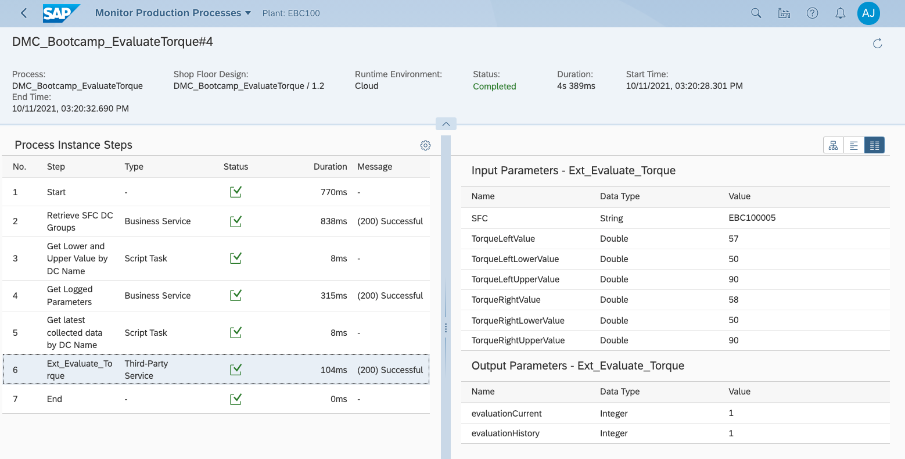
	
## Step 8: Assign your Production Process to POD

1. 	Open "POD Designer" App and select your own POD (e.g. DMC_BOOTCAMP_POD).

2. Select the "Validate" button, and click "Configuration" button to show the configuration panel.
	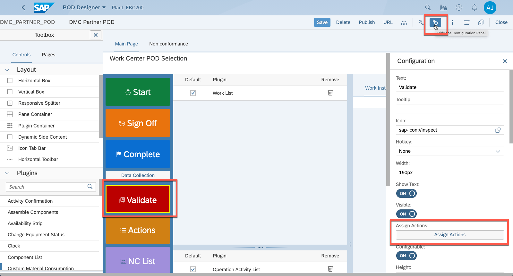

3. Click "Assign Actions" button and click "Add" Button to add the action.
	For the "Type" parameter, select "Production Process".
	For the "Type Definition", select your custom Production Process "P_DMC_Bootcamp_EvaluateTorque_DMC_Bootcamp_EvaluateTorque".
	
	
4. Click the "Configuration" button and configure the parameters as following.
	
	
	
	
5. Click "Save" button to save the POD.

## Step 8: Test the scenario
1. Open your own POD. You can get POD access URL by clicking the "URL" button in the "POD Designer" App. E.g. [https://DMC_URL/cp.portal/site#DMEWorkCenterPOD-Display?POD_ID=DMC_BOOTCAMP_POD](https://DMC_URL/cp.portal/site#DMEWorkCenterPOD-Display?POD_ID=DMC_BOOTCAMP_POD)

2. Select the SFC (e.g. 78378_030) and select the operation (e.g. 1879683-0-0010/0010). In the "Data Collection List" tab, click "Collect" button.
	
	
3. Enter the Data Collection Value and click "Save" button to perform the data collection.
	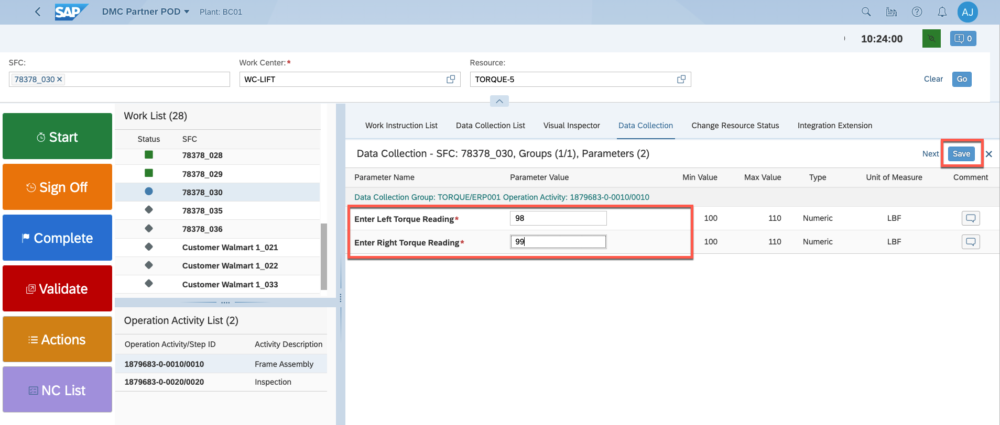
	
4. Click the "Validate" button to trigger the evaluation process.
	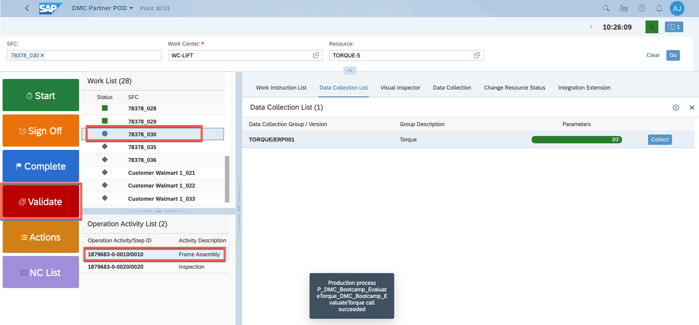
	
5. Go to "Monitor Production Process" App to check the details.
	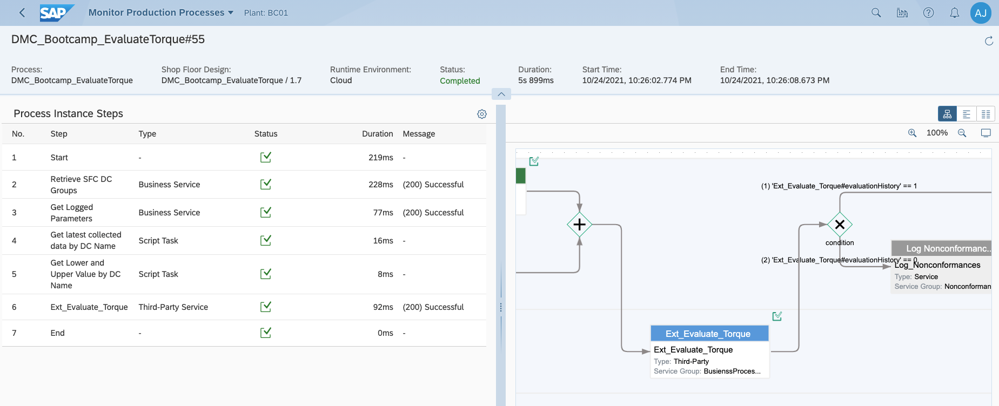
	
6. If either left or right torque value exceeds the min and max value consecutively 3 times, it will automatically log the nonconformance code. Perform the step 8.2 to step 8.4 three times with the torque value out of range, and go to "Monitor Production Process" App to check the details.	
	

7. Click "NC List" button, you will see the non conformance is automatically logged.
	
	
	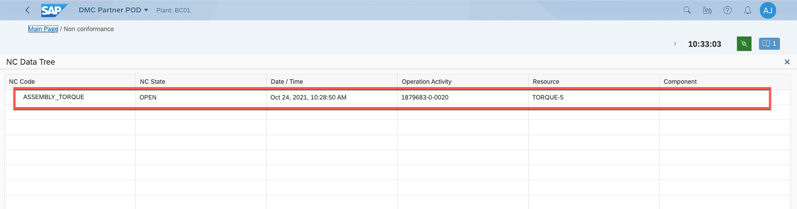
	
8. To check the MS SQL database table running in Kyma, you can access the URL `https://<API_URL>:<API_PORT>/api/v1/listAll` in the browser (or make a GET request to the URL from Postman) to see all the records in the table.
	
