# Exercise 3 - Perform Assembly Operation with visual inspection

## Overview
In this exercise, we would like to show an example of Visual inspection during the production process at a specific Operation.
A Machine learning model will be used to process a visual image to determine a successful pass or fail for the inspection.
   
## Step 1: Build the Machine Learning Model

There are many tools available to build and train a Machine Learning Model. In this example, we will make use of Google Teachable Machine which is a quick and easy tool to create and train a model.

The model will be based on images of a Valve Head assembly. This will consist of 3 categories of image:

* SCREW_LEFT (Missing Left Hand side Screw)

* SCREW_RIGHT (Missing Right Hand side Screw)

* OK (Acceptable image with no inconsistancy)

### 1. Access Google Teachable Machine

Link: [Teachable_Machine](https://teachablemachine.withgoogle.com/)

Click on 'Get Started' button.
	

### 2. Create a Model

Select the 'Image Project'.
   
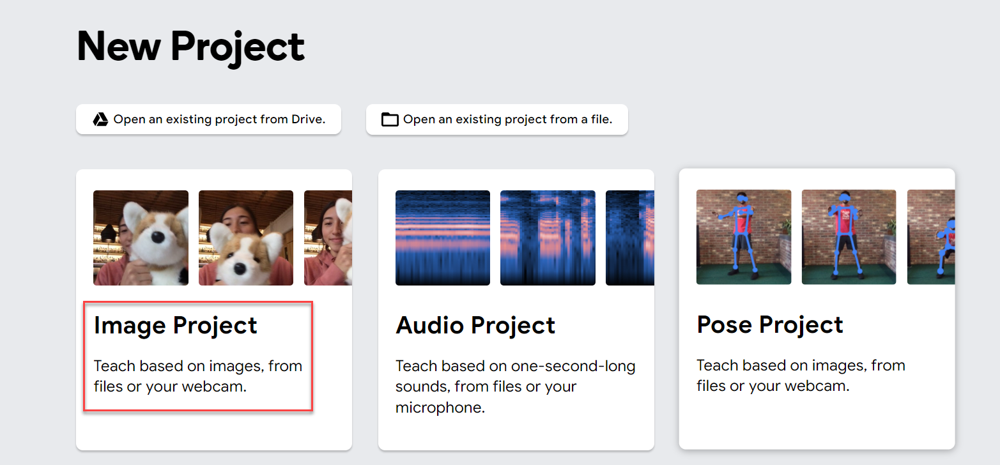

Choose 'Standard Image Model'.
   
 

The following User Interface will exist:

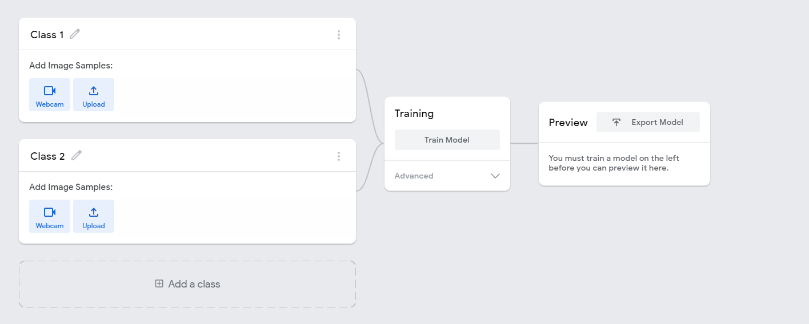 
   
The desired classes can now be created. In this case three classes: SCREW_LEFT, SCREW_RIGHT, OK. The third class can be inserted with the 'Add Class' button.

 

### 3. Upload Images

The sample images relevant to each class can now be uploaded by clicking the 'Upload' button within the relevant class.
   
Upload of the SCREW_LEFT images is shown. This can be achieved by dragging selected images across from a folder repository to the highlighted area. This should be repeated for each Class defined.
   
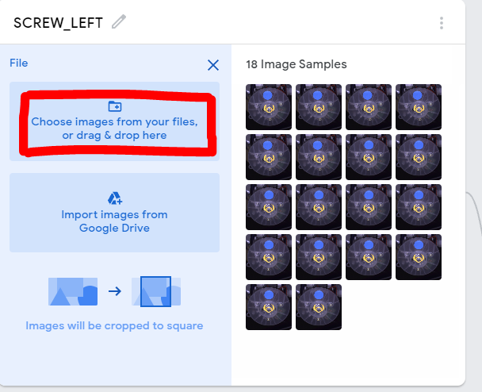   
   
Once all images have been uploaded to the relevant classes, the result should look like in this way.
   
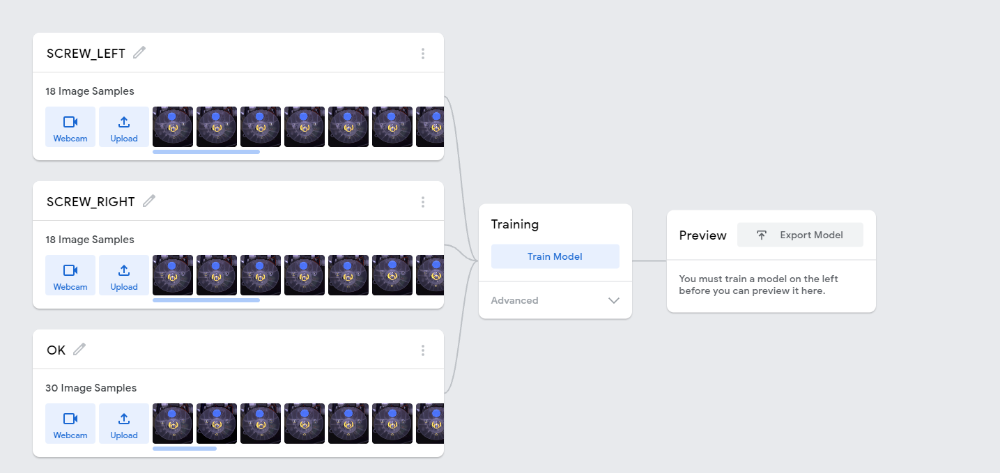   

### 4. Train the Model

We can now Train the Model, by using the uploaded sample images for each class to give intelligence to the Model allowing it to decide if an image supplied to it is good or bad.
   
Click 'Train Model'. 

After a short delay (generally around 30 seconds), the model will display as 'Trained'.
   
   
   
   
### 5. Export the Model

The model can now be exported by selecting 'Export Model'.
   
 

and then selecting the "Download" radio button and clicking 'Download My Model'.
   
 

This result in a zip file being downloaded will contain 3 files similar to the following structure.
   
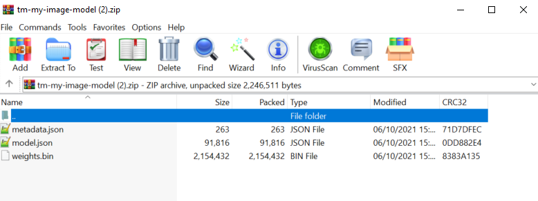 
   
We have now successfully created a machine learning model which we will consume in DMC in further steps.
   
## Step 2: Configure Nonconformance Code Structure
 
### 1. Create Nonconformance Code

Go to 'Manage Nonconformance Codes' app, and create two new Nonconformance code for **SCREW_LEFT** and **SCREW_RIGHT**.
   
**NOTE**: These NC codes should match the names of the classes within the machine learning model created in Step 1.
   
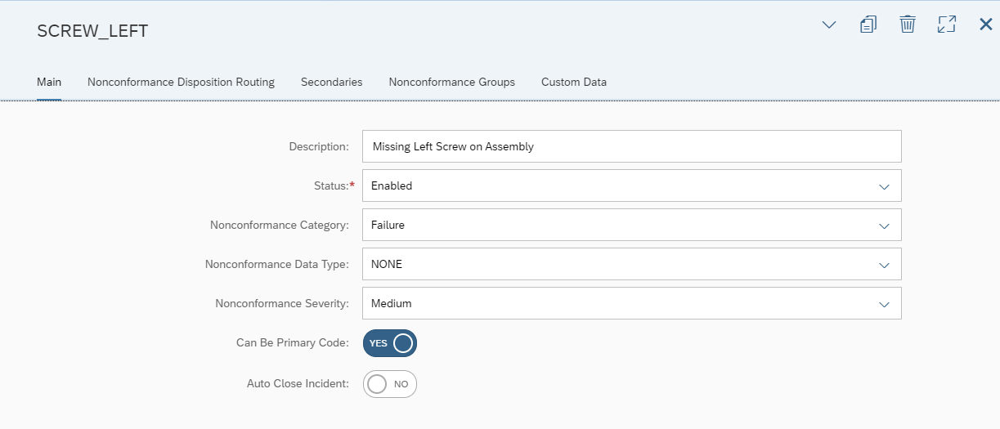 
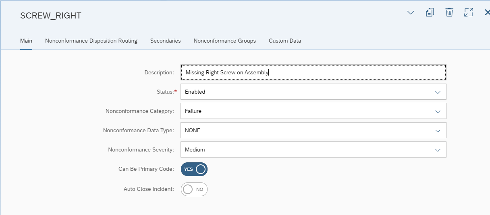 
 
### 2. Create Nonconformance Group

Go to 'Manage Nonconformance Groups' app, and create a new Nonconformance Group.

This Nonconformance Group should contain the two Nonconformance codes created previously.
  
  

## Step 3: Manage AI/ML Scenario
*This step will enable us to build the machine learning scenario allowing us to associate the previously generated machine learning model and Nonconformance code structure.*

### 1. Create an AI/ML Scenario

Go to 'Manage AI/ML Scenarios' app, and create a new scenario by selecting the 'Predictive Quality: Visual Inspection' scenario.
   
  
   
Enter a name and description for the Scenario, e.g. BOOTCAMP_VISUAL_INSP

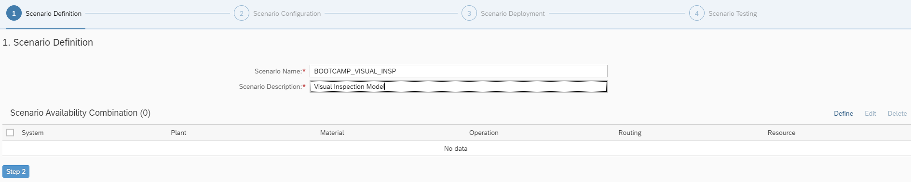     

Define the Scenario Available Combintation by clicking 'Define' and associate the relevant DMC Objects.

     

Click 'Add' and the expected result is shown as below:
   
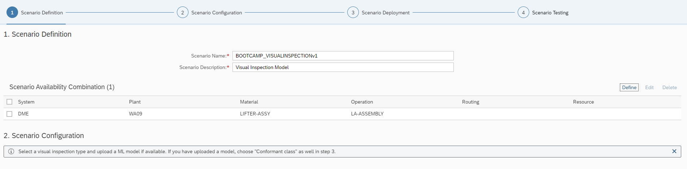
   
Click 'Step 2' to configure the Scenario, choose the Visual Inspection Type to be 'Image Multi Class Classification', and select the Inspection Mode to be 'Assisted'.
  
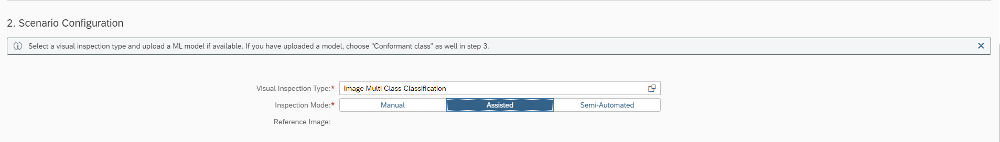

Now the files generated for the machine learning model in previous steps need to be added to the scenario. Either by clicking 'Add' to select files, or drag and drop files into the panel area. 

There are two files required to be added, **weights.bin** and **model.json**. 
   
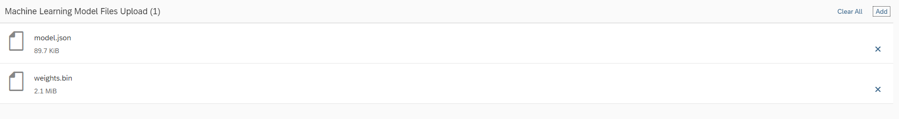

Model input and preprocessing steps should be configured as follows:
  
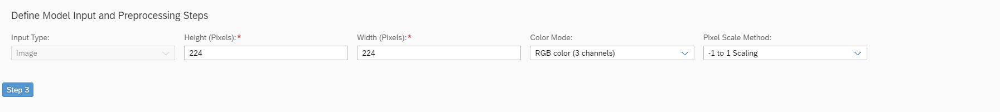

 Click 'Step 3' to the 'Scenario Deployment' step, and requires the additon of the classification classes that will be considered in the evaluation process in the POD Plugin. 
  

Add the Nonconformance Group 'MISSING_SCREW', and then add a Conformance Class e.g. OK
   

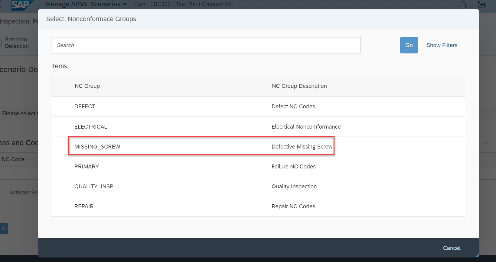
 
Each Entry requires a Class Title to be entered as below:
   
 

Click 'Step 4', and this step will allow us to have an option to test the scenario.
   
 

Click 'Review', and we can check the configurations in previous steps. The model can be deployed by clicking 'Save and Activate'. The resultant model will then display as 'Activated' on the main AI/ML page.
   
 

## Step 4: Test and Transact the Scenario

Create and relase an SFC against a shop order relating to the LIFTER-ASSY material.

Open the predefined DMC BootCamp POD.

Select and start the desired SFC and Operation.

 

Shift to the Visual Inspector tab, the Webcam associated with the PC / Laptop device being used by the operator can be used to capture an image of the assembled product for verification in the POD.
   
 

In this example, we will force a predetermined image into the POD. This will be done via a Postman API call.
   
In order to achieve this, the image to be passed via the API should be converted to a BASE-64 form. This can be realized via a tool such as     [Base64 Converter](https://codebeautify.org/image-to-base64-converter) .
   
Within Postman, import the Postman Collection.Select the 'POST InspectionLog' from the Visual Inspection folder.
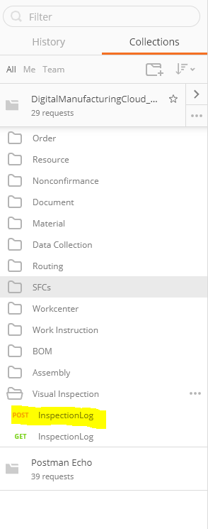    

The Body should be configured as below, ensuring all inputs (e.g. plant, SFC) correspond to required values. The BASE-64 converted file content should also be inserted.
   
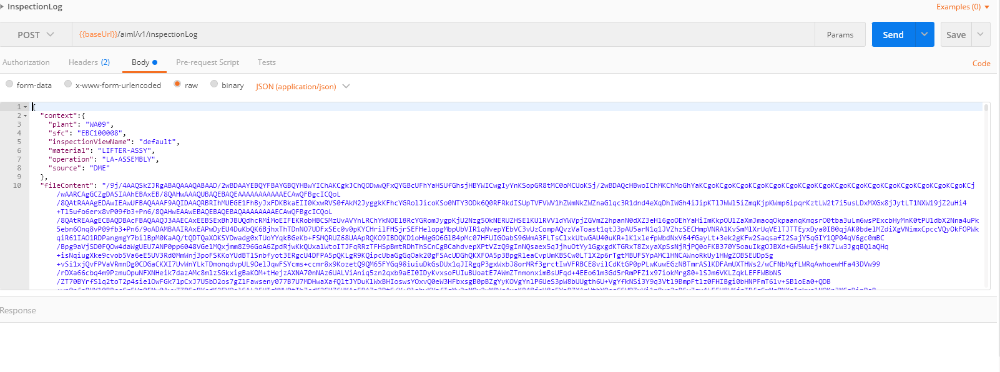    
   
After sending the POST request, a successful posting will result in the selected image being displayed in the POD, with a calculated result suggesting if the image is either conformant or nonconformant to the process.  

In this example, the model has calculated probability of the left screw being missing in the assembly is 99%.
   
