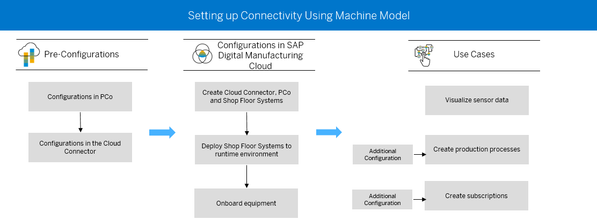

# Unit 8 - Shop Floor Monitoring

## Overview
The equipments on the shop floor gets connected to Digital Manufacturing Cloud via Plant Connectivity and using Machine Model and Connectivity with which the tags on the equipment can be monitored and necessary actions can be triggered. Also, with the same machine model action or setpoints can be sent to the machines. This establishes the bi-directional communication between Digital Manufacturing Cloud and Equipments on the shop floor. 

The following graphic depicts more of the connectivity scenario.

## Shop Floor Business Events
There is flexibility to embed production processes linked to business events. The list of events supported so far is as below - 

- SFC Started
- SFC Yield
- SFC Operation Activity Completed
- Resource Loaded
- Resource Status Changed
- Resource Bin Loaded
- Order Created
- Order Released
- Inspection Results Collection
- Goods Receipt Completed
- Extended Warehouse Management Staging Confirmed
