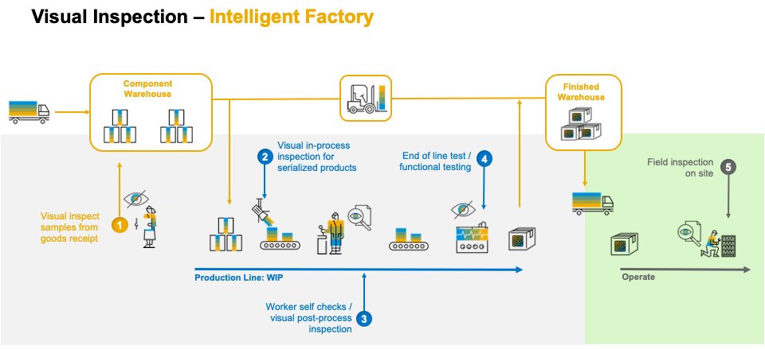

# Unit 5 - Machine Learning Extensions

## Overview
Visual inspection is one of the critical processes ensuring the quality of the manufactured product and can be found throughout the value chain: starting in the warehouse where goods are received. Following the value stream, visual inspection varies from worker self-checks, acceptance testing, to fully automated machine visions systems. Visual Inspection is even relevant after products have left the plant and are shipped to customers: field technicians inspecting the assets have to visually assess if certain maintenance tasks are required or to identify the right spare parts based on computer vision.

With the latest releases of SAP Digital Manufacturing Cloud, the new AI/ML scenario Visual Inspection was released to assist the operator in identifying defective parts and logging nonconformance to ensure that defective parts are automatically redirected to the repair work center or to initiate other corrective actions. This empowers the operator on the shop floor to focus on value-added processes instead of performing repetitive tasks which can be mentally exhausting and might introduce human error, leading to undetected quality problems.

## Key Highlights

- One of the key focuses of the new AI/ML scenario for visual inspection was to simplify the process to integrate a new machine learning model into the business process within minutes instead of months.
- Visual Inspection in SAP Digital Manufacturing Cloud allows users to upload a trained machine learning model (also referred as Bring Your Own Model) and activate it for use on the shop floor without writing a single line of code. 
- As a positive side-effect, Visual Inspection runs on the edge which means the model runs locally on the shop floor, not requiring the images to be send to the cloud for analysis, allowing robust and resilient predictions within sub-seconds.

For more details, please follow this blog here - [AI/ML Solution for Visual Inspection](https://blogs.sap.com/2020/12/14/ai-ml-solution-for-visual-inspection-overview-how-to-close-the-production-gap-for-machine-learning/) 
