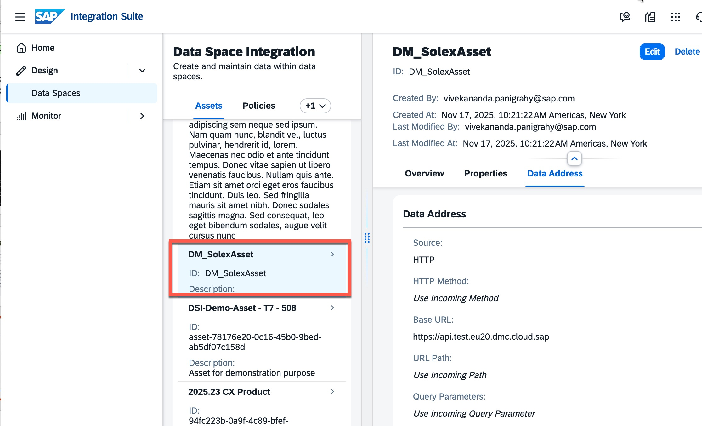
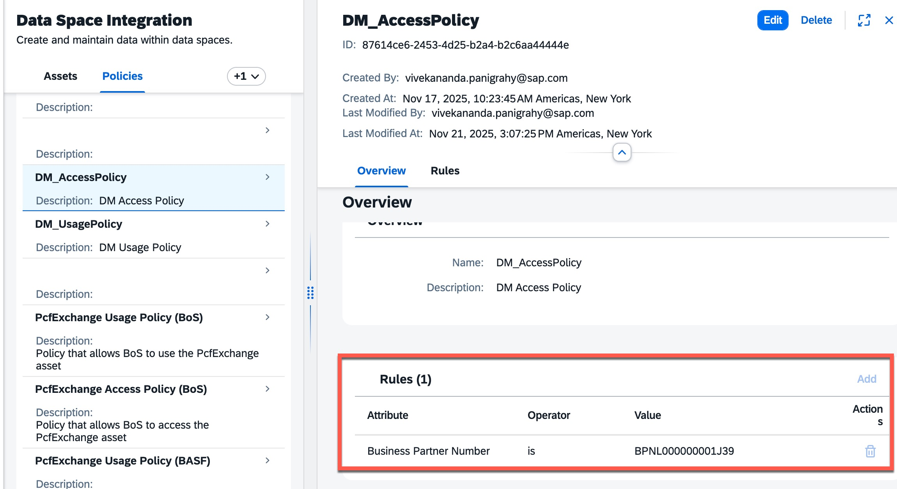
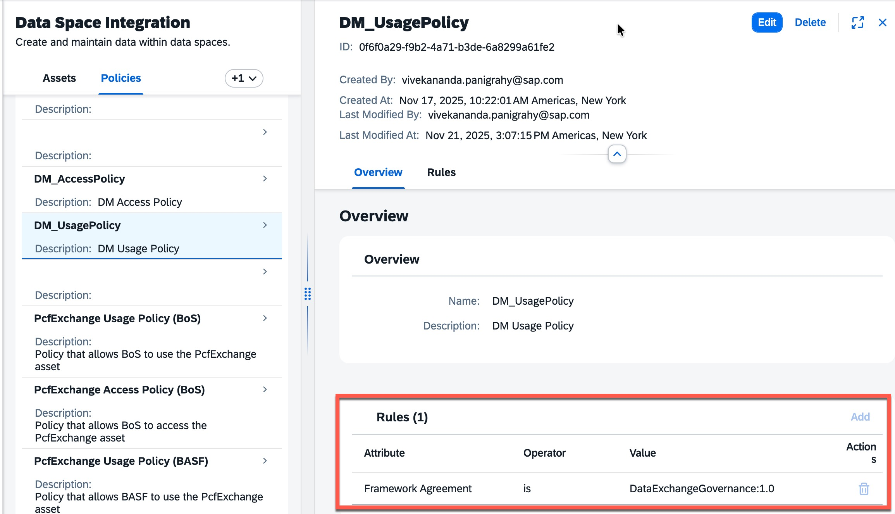
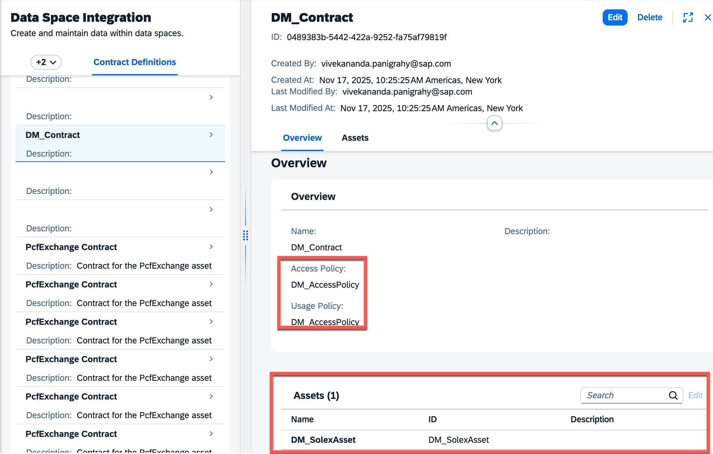
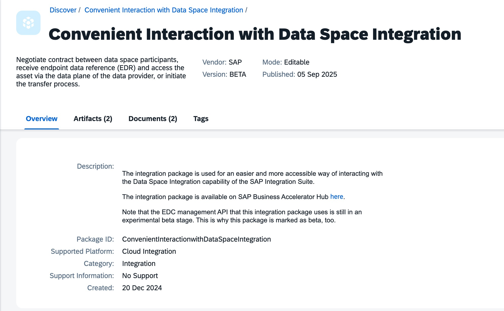
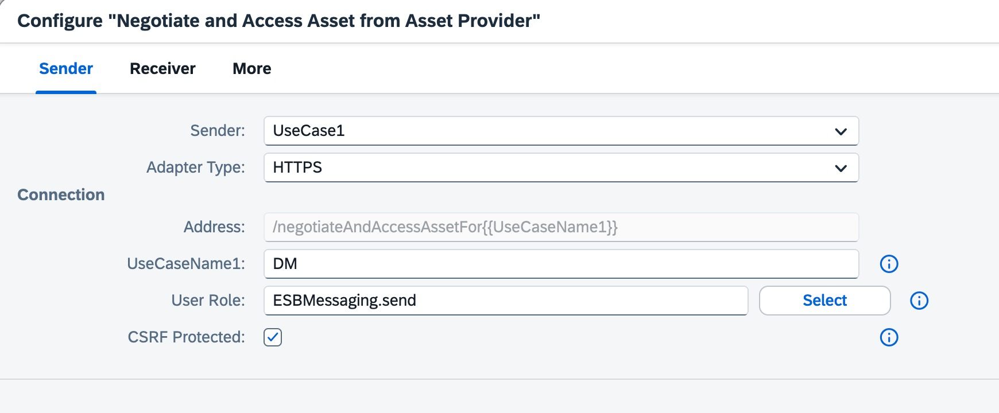
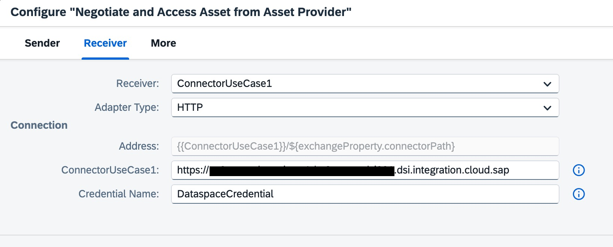
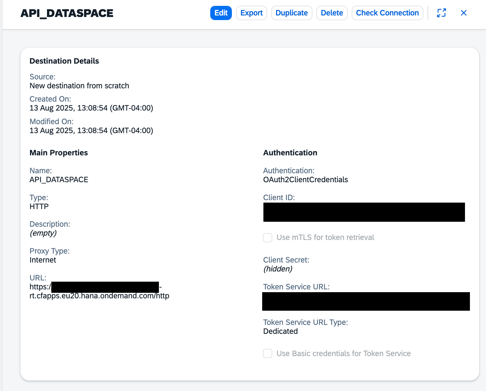
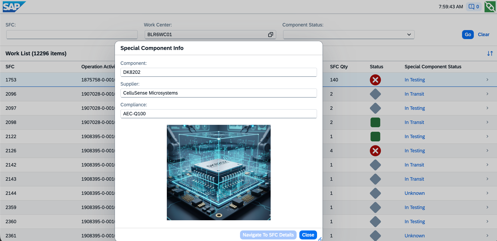

# Manufaturing-X Scenario

When developing an electric vehicle (EV), manufacturers must integrate several advanced components, including specialized chips sourced from external supplier plants. This scenario explores a real workflow found in an automotive manufacturing environment, where production continuity and just-in-time supply chain principles are critical. In this case, the Shop Floor Control (SFC) for the EV is structured around three major operations:

- `Battery Module Fabrication`: The process begins with the assembly of battery modules, which can proceed independently of other components and often initiates the parent SFC workflow.

- `Chip Embedding`: At this stage, the production is paused ("Hold" status in SFC) until the arrival of the specialized chip from a supplier plant. Once the chip is delivered, it undergoes thorough incoming inspection and testing to ensure quality and functionality before embedding into the vehicle’s electronics or battery cells.

- `Main Assembly`: Upon successful embedding and validation of the chip, the main assembly of the EV resumes. This ensures seamless integration of key electronic features and maximizes operational efficiency.

# Supplier Configuration

## Step 1: Define Asset 
Create an Asset in the Data Space associated with the Supplier

## Step 2: Define Policy
Create Access policy and Usage Policy to adhere to framework agreements and defining sharing rights to a list of trusted business partners

## Step 3: Define Contract
Create contract combining the assets and policies from the previous steps

# Customer Configuration

## Step 1: Configure CPI Package on the Cusstomer side
On the customer specific CPI tenant, copy CPI Package `Convenient Interaction with Data Space Integration`, configure the following parameters for artifact `Negotiate and Access Asset from Asset Provider` and deploy all the artifacts. 

Select a usecase name appropriately, later this will be part of HTTP API endpoint.  

## Step 2: Create Destination to Invoke the CPI API endpoint from DM POD/Production process

After deploying the artifact that can be invoked with URL that looks something like the following

https://<CPI_ENDPOINT>.hana.ondemand.com/http/negotiateAndAccessAssetFor<SAMPLE_USECASE>

## Step 3: Production Operator Dashboard

The information is fetched by passing the Supplier Partner ID and Component Id and the call is being done to the CPI endpoint which does the negotation based on agreed contract and data is fetched accordingly. 

