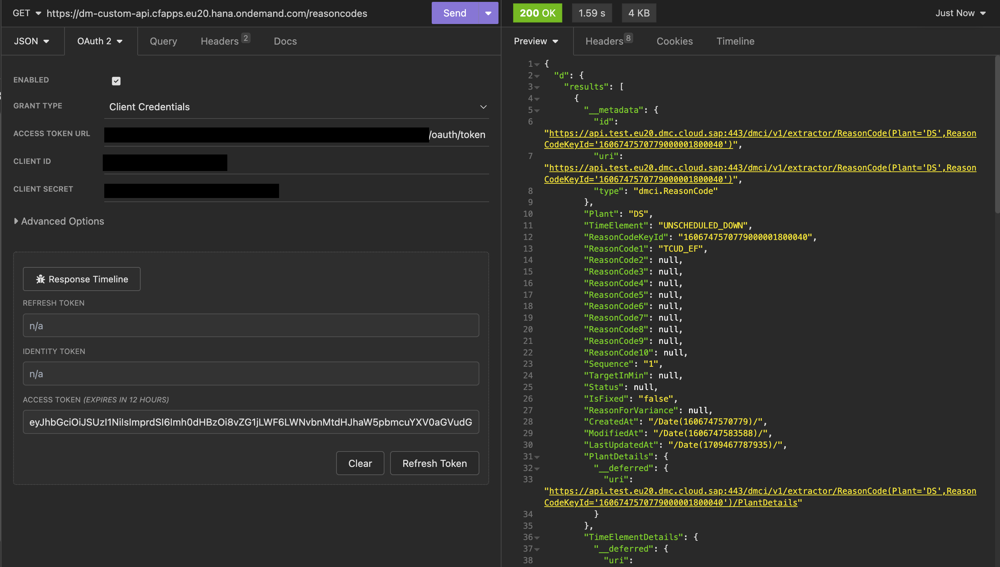

# Digital Manufacturing Extension: Custom protected BTP service calling DM APIs
This is a sample service with protected endpoint. This is calling implicitly DM APIs via destination.

Below we are going to use destination SAP_DMC_DEFAULT_SERVICE_KEY to fetch the reason codes. The endpoints are protected XSUAA instance and using the client credentials the endpoints can be validated. The same credentials can be used to setup destination further that can be invoked from DM Production processes. 


## Protecting endpoints
```
const xsenv = require('@sap/xsenv');
const services = xsenv.getServices({ uaa: { tag: "xsuaa" } });
const credentials = services.uaa;

const passport = require('passport');
const { XssecPassportStrategy, XsuaaService } = require("@sap/xssec");
const authService = new XsuaaService(credentials) // or: IdentityService, XsaService, UaaService ...
console.log( `Found UAA service credentials for client: ${services.uaa.clientid}` )
passport.use(new XssecPassportStrategy(authService));
app.use(passport.initialize());
app.use(passport.authenticate('JWT', { session: false }));
```


## Calling DM MDO APIs
```
const SapCfAxios = require('sap-cf-axios').default;
const axios = SapCfAxios("SAP_DMC_DEFAULT_SERVICE_KEY");

app.get('/reasoncodes', function(req,res){
    axios({
        method: 'GET',
        url: '/dmci/v1/extractor/ReasonCode?$format=json&$top=3',
        headers: {
            "content-type": "application/json"
        }
    }).then(function(response){
        // console.log(response.toString())
        res.send(response.data);
    }).catch(function (error) {
        console.log(error);
    });
})
```


