# Inbound request from non-SAP ERP system to SAP DM system using SAP DM integration workflows.

**Scenario**

This scenario will cover the inbound integration of SAP DM with non-SAP ERP system using standard SAP DM integration workflows. Details on how it can be achieved are covered in this document below using an example of Inbound Material Download **MATMAS05** workflow.

**Steps to create**

1. Verify that "SAP S/4HANA Integration with SAP Digital Manufacturing Cloud" package is already deployed on SAP Cloud Integration.

    - Go to SAP Cloud Integration and click on "Build and Develop Integration content" icon.
    - Filter for package "SAP S/4HANA Integration with SAP Digital Manufacturing Cloud" as shown below.

        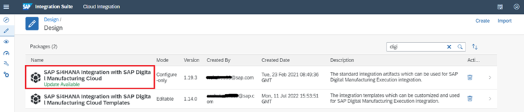

2. Verify that "General Message Processor" integration flow is available as an artifact in "SAP S/4HANA Integration with SAP Digital Manufacturing Cloud" package and deployed.

    - Open "SAP S/4HANA Integration with SAP Digital Manufacturing Cloud" package as specified in Step 1 and navigate to "Artifacts" tab.
    - Filter for "General Message Processor" and ensure that the iFlow is deployed.

        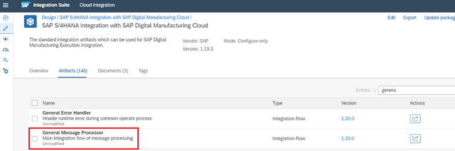

3. Get the HTTP Endpoint URL for "General Message Processor" iFlow.

    - Go to SAP Cloud Integration and click on "Operate and monitor integration scenarios" icon.
    - Go to "Manage Integration Content" and click "All".
    - Select "General Message Processor" and copy HTTP endpoint as shown below.

        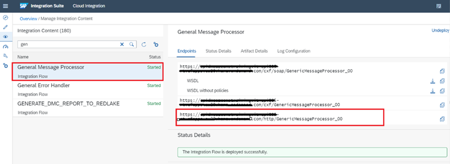

4. Use any API testing tool like Postman or SoapUI to test the above HTTP endpoint. We'll use Postman for this example. The assumption is that any non-SAP ERP system will consume this "General Message Processor" HTTP endpoint in the same way as these API testing tools.
5. In Postman, create new HTTP request and provide URL and Authentication details as shown below.
        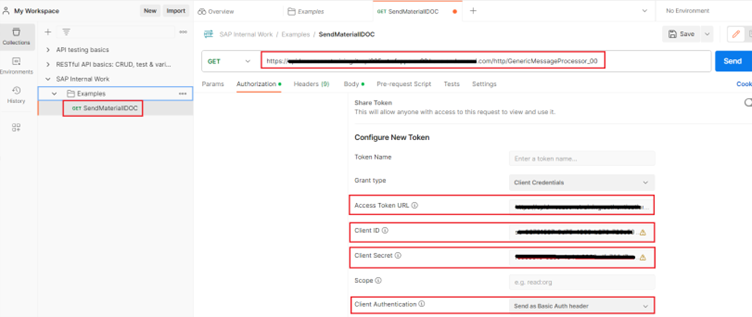

    Refer "[OAuth2 Client Credentials](#oauth2-client-credentials)" for fetching authentication details.
6. After providing authentication details click on "Get New Access Token" and then "Use Token" as shown below

    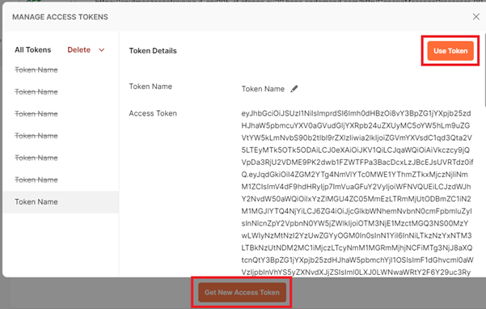

7. After the authentication is successful, create MATMAS05 IDOC request structure to be sent as payload and add it to the "Body" tab as shown below. Refer "[R1CH01007_RAW_MAT_IDOC.xml](readmeRefrences/R1CH01007_RAW_MAT_IDOC.xml)" for sample payload structure.

    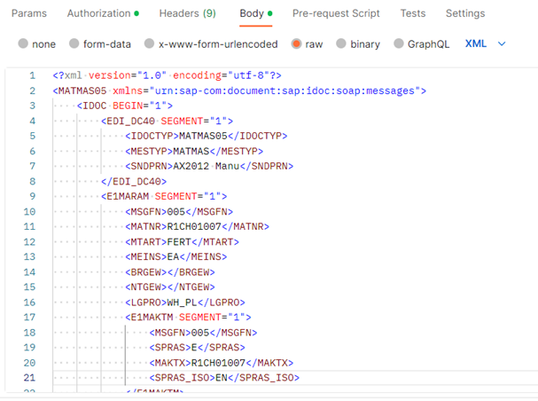
    
    Refer "[Sample Data](#sample-data)" if you would like to try other master and transactional data.
8. Click "Send" and check for HTTP call status should be success "200 OK".
9. Launch SAP DM, open "Integration Message Dashboard" and verify that the material was sent successfully as shown below.

    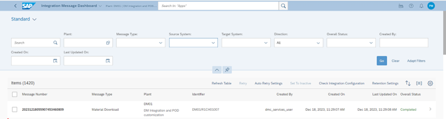

10. In SAP DM, open "Manage Material" and verify that the material was created successfully as shown below.

    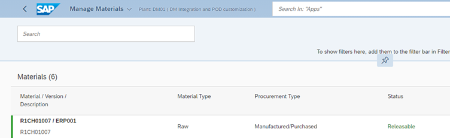

# Sample Data

Create below sample master and transactional data using the above process. Only the request payload (IDOC) needs to be changed in every HTTP call.

| **S.No.** | **Object Type** | **Object Name** | **Sample IDOC File** |
| --- | --- | --- | --- |
| 1. | Material (Finished) | S1SP02677 | [S1SP02677_FINISHED_MAT_IDOC.xml](readmeRefrences/S1SP02677_FINISHED_MAT_IDOC.xml) |
| 2. | Material (Raw) | R1CH01007 | [R1CH01007_RAW_MAT_IDOC.xml](readmeRefrences/R1CH01007_RAW_MAT_IDOC.xml) |
| 3. | Material (Raw) | R1MF00012 | [R1MF00012_RAW_MAT_IDOC.xml](readmeRefrences/R1MF00012_RAW_MAT_IDOC.xml) |
| 4. | Work Centre | TEST\_AZ | [LOIWCS03.xml](readmeRefrences/LOIWCS03.xml) |
| 5. | Production Order | 208277436 | [LOIPRO05.xml](readmeRefrences/LOIPRO05.xml) |

# OAuth2 Client Credentials

1. Open BTP cockpit and navigate to space of the SAP Cloud Integration sub-account.
2. Go to Instances and filter "Process Integration Runtime" service and "integration-flow" plan.
3. Click on key to get the OAuth2 Client Credentials details as shown below. 
    
    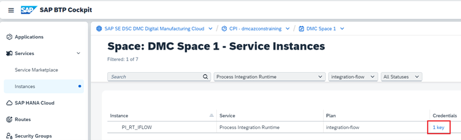

4. If the instance is not available, then "Create" new instance of "Process Integration Runtime" service and "integration-flow" plan type as shown below. Provide an "Instance Name".

    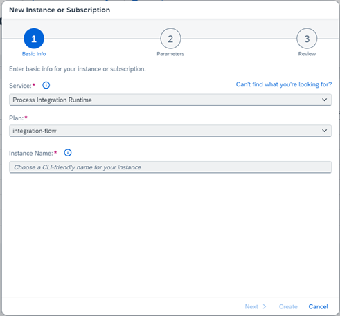

5. Once the instance is created then select that instance and navigate to "Service Keys" tab. Create a new Key as shown below. Provide "Service Key Name" 
    
    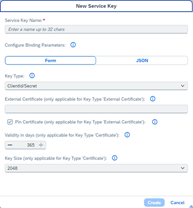

6. Once the key is created use it to get the OAuth2 Client Credentials details