# Outbound request from SAP DM system to non-SAP ERP system using SAP DM integration workflows.

**Scenario**

This scenario will cover the outbound integration of SAP DM with non-SAP ERP system using standard SAP DM integration workflows. Details on how it can be achieved are covered in this document below using an example of Outbound **Production Order Yield Confirmation** workflow.

**Steps to create**

**(1)** Create **NON\_ERP\_MOCK** server to simulate a NON-SAP ERP API call. You may use any API testing tools like postman or mockable.io. For this example, we have used mockable.io.

  a. Launch mockable.io and create a "New REST Mock". Provide details as shown below.

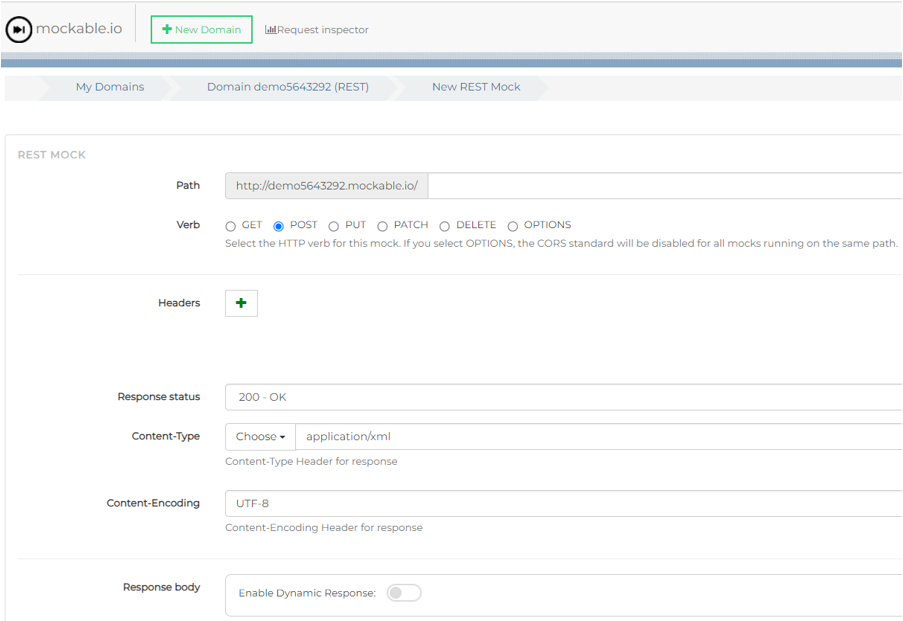

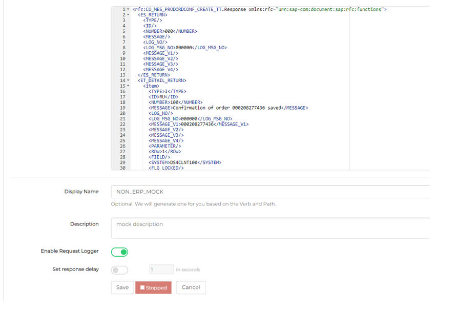

  b. In the response body provide the sample response XML. Please ensure the response XML is in the format returned by standard timetickets confirmation BAPI (CO\_MES\_PRODORDCONF\_CREATE\_TT). Refer [PRODORDCONF\_CREATE\_TT\_RESPONSE.xml](readmeRefrences/PRODORDCONF_CREATE_TT_RESPONSE.xml) for sample response.

  c. Save and start the mock server.

**(2)** Create **CUSTOM\_BAPI\_SERVICE\_PROCESSOR** artifact to call NON-ERP system instead of SAP ERP using standard SAP DM workflows.

  a. Go to SAP Cloud Integration and click on "Build and Develop Integration content" icon.

  b. Filter for package "SAP S/4HANA Integration with SAP Digital Manufacturing Cloud" as shown below and open. 

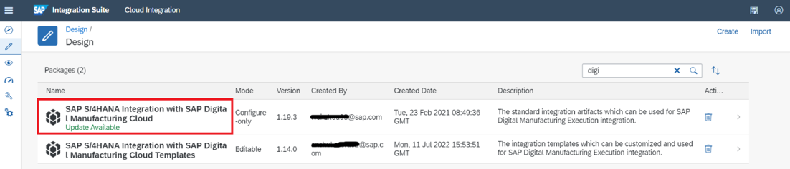
  c. Navigate to "Artifacts" tab and filter for "BAPI Service Processor" as shown below.

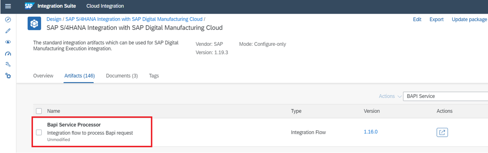

  d. Click on "Action" and "Copy". Create a copy by proving the name and selecting the package as shown below. The artifact will be created successfully in the selected package.

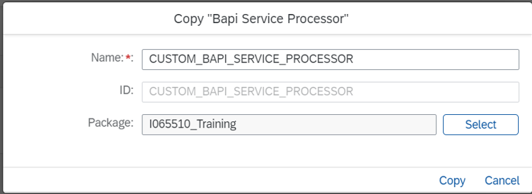

  e. Open **CUSTOM\_BAPI\_SERVICE\_PROCESSOR** artifact and make the changes as shown below.

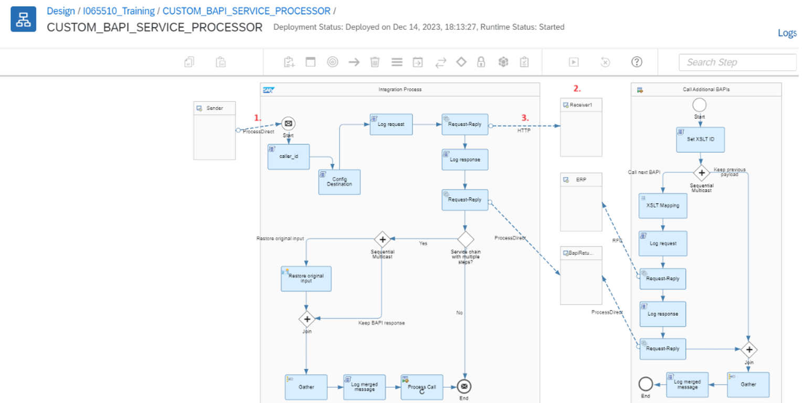

1. Open "ProcessDirect" link and open "Connection" tab. Change the Address from BAPI\_SERVICE\_PROCESSOR to NON\_ERP\_BAPI\_SERVICE\_PROCESSOR as shown below.

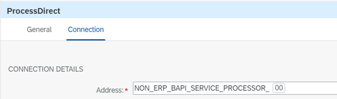

2. Add Receiver by clicking on Participants icon

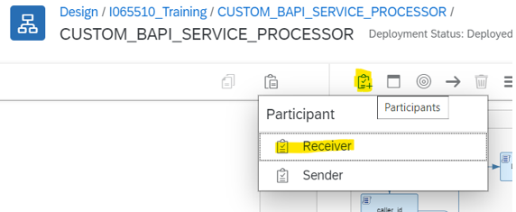

3. Remove the existing "RFC" link and make a new "HTTP" type connection from "Request-Reply" to newly added "Receiver1". Configure "HTTP" link as shown below.

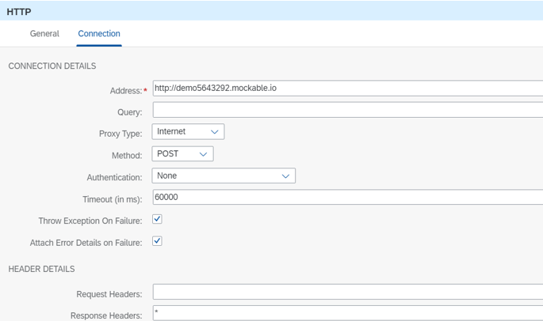

**(3)** Modify **Production Order Confirmation** workflow.

  a. Open SAP DM and navigate to "Manage Integration Workflows".

  b. Open Production Order Confirmation workflow and for "Service Stage Configuration" step specify "Custom Service Workflow" as "NON\_ERP\_BAPI\_SERVICE\_PROCESSOR\_{{ENDPOINT\_ID}}". Refer screenshot below.

**(4)** Verify **Collaboration Links** are maintained correctly.

  a. Open SAP DM and navigate to "Manage Collaboration Links".

  b. Open "COLLABORATION\_ERP\_YIELD\_CONFIRMATION" link and ensure that "ERP\_YIELD\_CONFIRMATION" directive is selected.

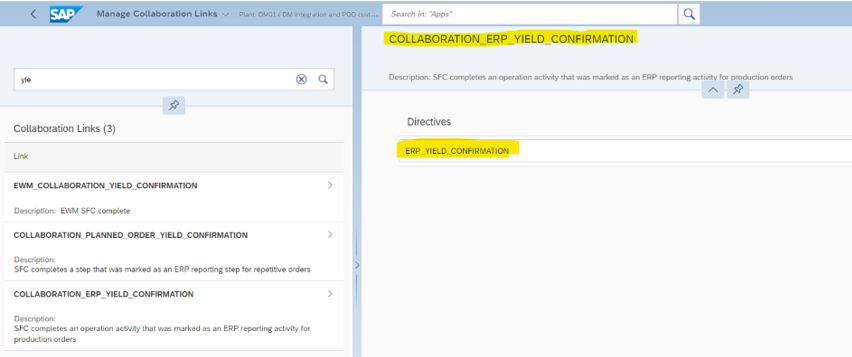

**(5)** Verify **Integration** settings are maintained correctly.

  a. Open SAP DM and navigate to "Manage Business Settings".

  b. Open "Integration" settings and maintain. Refer below for a sample.

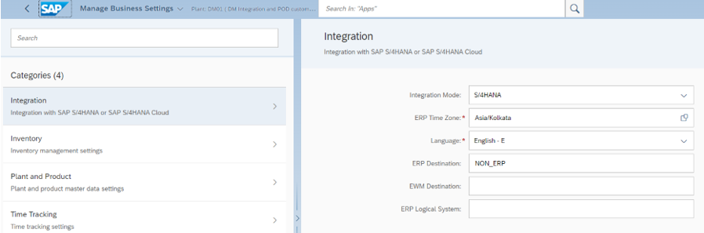

**(6)** Send **master and transactional data** to SAP DM from NON-SAP ERP system. Create below specified data which is already covered in [InboundFromNonSAPERPToSAPDMExample](../InboundFromNonSAPERPToSAPDMExample) example.

| **S.No.** | **Object Type** | **Object Name** |
| --- | --- | --- |
| 1. | Material (Finished) | S1SP02677 |
| 2. | Material (Raw) | R1CH01007 |
| 3. | Material (Raw) | R1MF00012 |
| 4. | Work Centre | TEST\_AZ |
| 5. | Production Order | 208277436 |

- Verify all the master data is created successfully in SAP DM.
- Release the production order so that the SFC's are created in SAP DM.

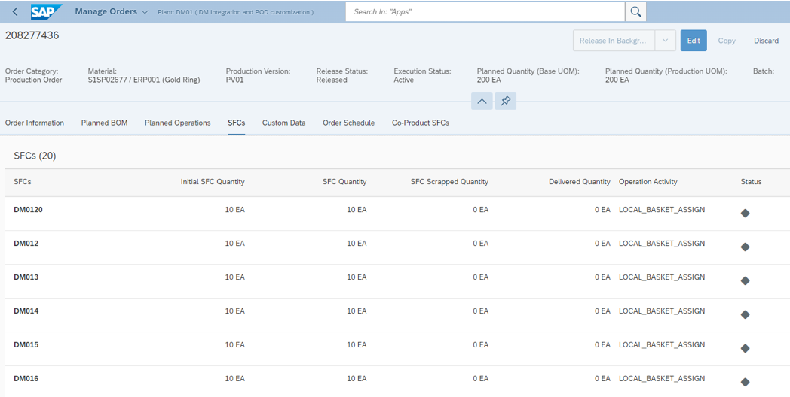

**(7)** Execution using "Work Center POD" in SAP DM

  a. Open "Work Center POD"

  b. Select Work Center and Resource. Click on "Go", SFC list will be displayed as shown below.

  c. Select any SFC (for example DM0115)

  d. Start & complete the operation as shown below. This should trigger the production order yield confirmation.

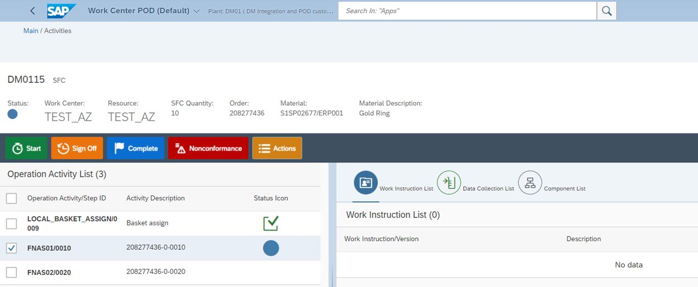

**(8)** Verify that the production order confirmation was done successfully.

  a. Open SAP DM and navigate to "Integration Message Dashboard".

  b. Filter for "Message Type" as "Production Order Yield Confirmation".

  c. Open details of your SFC record and verify that the status is "Completed".

  d. Navigate to CPI logs tab and verify that the "CUSTOM\_BAPI\_SERVICE\_PROCESSOR" was called successfully.

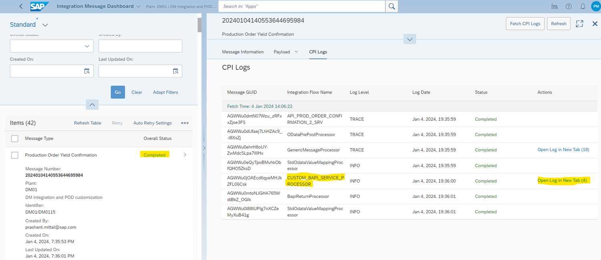

  e. To verify the request and response from the NON\_ERP\_MOCK server, click on "Open Log in New Tab (4)". Two of those tabs will have the request (Tab 2) and response (Tab 3).