# SAP DM How to Guide - Custom SAP DM S4HANA Cloud Public Message Aggregation

## Change History

| Date     | Version  | Author                  | Reviewer      | Approver  | Status    | Comment                        |
| -------- | -------- | ----------------------- | ------------- | --------- | --------- | ------------------------------ |
| 11-Mar-25| 1.0      |  Winter, Ou; Jace, Yang | Eason, Ling   |           | Done      | Draft                          |
| 1-May-25 | 1.1      | Eason, Ling             |               |           | Done      | Add more details               |

## 	Background
This package is just a Proof of concept that CPI can help DM to aggregate the messages to S4 Hana cloud public.Based on the [blog](https://community.sap.com/t5/supply-chain-management-blogs-by-sap/managing-erp-load-with-custom-correlation-in-sap-digital-manufacturing/ba-p/13793498), Sara Mani mentioned some possible solutions in S4 or DM side to improve the performance, however, the aggregation logic is raised here for further customization.
The main message here is for SFC yield confirmation aggregation.
Please perform the VTO before you deploy to your production environment!

> [!CAUTION]
>
> > Limitations:
> >
> > 1.	Aggregated message: if any failure happens in scheduler, and retry counter is greater than the retry limitation, please have your own logic to perform the manual retry from failed JMS queue. This PoC is not covered the manual processing part.
> > 2.	Incoming messages should in sequence and no parallel processing. Even the message counter Data store may encounter issues if the message volume becomes greater than 3 messages/second.
> > 3.	Scheduler can only process 1 message at a schedule run in this PoC.

## 	Configuration
### SAP DM
1. Login the SAP DM and search for “Manage Web Servers”:

2. Register CPI as webserver.

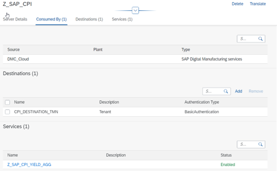

3. Define a schema.

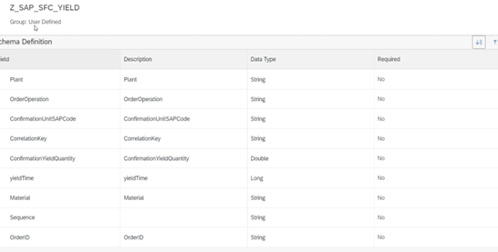

4. Register CPI Iflow as service, this step should be done after the CPI package imported and deployed.

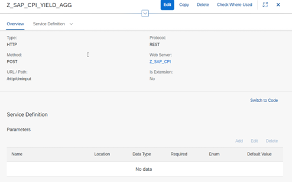

5. Create a PPD which will be triggered when the trigger for SFC yield.

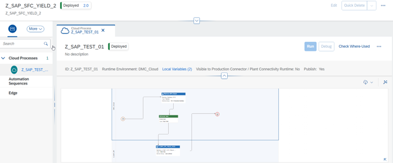

Import the [2025-03-27-04-50-30.dmcbak](./2025-03-27-04-50-30.dmcbak) with password: [1qaz@WSX]()

6. Create a business rule.

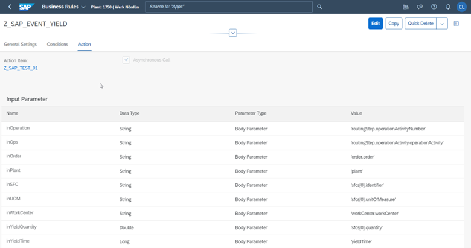

7. Disable ERP yield collaboration.

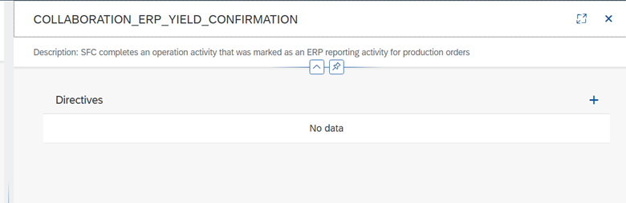

### SAP CPI

1.	Login SAP CPI, select “Design” and click import:

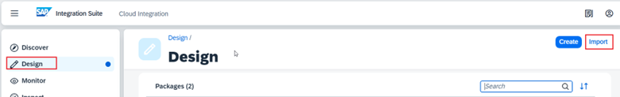

2.	Import package "[DMC Message Aggregator for S4HPC.zip](./DMC%20Message%20Aggregator%20for%20S4HPC.zip)"

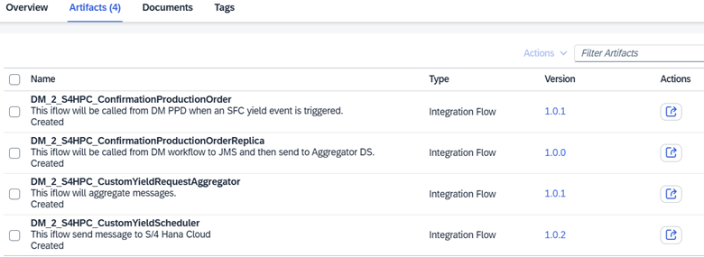

3.	DM_2_S4HPC_ConfirmationProductionOrder: This iflow will be called from DM PPD when an SFC yield event is triggered. This is the entry point for SAP DM, the URL need to be referred to configure the service endpoint in SAP DM.

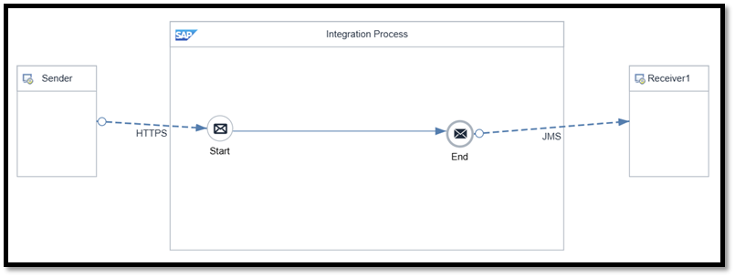

4.	DM_2_S4HPC_ConfirmationProductionOrderReplica: this iflow is called by SAP DM, in which the counter and wait time are calculated accordingly. 

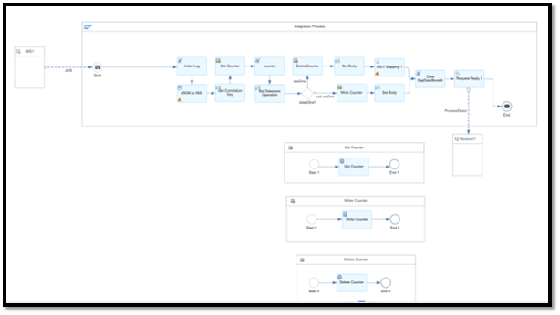

Parameters:

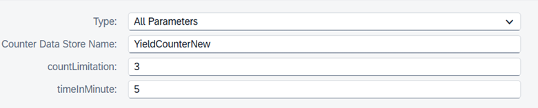

| Parameter Name          | Description                                                  | Configuration Suggestion                                     |
| ----------------------- | ------------------------------------------------------------ | ------------------------------------------------------------ |
| Counter Data Store Name | The data store name of the message counter and first message wait time. | Make it message relevant.                                    |
| countLimitaion          | Define how many messages will be waiting for aggregation.    | Based on your real case.                                     |
| timeInMinute            | Define the first message wait time in minute.                | Based on your real case, but less than Completion Timeout(in min). |

5.	DM_2_S4HPC_CustomYieldRequestAggregator: this iflow is called by previous iflow as main aggregator process.

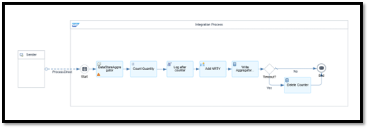

Parameters:

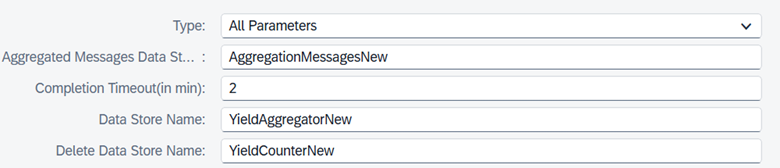

| Parameter Name                      | Description                                                  | Configuration Suggestion  |
| ----------------------------------- | ------------------------------------------------------------ | ------------------------- |
| Aggregated Messages Data Store Name | Define the data store name for aggregated messages.          | Make it message relevant. |
| Completion Timeout(in min)          | Define the aggregator timeout.                               | Based on your real case.  |
| Data Store Name                     | Define the data store name of the aggregator.                | Make it message relevant. |
| Delete Data Store Name              | The data store name of the message counter and first message wait time. | Make it message relevant. |

6.	DM_2_S4HPC_CustomYieldScheduler: This iflow send aggregated message to S/4 Hana Cloud

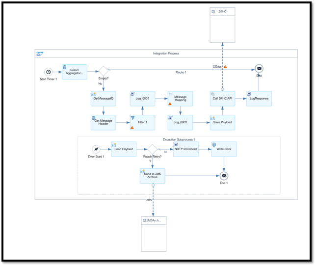

Timer Parameters:

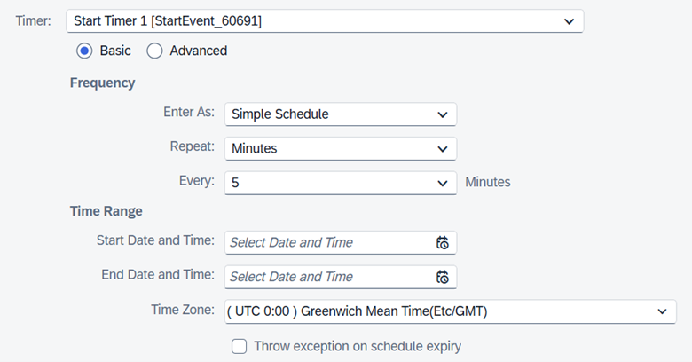

Receiver Parameters:

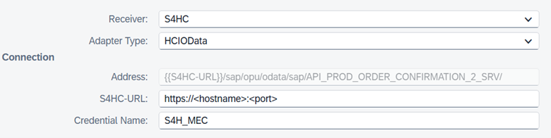

Other Parameters:

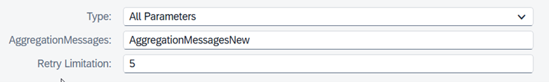

| Parameter Name      | Description                                              | Configuration Suggestion                                    |
| ------------------- | -------------------------------------------------------- | ----------------------------------------------------------- |
| Timer               | Define the frequency of the iflow.                       | Every 2~3 seconds per message, also can based on real case. |
| S4HC-URL            | Define the S4HC hostname and port to be called.          | Based on your real case.                                    |
| Credential Name     | Define the security material name maintained previously. | Based on your real case.                                    |
| AggregationMessages | Define the data store name for aggregated messages.      | Make it message relevant.                                   |
| Retry Limitation    | Define the retry limitation of the failed message.       | Based on your real case.                                    |

7.	Configure the Security material with the S4HC integration user and password.

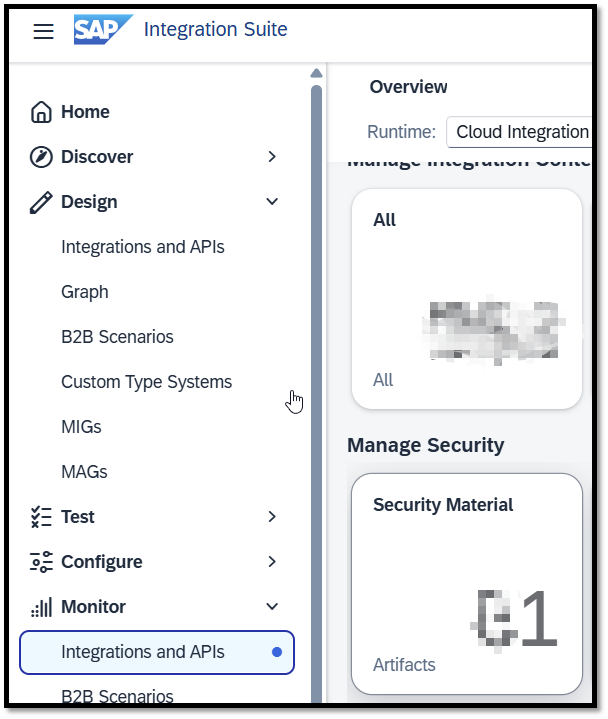 

### Task List

- [ ] Data Store Sender Adapter to replace the scheduler.
- [ ] JMS Sender Adapter to replace the scheduler.
- [ ] DMC Alert of failed messages.
