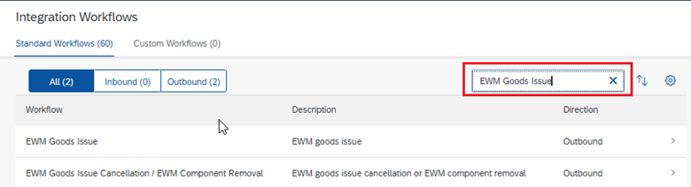

# SAP DM How to Guide - Custom SAP DM EWM GI Message Aggregation

## Change History

| Date        | Version | Author                  | Reviewer | Approver | Status | Comment                                                   |
| ----------- | ------- | ----------------------- | -------- | -------- | ------ | --------------------------------------------------------- |
| 19-Nov-24   | 1.0     | Eason, Ling; Sarah, Nie |          |          | Done   | Draft                                                     |
| 24-Nov-24   | 1.1     | Eason, Ling             |          |          | Done   | Add Testing Data                                          |
| 26-Nov-24   | 1.2     | Eason, Ling             |          |          | Done   | Add Configuration Guide                                   |
| 29-Nov-24   | 1.3     | Eason, Ling; Sarah, Nie |          |          | Done   | Add aggregated message error handling at DM and CPI side. |
| 6-June-2025 | 1.4     | Eason, Ling             |          |          | Done   | Optimize the logic                                        |
| 9-June-2025 | 1.5     | Eason, Ling             |          |          | Done   | Add JMS and DS processing Logic and retry logic.          |

## 	Background

This package is just a Proof of concept that CPI can help DM to aggregate the messages to S4 Hana cloud private. Based on the [blog](https://community.sap.com/t5/supply-chain-management-blogs-by-sap/managing-erp-load-with-custom-correlation-in-sap-digital-manufacturing/ba-p/13793498), Sara Mani mentioned some possible solutions in S4 or DM side to improve the performance, however, the aggregation logic is raised here for further customization.

The main message in this document is for EWM Goods Issue Aggregation.

Please perform the VTO before you deploy to your production environment!

> [!CAUTION]
>
> > Limitations:
> >
> > 1.	Aggregated message: Even the auto retry and manual retry are covered in this PoC, you can also define your own retry solution by using the JMS queue. There is no wait time for the auto retry, only the retry limitation.
> > 2.	Incoming messages should in sequence and no parallel processing. Even the message counter Data store may encounter issues if the message volume becomes greater than 3 messages/second.
> > 3.	Scheduler can only process 1 message at a schedule run in this PoC.
> > 4.	Datastore sender adapter may required further CPI license if you want to use it, and S4 side lock situation may happen.
> > 5.	If you want to use the JMS queue for the aggregation message, please ensure no parallel processing for the queue.

## 	Configuration

### SAP DM Workflow

1.	Login the SAP DM and search for “Manage Integration Workflows”:

 

2. Search for “EWM Goods Issue”:

3. Maintain Custom request XSLT in service configuration:

This the source XSLT you can refer to the [XSLT](./DM_requestXSLT.xml).

4. Maintain Custom Service in the service configuration:

### SAP CPI

1.	Login SAP CPI, select “Design” and click import:

    
2. Import Iflow: select the package for import,"[DMC Message Aggregator for S4 Private Cloud.zip](./DMC%20Message%20Aggregator%20for%20S4%20Private%20Cloud.zip)".

| **Iflow**                                            | **Description**                                              |
| ---------------------------------------------------- | ------------------------------------------------------------ |
| **Custom EWM  GoodsIssue Aggregate process request** | Main Iflow                                                   |
| **Custom EWM GoodsIssue Aggregator**                 | called by  main iflow, the aggregator is called              |
| **Custom Scheduler  for EWM Goods Issue Aggregator** | a scheduler to select  the aggregated message and process it. |
| **Custom Process EWM Aggregation Messages**          | Iflow will be  called by DM PPD from Alert.                  |
| **Custom Raise Alert  to DM**                        | Iflow will be called  by CPI if manual retry required.       |
| **Custom DS for EWM Goods Issue Aggregator**         | Use DS sender  adapter to replace timer.  Require more  license, may result in parallel processing for the same order. |
| **Custom JMS for EWM  Goods Issue Aggregator**       | The aggregated message  can be sent to JMS queue.            |
| **Custom JMS for EWM Goods Issue Process**           | JMS sender  adapter to process the aggregated messages.      |
| **Testing from SoapUI  or Postman**                  | By configuration, this  can test the process direct iflows on demand with different XML request. |

3. Configuration Iflow as expected:

>a.   Custom EWM GoodsIssue Aggregate request; - Main Iflow;

| **Parameter Name**             | **Description**                                              | **Configuration Suggestion**                                 |
| ------------------------------ | ------------------------------------------------------------ | ------------------------------------------------------------ |
| **Completion Timeout(in min)** | Only used for response.                                      | Same in Custom EWM GoodsIssue Aggregator.                    |
| **Counter Data Store Name**    | The data store name of the message counter and first  message wait time. | Make it message relevant.                                    |
| **countLimitaion**             | Define how many messages will be waiting for aggregation.    | Based on your real case.                                     |
| **Data Store Name**            | Only used for response.                                      | Same in Custom EWM GoodsIssue Aggregator.                    |
| **Enable Logging**             | To enable the logging of documents.                          | Default is Y, when you don’t need extra logs, then set to other  value. |
| **timeInMinute**               | Define the first message wait time in minute.                | Based on your real case, but less than Completion  Timeout(in min). |

 

>b.   Custom EWM GoodsIssue Aggregator; - called by main iflow, the aggregator is called;

| **Parameter Name**                         | **Description**                                              | **Configuration Suggestion**                                 |
| ------------------------------------------ | ------------------------------------------------------------ | ------------------------------------------------------------ |
| **Aggregated Messages Data Store Name**    | Define the data store name for aggregated messages.          | Make it message relevant.                                    |
| **Aggregator Data Store Name**             | Define the data store name of the aggregator.                | Make it message relevant.                                    |
| **Completion Timeout(in min)**             | Define the aggregator timeout.                               | Based on your real case.                                     |
| **Counter Data Store Name**                | The data store name of the message counter and first  message wait time. | Make it message relevant.                                    |
| **Enable Logging**                         | To enable the logging of documents.                          | Default is Y, when you don’t need extra logs, then set to other  value. |
| **countLimitaion**                         | Define how many messages will be waiting for aggregation.    | Based on your real case.                                     |
| **Process Aggregated Message By (JSM/DS)** | Define which sender  adapter to use to process the aggregated messages. | Default is DS.                                               |

>c.   Custom Scheduler for EWM GI Aggregator; - a scheduler to select the aggregated message and process it.

| **Parameter Name**                                | **Description**                                              | **Configuration Suggestion**               |
| ------------------------------------------------- | ------------------------------------------------------------ | ------------------------------------------ |
| **EWM Destination in DM**                         | Copy from DM.                                                | Copy from DM.                              |
| **Failed Messages Data Store Name**               | Define the failed messages data store name.                  | Can be shared with other messages.         |
| **Retry Limitation**                              | Define how many times the messages can be auto tried.        | Based on your real case.                   |
| **Select Data Store Name**                        | Same as the aggregated message data store.                   | Same as the aggregated message data store. |
| **Store Failed Aggregated Message to Data Store** | True/False, True means no auto retry, false will take retry  limitation to auto retry the message. | Based on your real case.                   |

>d.   Custom Process EWM Aggregation Messages; - Iflow will be called by DM PPD from Alert.

| **Parameter Name**                  | **Description**                             | **Configuration Suggestion**       |
| ----------------------------------- | ------------------------------------------- | ---------------------------------- |
| **Failed Messages Data Store Name** | Define the failed messages data store name. | Can be shared with other messages. |

>e.   Custom Raise Alert to DM; - Iflow will be called by CPI if a manual retry required.

| **Parameter Name**   | **Description**              | **Configuration Suggestion** |
| -------------------- | ---------------------------- | ---------------------------- |
| **DM API URL**       | Define the DM API URL.       | Based on your real case.     |
| **DM Alert PPD KEY** | Define the DM Alert PPD KEY. | Based on your real case.     |

> [!CAUTION]
> > Above parameters will need to be configured after you get the SAP DMC PPD related information.

>f.    Custom DS for EWM Goods Issue Aggregator

| **Parameter Name**       | **Description**                                              | **Configuration Suggestion**               |
| ------------------------ | ------------------------------------------------------------ | ------------------------------------------ |
| **Data Store Name**      | Same as the aggregated message data store.                   | Same as the aggregated message data store. |
| **Poll Interval (in s)** | If no messages in the DS, how many seconds to system will  try to poll from the DS. | Based on your real case.                   |

| **Parameter Name**                  | **Description**                                       | **Configuration Suggestion**                                 |
| ----------------------------------- | ----------------------------------------------------- | ------------------------------------------------------------ |
| **Enable Logging**                  | To enable the logging of documents.                   | Default is Y, when you don’t need extra logs, then set to other  value. |
| **EWM Destination in DM**           | Copy from DM.                                         | Copy from DM.                                                |
| **Failed Messages Data Store Name** | Define the failed messages data store name.           | Can be shared with other messages.                           |
| **Retry Limitation**                | Define how many times the messages can be auto tried. | Based on your real case.                                     |
| **Select Data Store Name**          | Same as the aggregated message data store.            | Same as the aggregated message data store.                   |

>g.   Custom JMS for EWM Goods Issue Process 

| **Parameter Name** | **Description**    | **Configuration Suggestion** |
| ------------------ | ------------------ | ---------------------------- |
| **Queue Name**     | The JMS queue name | Based on your real case.     |

 

>h.   Custom JMS for EWM Goods Issue Aggregator

| **Parameter Name** | **Description**    | **Configuration Suggestion** |
| ------------------ | ------------------ | ---------------------------- |
| **Queue Name**     | The JMS queue name | Based on your real case.     |

 

| **Parameter Name**                  | **Description**                                       | **Configuration Suggestion**                                 |
| ----------------------------------- | ----------------------------------------------------- | ------------------------------------------------------------ |
| **Enable Logging**                  | To enable the logging of documents.                   | Default is Y, when you don’t need extra logs, then set to other  value. |
| **EWM Destination in DM**           | Copy from DM.                                         | Copy from DM.                                                |
| **Failed Messages Data Store Name** | Define the failed messages data store name.           | Can be shared with other messages.                           |
| **Retry Limitation**                | Define how many times the messages can be auto tried. | Based on your real case.                                     |

>i.    Testing from SoapUI or Postman

 

| **Parameter Name** | **Description**          | **Configuration Suggestion**             |
| ------------------ | ------------------------ | ---------------------------------------- |
| **Address**        | The process direct name. | Set the process direct you want to test. |

4.	Deploy Iflows in SAP CPI.

### SAP DM PPD
As a reference, you can also import the [2024-12-03-03-51-59.dmcbak](./2024-12-03-03-51-59.dmcbak) with password: [1qaz@WSX]()

#### Setup the PPD which will be called from CPI to raise Alert:

1.	Login the SAP DM and search for “Design Production Processes”:

2.	Create a PPD to raise Alert:

3.	Make the PPD as service:

4.	Get the key of PPD in “Manage Service Registry”:

5.	Get the DM API URL from “Manage Web Servers”:

6.	Configure the Iflow “Custom Raise Alert to DM”:

#### Setup the PPD which will called CPI to retry failed aggregated message:

1.	Setup Web server in “Manage Web Server”: With CPI host URL and pre-configured destination on BTP.

2.	Make CPI connected with DMC_Cloud:

3.	Get the endpoint of iflow “Custom Process EWM Aggregation Messages” in CPI “Manage Integration Content”:

4.	Main the service in “Manage Service Registry”:

5.	Create a PPD to call this service:

6.	Make the created PPD as service. This is the samilar step as step 3 in “Setup the PPD which will be called from CPI to raise Alert”.

### SAP DM Alert
1.	Login the SAP DM and search for “Manage Alert Types”: with alert data schema DME_Shopfloor.

 

2.	Setup alert actions with the second created PPD:

 

> [!IMPORTANT] 
>
> > Example only show the PoC result when message process failed in CPI, which will send this information to DMC alert. Such as S4 side material lock or order lock result in message process fail.
> >  
> >
> > You can reprocess the message by click the retry custom action, with the alert Id if the CPI message process success, the alert will be closed automatically. The messageID is auto filled in, when you click the RETRY button.
> >  

## Example of define the configuration parameters in SAP CPI
>[!WARNING]
> >This is only the example of define the configuration parameters in SAP CPI. You can define the parameters in your own way.
> > 

We take 2 elements into consideration while doing the message aggregation:
- :hourglass:Time: When messages are waited for specific time, the aggregation happens.
- :+1:Quantity: When messages reach to a specific number, the aggregation happens.

> [!TIP]
>
> Both elements are related with correlationKey.
>
> When in high volume, quantity condition is the limitation to make package small, otherwise in a specific time the message package will be huge and increase the backend processing time.
>
> When in low volume, time condition is the limitation to ensure the message exchange efficiency, otherwise the messages will wait for the quantity limit for a long time.

In CPI, we have 3 conditions:
1.	Counter(countLimitation parameter): when a specific amount of message reached, we will set the message to the last message; like 100 messages.
2.	Timer(timeInMinute parameter): when the first message of the correlationKey waited in the queue for a specific time, we will set the message to the last message; like 5 mins.
3.	Complete timeout: when a correlationKey message queue waited for a specific time, and no more messages come in, then accumulated messages will be aggregated.

