# How to write Custom Pre-XSLT Workflow program & Custom XSLT and use them as plugin in SAP DM Integration Workflows

**Scenario**

As shown in the image below, each attribute of SAP DM integration workflow is divided into two categories:

- Standard (optionally pre-shipped as part of SAP DM integration workflow)
- Custom (can be provided by partners or customers and takes priority over Standard)

Partners/Customers can write their own custom workflow programs or custom XSLT and use it in the DM integration workflows. Details on how it can be achieved are covered in this document below using an example of Inbound Production Order Download **LOIPRO05 V2** workflow.

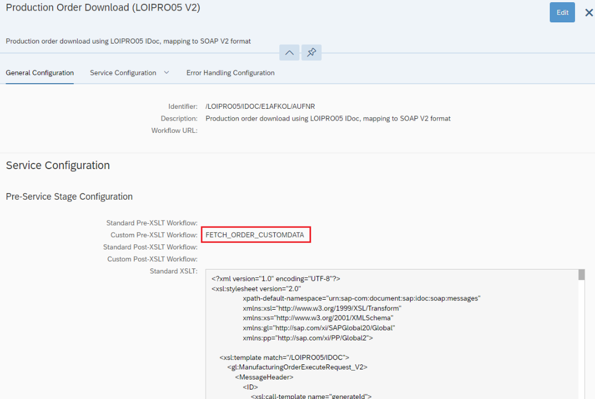

_Figure 1_

**Custom Pre-XSLT Workflow** may be used for data enrichment of payload by getting data from sources like SAP DM API's, BAPI/RFC or any other third-party API's. In this example, FETCH\_ORDER\_CUSTOMDATA workflow will help to enrich incoming Production Order IDOC with SAP DM production order custom data (CONFIRMATIONHISTORY1, CONFIRMATIONHISTORY2). Refer "[Writing Custom Pre-XSLT Workflow Program](#writing-custom-pre-xslt-workflow-program)" for details.

**Note:** Custom Post-XSLT workflow can also be created and used in similar way.

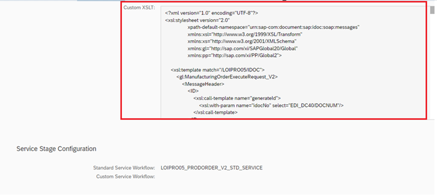

_Figure 2_

­ **Custom XSLT** are generally used to create API request structures like Standard XSLT. In addition to that they can also be used to map any additional data fields or make data alterations like removing leading zeros etc. In this example the custom XSLT modification is to map the production order custom data fields (CONFIRMATIONHISTORY1, CONFIRMATIONHISTORY2) which were enriched in the IDOC using FETCH\_ORDER\_CUSTOMDATA workflow. Refer [Writing Custom XSLT](#writing-custom-xslt) for details.

# Writing Custom Pre XSLT Workflow Program

This can be written as an integration flow (iFlow) in SAP Cloud Integration.

**Steps to create.**

1. Open SAP Cloud Integration and click on "Build and Develop Integration content" icon
2. Click "Create" button to create new package or use any existing package.
3. Open the package and click on Edit button.
4. Navigate to "Artifacts" tab and click on "Add" -\> "Integration Flow"
5. Provide Name (for e.g. FETCH\_ORDER\_CUSTOMDATA) and ID and click on "OK".
6. Open the iFlow and design as shown in the image below. Refer [FETCH_ORDER_CUSTOMDATA.zip](readmeRefrences/FETCH_ORDER_CUSTOMDATA.zip) for sample iFlow.

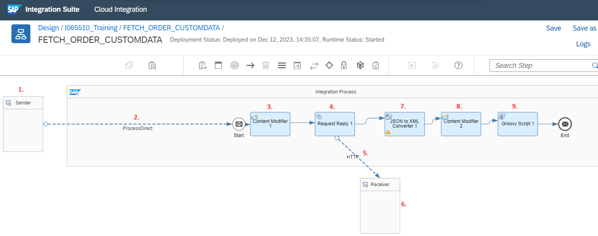

_Figure 3_

Details of iFlow

1. **Sender** - You use the HTTPS sender adapter to communicate with receiver systems using HTTPS message protocol.
2. **Process Direct** - The ProcessDirect adapter offered by SAP Cloud Integration enables you to communicate with other integration flows deployed in your tenant. In this example the custom iFLow (FETCH\_ORDER\_CUSTOMDATA) will be called by standard "General Message Processor" iFlow (this is part "SAP S/4HANA Integration with SAP Digital Manufacturing Cloud" package). In connection details specify Address as "FETCH\_ORDER\_CUSTOMDATA". This should be same as specified in Custom Pre-XSLT workflow (Refer Figure 1).

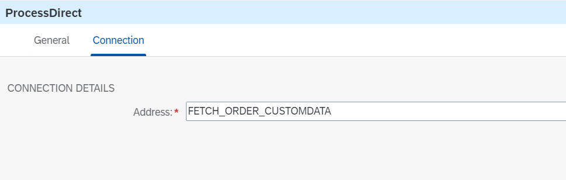

_Figure 4_

3. **Content Modifier 1** – In Exchange Property tab, create properties to store original IDOC message, plant and order number as shown below.

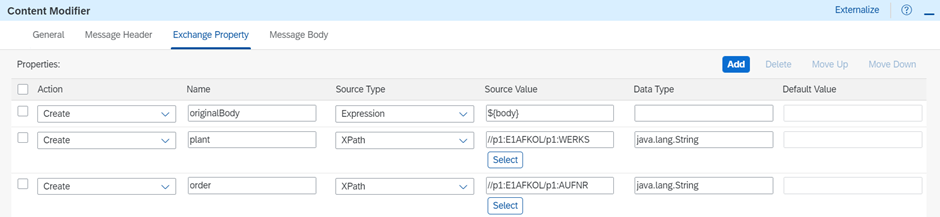

_Figure 5_

4. **Request Reply 1** – This step is used to call an external receiver system in a synchronous step and get back a response. In this example make an SAP DM production order API call by passing plant and order information to fetch order details along with its custom data.
5. **HTTP** – Specify HTTP connection details as shown below and provide "OAuth2 Client Credentials" type credentials. Refer "[OAuth2 Client Credentials](#oauth2-client-credentials)" for details.

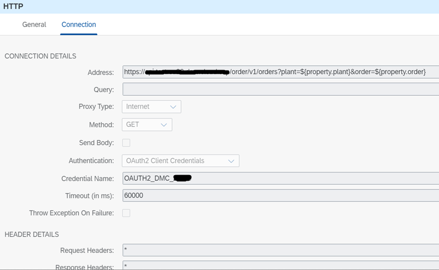

_Figure 6_

6. **Receiver** - Use the HTTP receiver adapter to communicate with target systems using HTTP message protocol. In this example the external receiver system is SAP DM.
7. **JSON to XML Convertor 1** – Convert the API response from JSON to XML
8. **Content Modifier 2** – In Exchange Property tab, create properties to store Confirmation History custom data fields (CONFIRMATIONHISTORY1, CONFIRMATIONHISTORY2) as shown below.

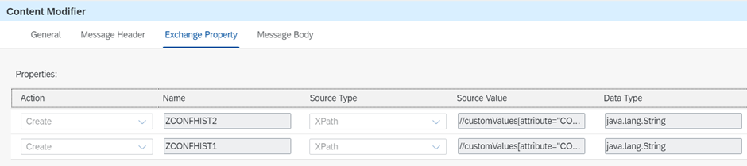

_Figure 7_

9. **Groovy Script 1** – Create script to append confirmation history data in E1AFKOL section of IDOC. Refer [GetOrderCustomData.groovy](readmeRefrences/GetOrderCustomData.groovy) for sample script.

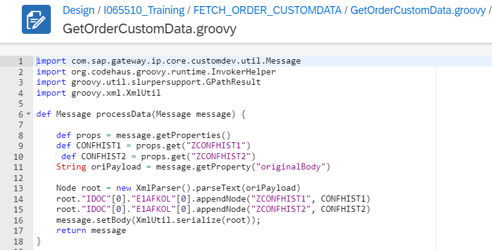

_Figure 8_

**Original IDOC** (without confirmation history data). Refer [LOIPRO05_Original.xml](readmeRefrences/LOIPRO05_Original.xml) for sample IDOC.

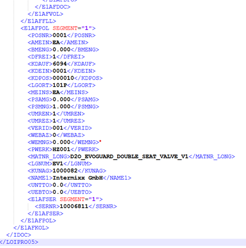

_Figure 9_

**Enriched IDOC** (with confirmation history data). Refer [LOIPRO05_Enriched.xml](readmeRefrences/LOIPRO05_Enriched.xml) for sample IDOC.

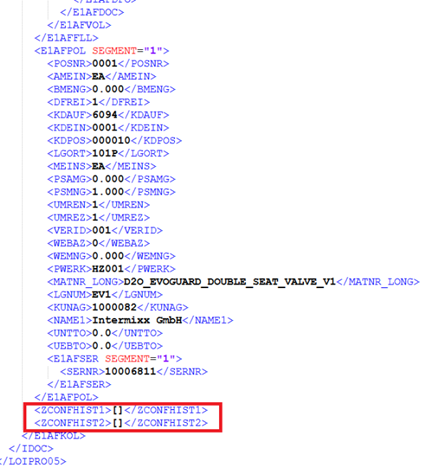

_Figure 10_

# Writing Custom XSLT

The custom XSLT's are written in a similar way how Standard XSLT's are written.

**Steps to create.**

1. Create a valid new XSLT using any of the XSLT editors. Or copy and modify the standard XSLT provided by SAP DM Integration workflow.
2. To use the custom XSLT in the workflow, just copy and paste in Custom XSLT field as shown in **Figure 2**.

**Custom XSLT** (with additional mapping for confirmation history data). Refer [CustomProductionOrderRequest.xsl](readmeRefrences/CustomProductionOrderRequest.xsl) for sample XSLT.

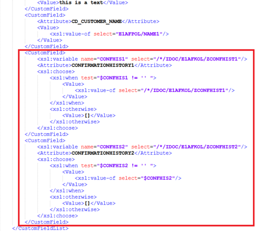

_Figure 11_

# OAuth2 Client Credentials

**Steps to create.**

  1. Open SAP Integration Suite, click on "Monitor Artifacts" icon and select "Integrations and APIs"

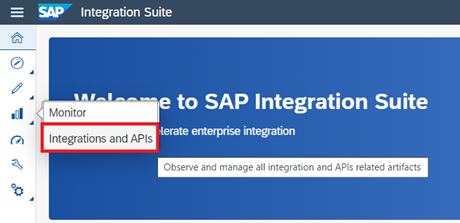

_Figure 12_

  1. Navigate to "Manage Security" and select "Security Material".
  2. Look for "OAuth2 Client Credentials" type credentials, if already configured to connect with the SAP DM system

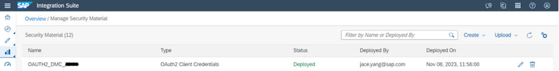

_Figure 13_

  1. If the credentials are not configured, then create new by clicking "Create" button and select "OAuth2 Client Credentials". Provide the credential information to connect with SAP DM system as shown below.

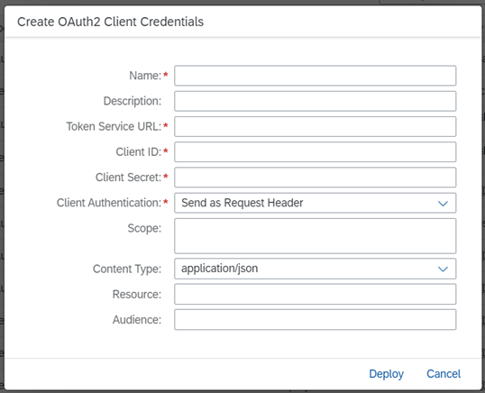

_Figure 14_
