# SAP DM Custom View POD Plugin Examples

This document will cover the below scenarios that may be used in SAP Digital Manufacturing (SAP DM) custom view POD plugin development.

1. **Scenario 1 – Calling Standard API** from custom POD plugin.
2. **Scenario 2 – Standard event publishing** from custom POD plugin.
3. **Scenario 3 – Standard event subscribing** in custom POD plugin.
4. **Scenario 4 – Custom event publishing** from custom POD plugin and **Subscribing** it in another custom POD plugin.
5. **Scenario 5 – Notification** to custom POD plugin from SAP DM Production Process or any other system through API call.
6. **Scenario 6 – POD Message Notification** to custom POD plugin from SAP DM Production Process.
7. **Scenario 7 – Calling SAP DM Production Process** from custom POD plugin.

 

**Prerequisite** (Only if deployed to BTP)

It is recommended to go through [InstallationAndConfigurationGuide](https://github.com/SAP-samples/digital-manufacturing-extension-samples/blob/main/dm-podplugin-extensions/ViewPodPluginTemplate_And_Example/documentation/InstallationAndConfigurationGuide.pdf) before starting these examples. This guide will help you to understand the end-to-end process involved in custom view POD plugin development.

- Set up Business Application Studio.
- Steps to be executed to implement the custom view POD plugin example.
- Deploy plugins to SAP BTP Cloud Foundry.
- Configure and test custom view POD plugin in SAP DM.

 

**Project detail to cover above scenarios.**

Setup an operation POD in SAP DM as shown below.

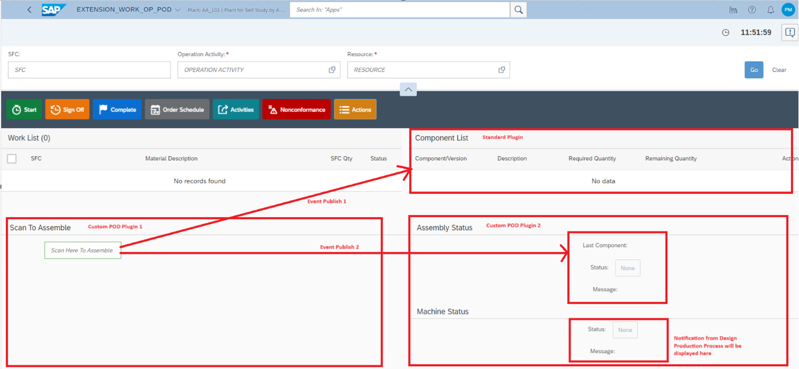

**For Scenario 1** - 'Custom POD Plugin 1' calls the standard SAP DM API to assemble the scanned component.

**For Scenario 2** - 'Custom POD Plugin 1' publishes a standard event 'Event Publish 1' to component list plugin which refreshes the component list after successful assembly to show the current status.

**For Scenario 3** - 'Custom POD Plugin 2' subscribes to a standard event which displays an information message to show the number of SFC's selected.

**For Scenario 4** - 'Custom POD Plugin 1' publishes 'Event Publish 2' to 'Custom POD Plugin 2' to update the assembly status of last scanned component as SUCCESS or ERROR.

**For Scenario 5** - 'Custom POD Plugin 2' has a Machine status section which subscribes to a custom notification event. When an event is published from SAP DM Production Process or any other source using notification service, the Machine status will be updated as READY or NOT\_READY.

**For Scenario 6** - 'Custom POD Plugin 2' subscribes to a standard POD Message notification event. When a POD Message event is published from SAP DM Production Process an information message will be displayed with the notification details.

**For Scenario 7** - 'Custom POD Plugin 2' calls the SAP DM Production Process that can be consumed as an API. For this example, we'll use the same SAP DM Production Process which is used in scenario 5 to update the Machine status as READY or NOT\_READY.

 

**Steps to setup.**

1. Follow Installation and Configuration guide as specified in prerequisite section. Clone the project [(dm-podplugin-extensions/CustomPodPluginExamples)](../../CustomPodPluginExamples) from GIT.

2. Upload the extension to POD Designer.

3. Create the POD layout in Main tab as shown below.

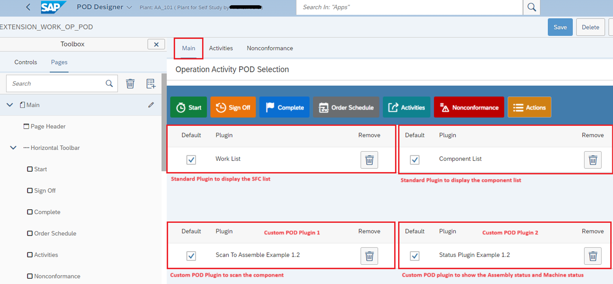

4. Click on 'Configure Notification' button and configure as shown below. This is done to enable the POD to receive notifications.

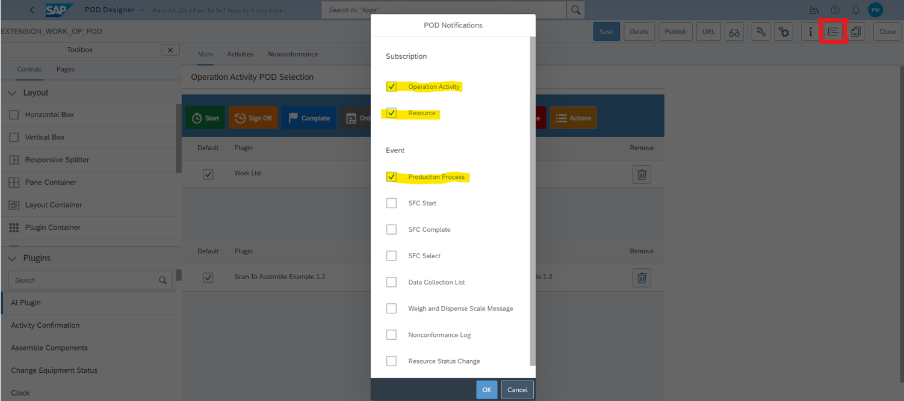

5. Save and launch URL to open the POD.  

 

**Note** : 
* Explanation of code will be covered in detail for each scenario later in this document.
* Event (Production Process) should be enabled when the POD must receive notification from SAP DM Production Process.

# Details on Scenario 1

The 'Custom POD Plugin 1' is used to scan the BOM component at a given assembly operation and resource. The plugin will then call a standard API to assemble the scanned component.

_**Note** : For successful assembly of component using this example, please ensure that 'Assembly Data Type' is 'NONE' for the BOM component._

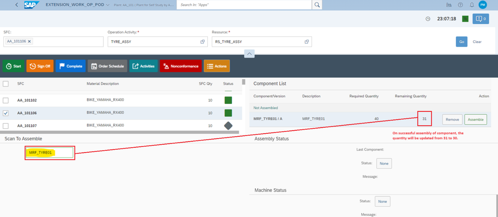

Below are the main code files to refer.

| **File Name** | **Plugin** | **Path** |
| --- | --- | --- |
| [MainView.controller.js](./controller/MainView.controller.js#L1) | Custom POD Plugin 1 | ExtensionWork/ScanToAssembleExample/./controller/MainView.controller.js |
| [MainView.view.xml](./view/MainView.view.xml#L1) | Custom POD Plugin 1 | ExtensionWork/ScanToAssembleExample/./view/MainView.view.xml |

The 'scanassemblyapp/controller/MainView.view.xml' view contains an input field to scan the component. On scan, [**onScanSubmit()**](./controller/MainView.controller.js#L91) function is called which is defined in the 'scanassemblyapp/controller/MainView.controller.js' controller. **onScanSubmit()** function checks if a component is scanned then it will call [**assembleMaterial()**](./controller/MainView.controller.js#L137) function else it will throw an error. The **assembleMaterial()** function calls the standard API (assembly/v1/assembledComponents) to assemble the component.

_**Note** : In the same way any other standard SAP DM API can be called form custom POD plugins. Refer for_ [_SAP DM API's_](https://api.sap.com/package/SAPDigitalManufacturingCloud/rest)

 

# Details on Scenario 2

The 'Custom POD Plugin 1' after successful assembly of component publishes a standard event to 'Component List' plugin which refreshes the component list to show the current assembly status.

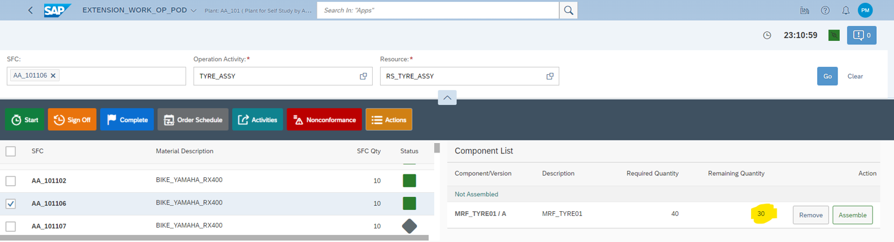

Below are the main code files to refer.

| **File Name** | **Plugin** | **Path** |
| --- | --- | --- |
| [MainView.controller.js](./controller/MainView.controller.js#L1) | Custom POD Plugin 1 | ExtensionWork/ScanToAssembleExample/./controller/MainView.controller.js |

The'scanassemblyapp/controller/MainView.controller.js' controller has [**publishComponentListRefresh()**](./controller/MainView.controller.js#L191) function which publishes a standard **ComponentListRefreshEvent** event. The standard Component List plugin listens to this event and refresh the component list on receiving this event.

_**Note** : In the same way other standard SAP DM core plugin events can be used in custom POD plugins. Refer for_ [_SAP DM Core Plugin Events_](https://help.sap.com/docs/sap-digital-manufacturing/pod-plugin-developer-s-guide/plugin-events)

 

# Details on Scenario 3

The 'Custom POD Plugin 2' subscribes to a standard event which displays an information message to show the number of SFC's selected.

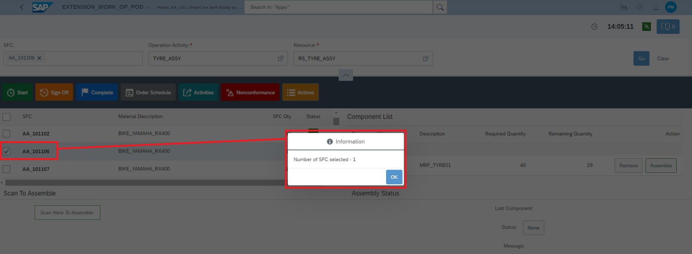

Below are the main code files to refer.

| **File Name** | **Plugin** | **Path** |
| --- | --- | --- |
| [MainView.controller.js](../assemblyStatus/controller/MainView.controller.js#L1) | Custom POD Plugin 2 | ExtensionWork/ScanToAssembleExample/../assemblyStatus/controller/MainView.controller.js |

A standard core plugin event **WorklistSelectEvent** is subscribed in [**onBeforeRenderingPlugin()**](../assemblyStatus/controller/MainView.controller.js#L12) function of 'statusapp/controller/MainView.controller.js' controller. This event is triggered when the SFC selection is changed in the standard 'Work List' plugin.

An event handler function [**handleWorklistSelectEvent()**](../assemblyStatus/controller/MainView.controller.js#L28) is defined for **WorklistSelectEvent** event to display an information message with the number of SFC selected. This user-defined event handler function can be used to perform any custom logic.

**WorklistSelectEvent** event is un-subscribed in [**onExit()**](../assemblyStatus/controller/MainView.controller.js#L89) function of 'statusapp/controller/MainView.controller.js' controller.

 

# Details on Scenario 4

The 'Custom POD Plugin 1' after component assembly publishes an event to 'Custom POD Plugin 2'. This event updates the assembly status of the last scanned component in 'Custom POD Plugin 2' as SUCCESS or ERROR.

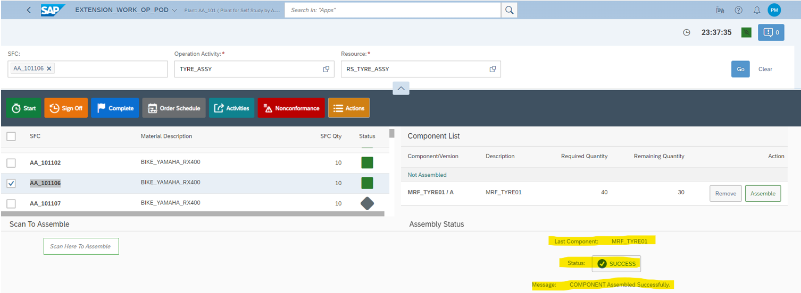

Below are the main code files to refer.

| **File Name** | **Plugin** | **Path** |
| --- | --- | --- |
| [MainView.controller.js](./controller/MainView.controller.js#L1) | Custom POD Plugin 1 | ExtensionWork/ScanToAssembleExample/./controller/MainView.controller.js |
| [MainView.view.xml](../assemblyStatus/view/MainView.view.xml#L1) | Custom POD Plugin 2 | ExtensionWork/ScanToAssembleExample/../assemblyStatus/view/MainView.view.xml |
| [MainView.controller.js](../assemblyStatus/controller/MainView.controller.js#L1) | Custom POD Plugin 2 | ExtensionWork/ScanToAssembleExample/../assemblyStatus/controller/MainView.controller.js |

The 'scanassemblyapp/controller/MainView.controller.js' controller has [**publishAssemblyStatus()**](./controller/MainView.controller.js#L195) function which publishes a custom **UpdateAssemblyStatusEvent** event.

**UpdateAssemblyStatusEvent** event is subscribed in [**onBeforeRenderingPlugin()**](../assemblyStatus/controller/MainView.controller.js#L12) function of 'statusapp/controller/MainView.controller.js' controller.

An event handler function [**handleAssemblyStatusEvent()**](../assemblyStatus/controller/MainView.controller.js#L21) is defined for **UpdateAssemblyStatusEvent** event to update the assembly status in 'statusapp/view/MainView.view.xml' view. This user-defined event handler function can be used to perform any custom logic.

**UpdateAssemblyStatusEvent** event is un-subscribed in [**onExit()**](../assemblyStatus/controller/MainView.controller.js#L89) function of 'statusapp/controller/MainView.controller.js' controller.

 

# Details on Scenario 5

The 'Custom POD Plugin 2' has a Machine status section which subscribes to a custom notification event. On receiving the notification from SAP DM Production Process or any other source, the Machine status will be displayed as READY or NOT\_READY.

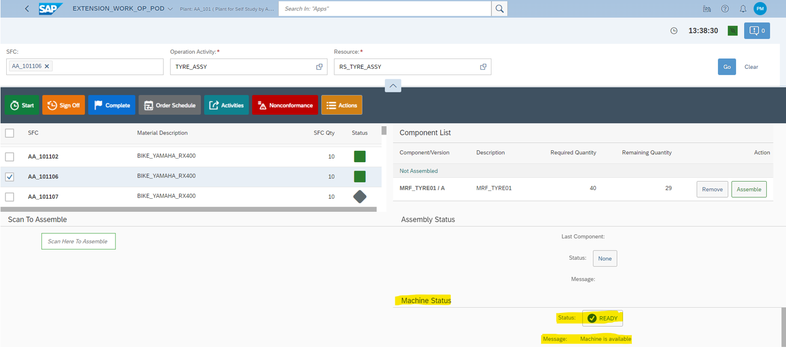

Below are the main code files to refer.

| **File Name** | **Plugin** | **Path** |
| --- | --- | --- |
| [MainView.view.xml](../assemblyStatus/view/MainView.view.xml#L1) | Custom POD Plugin 2 | ExtensionWork/ScanToAssembleExample/../assemblyStatus/view/MainView.view.xml |
| [MainView.controller.js](../assemblyStatus/controller/MainView.controller.js#L1) | Custom POD Plugin 2 | ExtensionWork/ScanToAssembleExample/../assemblyStatus/controller/MainView.controller.js |

Below are the three methods which are overwritten in 'statusapp/controller/MainView.controller.js' controller to subscribe to custom Notification event (event name – ' **SCREW\_DRIVER\_STATUS**').

- The function [**isSubscribingToNotifications()**](../assemblyStatus/controller/MainView.controller.js#L40) will enable the plugin to create subscriptions.
- The function [**getNotificationMessageHandler()**](../assemblyStatus/controller/MainView.controller.js#L45) will return the handler function [**handleScrewDriverReady()**](../assemblyStatus/controller/MainView.controller.js#L56) in the custom plugin which is called when a message for the input event name ' **SCREW\_DRIVER\_STATUS**' is received.
- The function [**getCustomNotificationEvents()**](../assemblyStatus/controller/MainView.controller.js#L35) returns the names of the event types the plugin is subscribing to.

The **handleScrewDriverReady()** function is used to update the machine status in 'statusapp/view/MainView.view.xml' view. This user-defined event handler function can be used to perform any custom logic on receiving the notification.

**Publishing Custom Events to POD from SAP DM Production Process.**

1. In SAP DM, launch Design Production Processes and import [**POD\_PLUGIN\_NOTIF**](../../readmeReferences/POD_PLUGIN_NOTIF.dmcbak) production process.
2. Open 'My Imports' tab and open **POD\_PLUGIN\_NOTIF** and click on 'Quick Deploy' button. _[Password for **POD\_PLUGIN\_NOTIF** file is **Sap@1234**]_

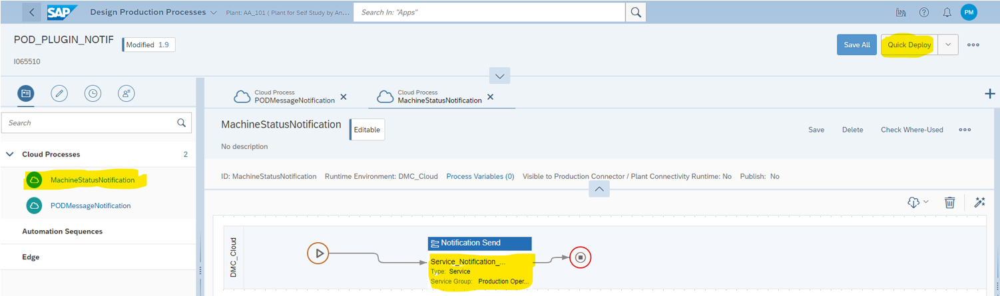

3. Select **MachineStatusNotification** cloud process in which **Notification Send** service is configured with required inputs (eventName, parameters & subscription details). Click on 'Run' button to run the process. Provide plant, operation and resource to match with the POD selection details and click on 'Run'.

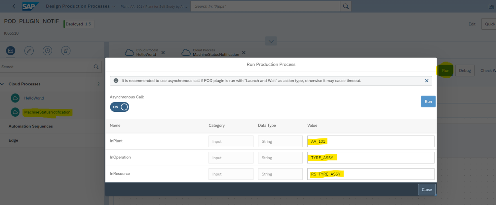

4. A notification will be received by the Custom POD Plugin 2 and the machine status will be updated.

**Publishing Custom Events to POD using notification API (/notification/v1/send).**

1. Open SAP BTP cockpit and navigate to space of SAP DM sub-account.
2. Go to Instances, filter "SAP Digital Manufacturing" service and click on key.

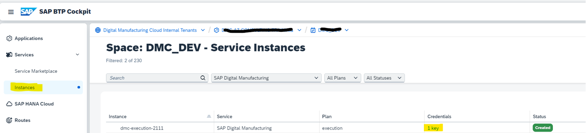

3. Get below details from the key.

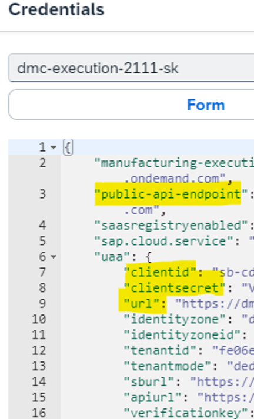

4. Create POST request in any API testing tool and provide Authorization details (oAuth 2.0 type) using above key information.

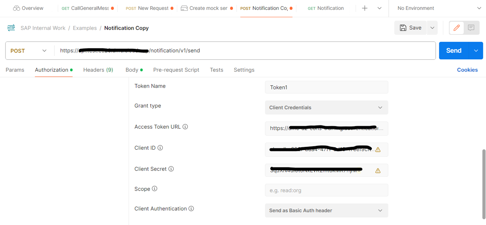

- POST URL - \<public-api-endpoint\> **/notification/v1/send**
- Client ID – \<clientid\>
- Client Secret - \<clientsecret\>
- Access Token URL - \<url\> **/oauth/token**

5. Provide JSON notification request payload and click Send. Refer for [**Sample Request Payload**](../../readmeReferences/notificationPayload.json)
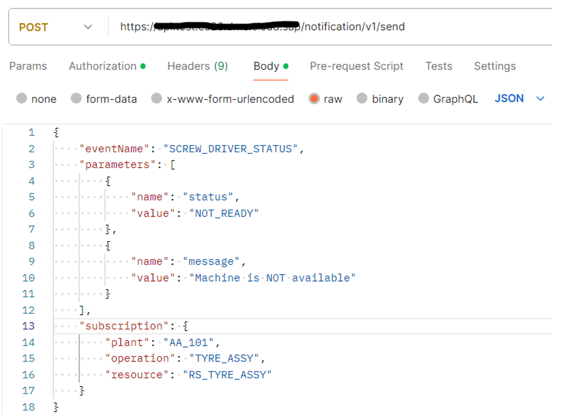

6. A notification will be received by the Custom POD Plugin 2 and the machine status will be updated.

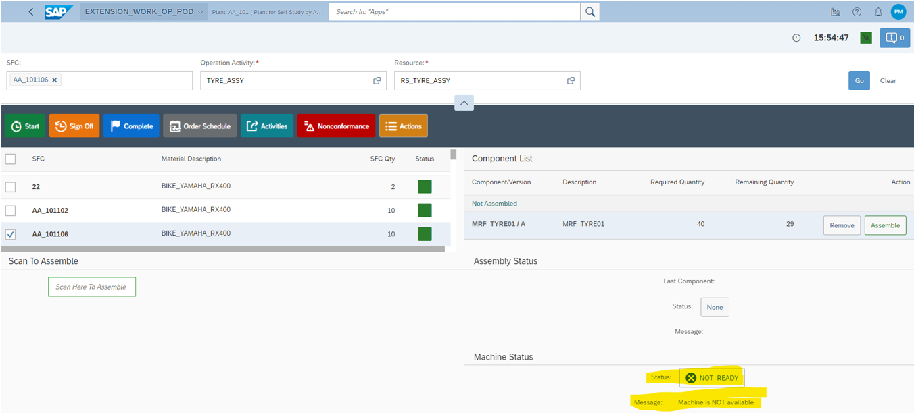

_**Note** : For more details, refer_ [_Implementing Push Notifications_](https://help.sap.com/docs/sap-digital-manufacturing/pod-plugin-developer-s-guide/implementing-push-notifications) _on SAP DM help portal._

 

# Details on Scenario 6

The 'Custom POD Plugin 2' subscribes to a standard POD Message notification event. On receiving the notification from SAP DM Production Process an information message will be displayed with the notification details.

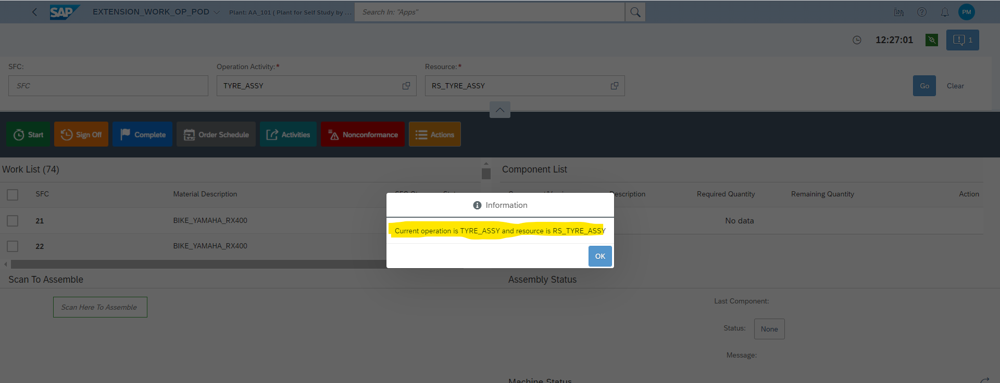

Below are the main code files to refer.

| **File Name** | **Plugin** | **Path** |
| --- | --- | --- |
| [MainView.view.xml](../assemblyStatus/view/MainView.view.xml#L1) | Custom POD Plugin 2 | ExtensionWork/ScanToAssembleExample/../assemblyStatus/view/MainView.view.xml |
| [MainView.controller.js](../assemblyStatus/controller/MainView.controller.js#L1) | Custom POD Plugin 2 | ExtensionWork/ScanToAssembleExample/../assemblyStatus/controller/MainView.controller.js |

Like scenario 5, below are the three methods which are overwritten in 'statusapp/controller/MainView.controller.js' controller to subscribe to standard POD Message Notification event (standard event name – ' **PP\_ACTION**').

- The function [**isSubscribingToNotifications()**](../assemblyStatus/controller/MainView.controller.js#L40) will enable the plugin to create subscriptions.
- The function [**getNotificationMessageHandler()**](../assemblyStatus/controller/MainView.controller.js#L45) will return the handler function [**handlePPAction()**](../assemblyStatus/controller/MainView.controller.js#L64) in the custom plugin which is called when a message for the input event name ' **PP\_ACTION'** is received.
- The function [**getCustomNotificationEvents()**](../assemblyStatus/controller/MainView.controller.js#L35) returns the names of the event types the plugin is subscribing to.

The **handlePPAction()** function displays an information message with the notification details. This user-defined event handler function can be used to perform any custom logic on receiving the notification.

**Publishing standard POD Message Events to custom POD plugin from SAP DM Production Process**.

1. In SAP DM, launch Design Production Processes. Import [**POD\_PLUGIN\_NOTIF**](../../readmeReferences/POD_PLUGIN_NOTIF.dmcbak)  production process if not done already, as specified in scenario 5.
2. Open 'My Imports' tab and open **POD\_PLUGIN\_NOTIF** and click on 'Quick Deploy' button. _[Password for **POD\_PLUGIN\_NOTIF** file is **Sap@1234**]_

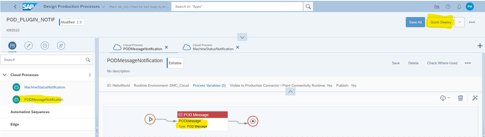

3. Select **PODMessageNotification** cloud process in which **POD Message** control is configured with a message. Click on 'Run' button to run the process. Provide plant, operation and resource to match with the POD selection details and click on 'Run'.

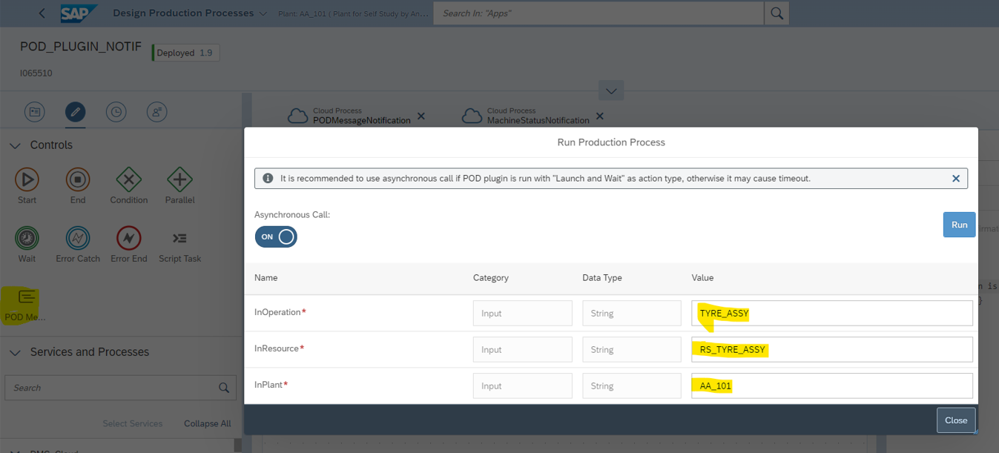

4. A notification will be received by the Custom POD Plugin 2 and an alert will be shown with the notification message.

 

# Details on Scenario 7

The 'Custom POD Plugin 2' calls the SAP DM Production Process that can be consumed as an API. In this example, we'll use the same production process which is used in scenario 5 to update the Machine status as READY or NOT\_READY on click of refresh button as shown below.

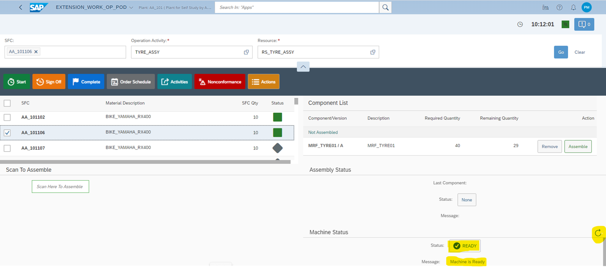

Below are the main code files to refer.

| **File Name** | **Plugin** | **Path** |
| --- | --- | --- |
| [MainView.view.xml](../assemblyStatus/view/MainView.view.xml#L1) | Custom POD Plugin 2 | ExtensionWork/ScanToAssembleExample/../assemblyStatus/view/MainView.view.xml |
| [MainView.controller.js](../assemblyStatus/controller/MainView.controller.js#L1) | Custom POD Plugin 2 | ExtensionWork/ScanToAssembleExample/../assemblyStatus/controller/MainView.controller.js |

The 'scanassemblyapp/controller/MainView.view.xml' view has a refresh button. On click of refresh button, [**fetchMachineStatus()**](../assemblyStatus/controller/MainView.controller.js#L68) function is called which is defined in the 'scanassemblyapp/controller/MainView.controller.js' controller. **fetchMachineStatus()** function calls the production process API to update the machine status.

Follow below step for getting the production process API URL.

- Use [**POD\_PLUGIN\_NOTIF**](../../readmeReferences/POD_PLUGIN_NOTIF.dmcbak)  production process and follow the steps as specified in scenario 5 to import and deploy. _[Password for **POD\_PLUGIN\_NOTIF** file is **Sap@1234**]_
- Ensure the **MachineStatusNotification** cloud process is Published as shown below.

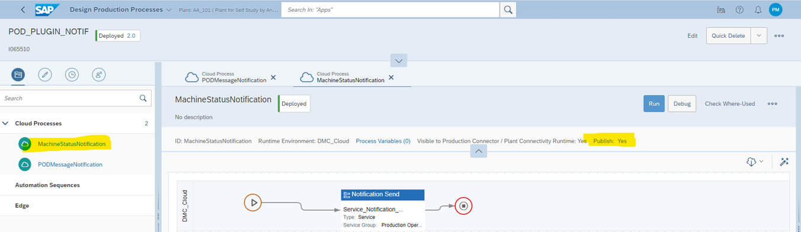

- Launch **Manage Service Registry** app and open **MachineStatusNotification** API service. Use the URL for making the API call to the production process.

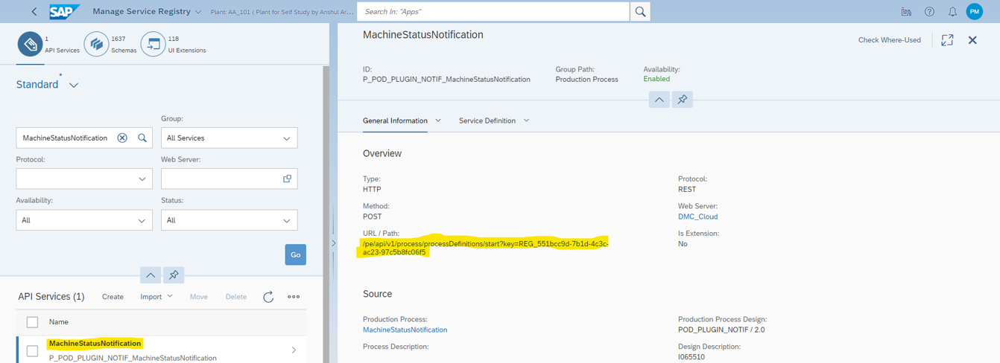