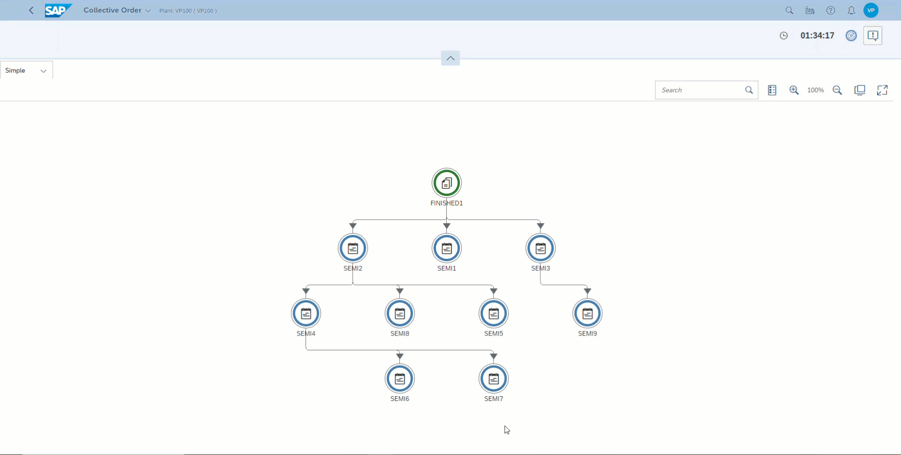

# Use Case
Represent a Collective Order in a network graph. Each order in the Collective Order to have information related to PARENT_ORDER and LEADING_ORDER using which the relationship and execution plan can be derived. Ability to show additional information at the Order Level in popup and clicking on the Order Node, possibility to raise worklist refresh event with filter param of selected order, hence refreshing the operator screen only with the relevant SFCs.

# Demonstration



# Master Data
Here in this plugin, we will use custom data to store PARENT_ORDER and LEADING_ORDER which can come from ERP \n 


# Code Snippets
Here are few code snippets from the implmentation

## API: Worklist order list 
```
let sPlant = this.getPodController().getUserPlant();
this.getPublicApiRestDataSourceUri() + 'order/v1/orders/list?plant=' + sPlant ; 
```

## Raising Worklist Refresh Event on Node Click
```
let selectedOrder = oEvent.getSource().getTitle();
this.publish("WorklistRefreshEvent", { "source": this, "order": <selectedOrder>, "forceSelection": true, "sendToAllPages": true});
```


