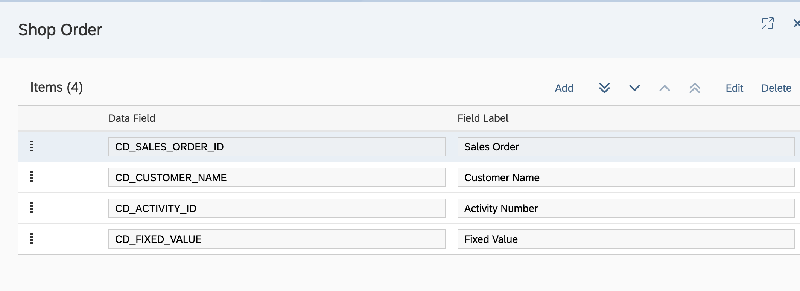
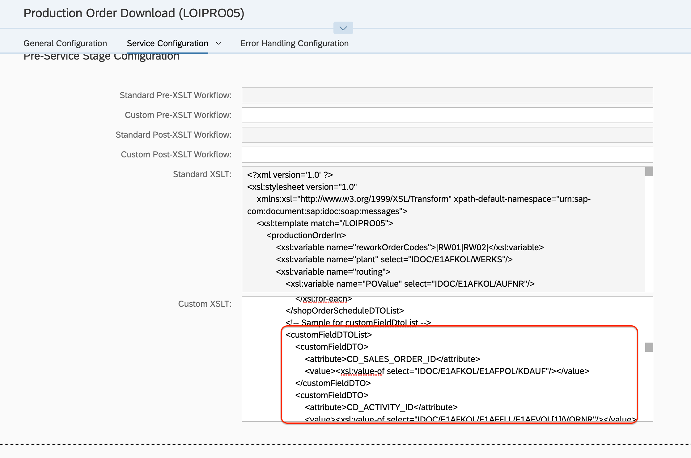
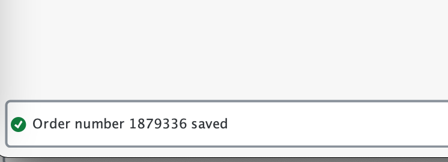
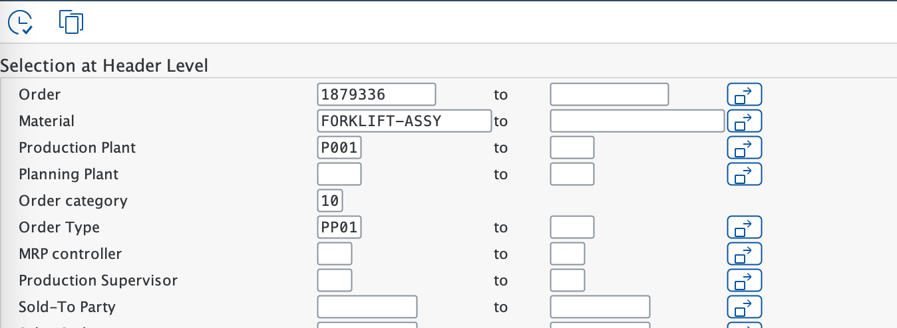
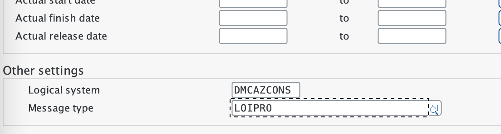

# Exercise 1.1 - Create Production Order with custom fields

## Step 1 - Create Custom Data in app Manage Custom Data
1. Open app Manage Custom Data with your plant
2. Select Shop Order, and define your own data fields, then save

    | Data Field      | Field Label |
    | ----------- | ----------- |
    | CD_SALES_ORDER_ID      | Sales Order       |
    | CD_CUSTOMER_NAME   | Customer Name        |
    | CD_ACTIVITY_ID   | Activity Number         |
    | CD_FIXED_VALUE           | Fixed Value    |

    

## Step 2 - Define Rules for populate values for the fields
1. Open app Manage Integration Workflows and select Production Order Download (LOIPRO05), select Production Order Download (LOIPRO05 V2) if you already enabled V2 version for LOIPRO05 processing
2. Copy the value from section 'Standard XSLT'
3. Modify the value populating rule by goto the end of block of 'shopOrderIn', uncomments the section dev team reserved and build your own one, save it to Custom XSLT section. [Sample XSLT](../dm-integration-extensions/LOIPRO05_Reqeust_customized_with_sales_order_and_customer.xsl); For V2, search 'Sample for custom field on order level' to locate it.[Sample XSLT V2](../dm-integration-extensions/LOIPRO05_Reqeust_customized_with_sales_order_and_customer_V2.xsl)

## Step 3 - Create Production Orders from SAP S/4 HANA
1. Login to SAP S/4 HANA system
- Goto transaction co08
- Enter the correct sales order, ordre type then hit 'enter' and an sales order based Production order genarted

- Confirm the Quantity and End date and hit 'Enter'

- Release the order first and then Save, you will be given an order number in the message

- Send the Production Order with program RCCLORD from transaction se38, Order, material, Production Plant, Order Type, Logical System and Message Type should be filled with.

- If the Plant id are dirrent between DMC and S/4 HANA, you need do the plant conversion, refer [Plant Conversion](https://help.sap.com/viewer/c86ca4026fae4cb3ba66ed751866175b/latest/en-US/28923c635ae1463898b039b78d5137f7.html?q=Plant%20Conversion)

## Step 4 - Verify Production Order
1. Open app Manage Orders
2. Select the order you created from DMC or SAP S/4 HANA
3. Review the order, you should be able verify the Sales Order ID and Customer Name from tab 'Custom Data'

## Step 5 - Create Production Orders from DMC
1. Open app Manage Orders and click 'Create'
2. Fill in values for mandatory fields
3. Fill in Custom data fields and Save