# Exercise 1.2 - Release Production Order

## Overview
In this exercise, we would like to show you how you can release Production Order and generate the SFC next number based on custom business requirement. The next number of SFC release would be generated based on the custom field (e.g. Sales Order) of the production order.

## Step 1: Build your custom function in Kyma Runtime
1. Access to your Kyma Dashboard.

2. Under the "Namespaces" section, click the "Create Namespace" button to create a new namespace. 

3. Enter the name of your namespace, e.g dmc-extension.

4. Under the "Namespaces" section, select the newly created namespace to access that.

5. Go to the "Workloads" section, then click the "Functions" section and click the button "Create Function" to create a new function.
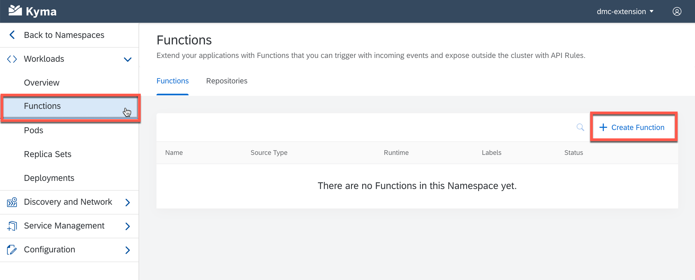

6. Enter the name of your function, e.g get-nextnumber and click Create.
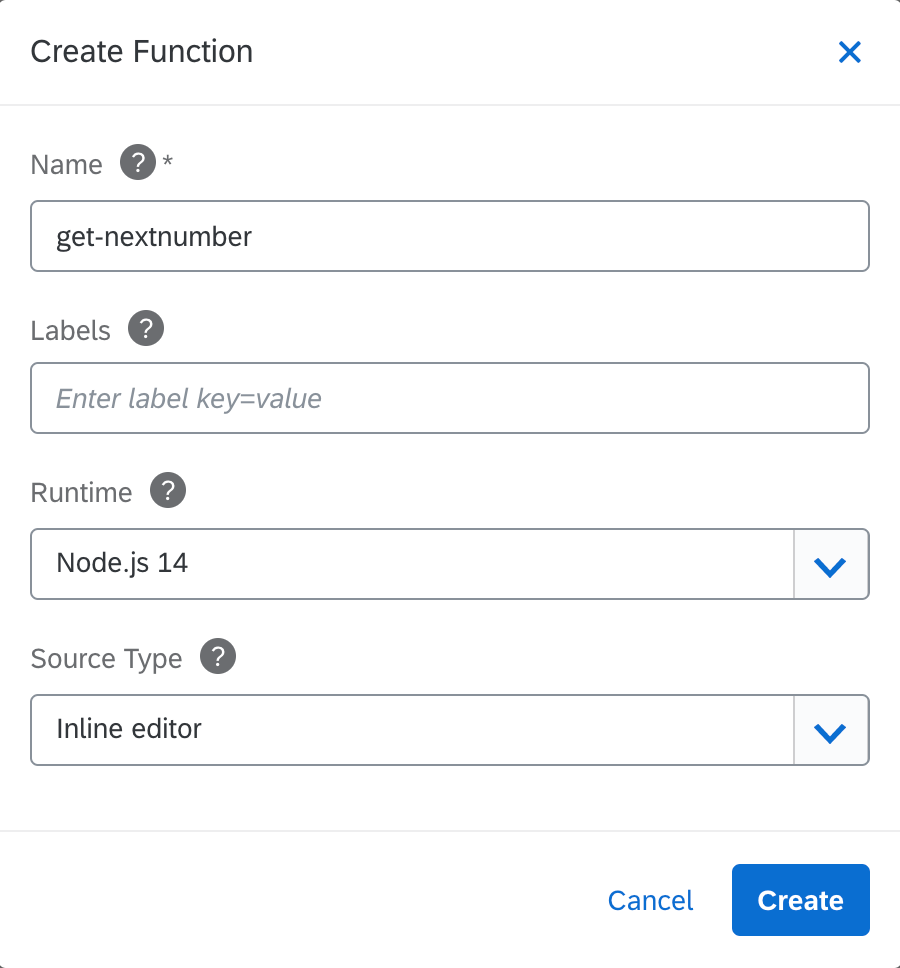

7. Go to the "Source" tab under "Code" tab, copy the sample code from file ["index.js"](https://github.com/SAP-samples/digital-manufacturing-extension-samples/blob/main/dm-inapp-service-extensions/sample-service-extension/index.js) under the folder "dm-inapp-extensions" from Github Sample Code and paste in the inline editor.
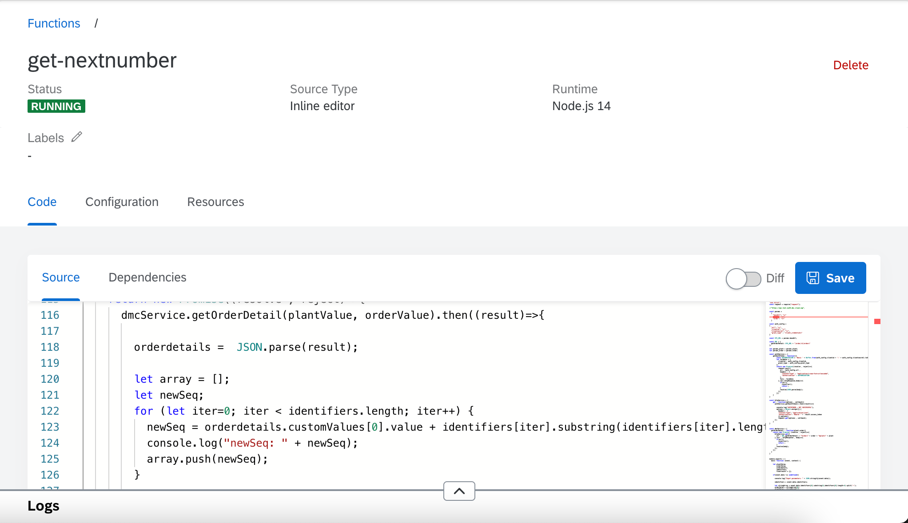

8. Go to the "Dependencies" tab under "Code" tab, copy the sample code from file ["package.json"](https://github.com/SAP-samples/digital-manufacturing-extension-samples/blob/main/dm-inapp-service-extensions/sample-service-extension/package.json) under the folder "dm-inapp-extensions" from Github Sample Code and paste in the inline editor.

9. In the Environment Variables area, add the following custom variables and secret variables.

| Variable Name |  Value  | Explananation |
|:-----|:--------:|------:|
| grant_type   | `client_credentials` |     -   |
| url   | your DMC Token Service URL e.g. `https://<subaccount>.authentication.eu20.hana.ondemand.com/oauth/token` |   should not leave out the path `/oauth/token` |
| baseUrl   | your DMC Public API URL e.g. `https://api.test.eu20.dmc.cloud.sap` |   public api end point of dmc service instance, find in service key the attribute "public-api-endpoint" |
| clientsecret   | secret contain your DMC Client Secret |    find in service key |
| clientid   | secret contain your DMC Client Id |    find in service key |
| plant   | your default plant, e.g. `EBC300` |    optional |
| order   | your default order, e.g. `1890392` |    optional |

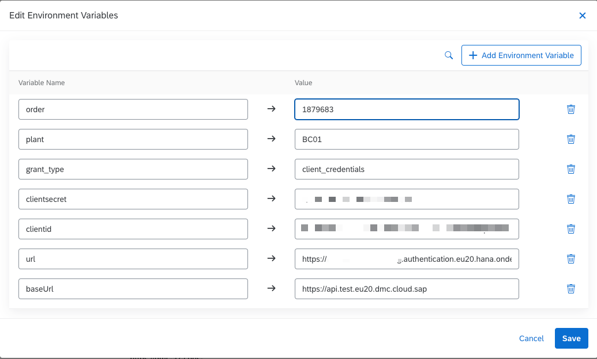

For the secret variables, go to Configuration > Secrets tab to create secret.

You can maintain some security artifacts within this secret. In our case, it should be client id and client secret of your DMC tenant.

10. Click "Save" button, which automatically triggers the build and deployment process. Once it is finished, your function will be in the "RUNNING" status.

11. Go to the "Configuration" tab and click the "Create API Rule" button.
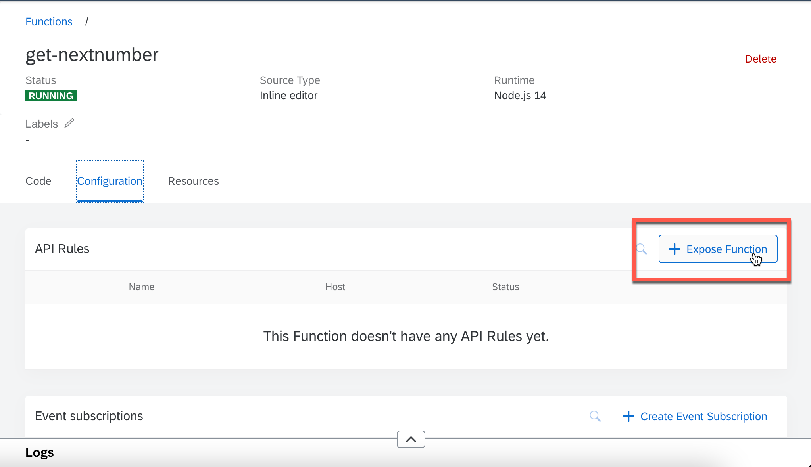

12. Enter the name (e.g dmc-in-app-extension) and Subdomain name (e.g dmc-in-app-extension) to create API rule.
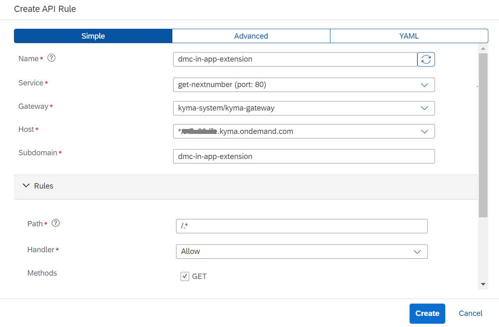

13. You can find your API End Point URL under the "API Rule". 
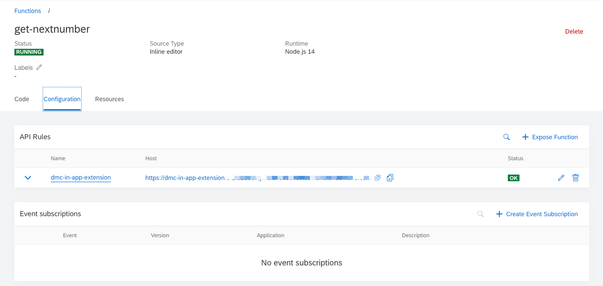

## Step 2: Register your extension in service registry
1. Open "Manage Service Registery" App in SAP DMC.

2. Click "Create" button.

3. Under "Header" tab, for the parameter "Server Name", enter the name accordingly. E.g."Ext_getnextnumber".

4. Under "Header" tab, for the paramter "Group", select "FaaS".

5. Under "Header" tab, for the paramter "Status", enable that.
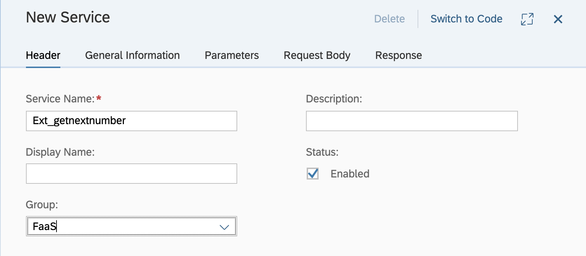

6. Under "General Information" tab, for the parameter "Protocol", select "REST".

7. Under "General Information" tab, for the parameter "Method", select "POST".

8. Under "General Information" tab, for the paramter "URL/Path", enter the API End Point URL under the API Rule of your Kyma Function.

8. Under "General Information" tab, for the parameter "Is Extension", select "Yes".

9. Under "Request Body" tab, for the paramter "Request Body", enable that.

10. Under "Request Body" tab, for the paramter "Required", select "Yes".

11. Under "Request Body" tab, click "Add" button to add "application/json" content type.

12. Under "Request Body" tab, select the Schema of "application/json" content type and click "Define Inline Schema".

13. Define the inline scheme as following.

		{
		    "type": "object",
		    "required": [
		        "event",
		        "context"
		    ],
		    "properties": {
		        "context": {
		            "description": "FaaS Context",
		            "type": "string"
		        },
		        "event": {
		            "description": "FaaS Event",
		            "type": "string"
		        }
		    }
		}

14. Click "Create" button and your extension service is registered in SAP DMC.

## Step 3: Configure your extension in the next number of SFC Release
1. Open "Manage Next Numbers" App.

2. Go to "SFC Release" Tab and select the material you would like to add the extension. E.g. LIFTER-ASSY.
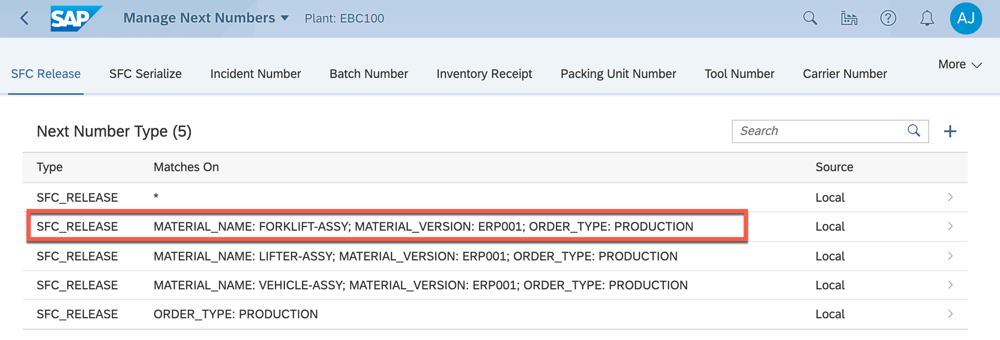

3. For the parameter "Prefix", enter `{ORDER_NAME}-{PLANT}_`. In the parameter, `{ORDER_NAME}` and `{PLANT}` are the replaceable parameters. It will replace the field name with the value of the field. `{PLANT}` is the plant where the material is being used. `{ORDER_NAME}` is the The order of the SFC number. Add a split character `-` in the middle in order to split these two fields in the extension. 
 [Replaceable Parameters for Use in Manage Next Numbers](https://help.sap.com/viewer/97c9e9b9fac74be2a023638cd1700b46/latest/en-US/3d61498ec33e44438ae9f32eb8b77e12.html)

4. For the parameter "Sequence Length", enter `3`.

5. For the parameter "Extension", choose the service "Ext_getnextnumber", which you've created in the "Service Registery" App.

## Step 4: Release the SFC to check the result
1. Open "Manage Orders" App.

2. Choose the Production Order with the material "LIFTER-ASSY".
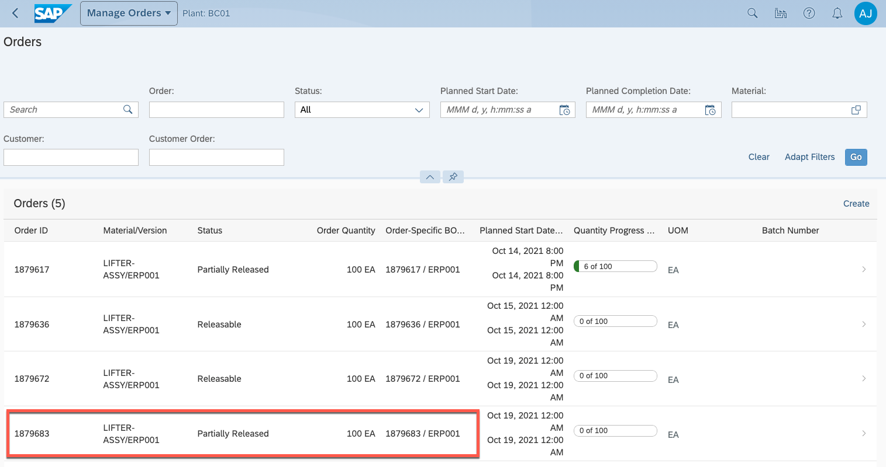

3. Go to the "Custom Data" tab. Check the data of the custom attribute  "Sales Order" is not empty.
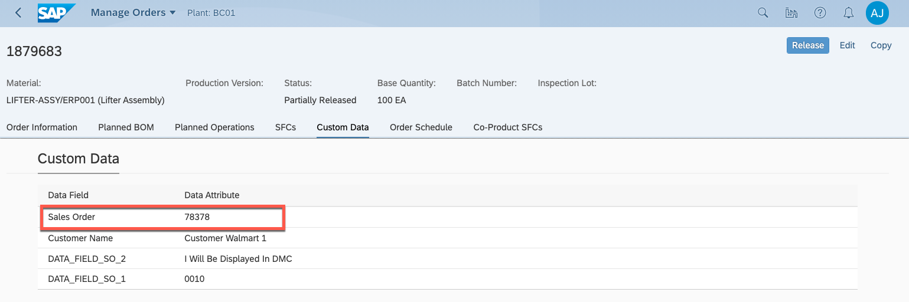

4. Click "Release Button".

5. The released SFC Number would be starting with the Sale Order and following with the current sequence number.
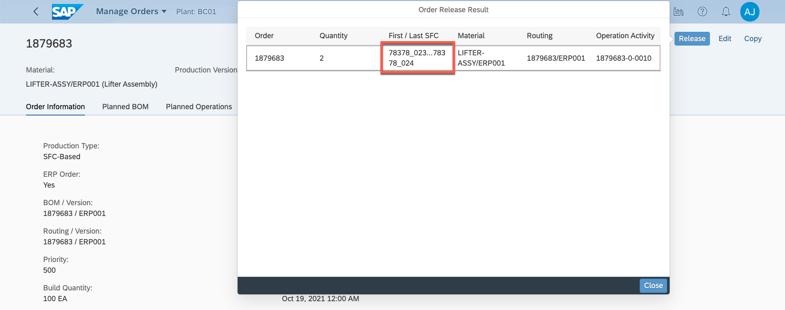
