# Exercise 2.1 - Evaluate Torque Value

## Overview
In this exercise, we would like to show you how to write your own business application with persistence layer and exposed as an API in the SAP BTP, Kyma Runtime, how to extend your production process with your own business extensions in SAP DMC Shop Floor Designer and how to trigger your production process from your POD.

## Prerequisites

- SAP BTP, Kyma runtime instance
- [Docker](https://www.docker.com/)
- [kubectl](https://kubernetes.io/docs/tasks/tools/install-kubectl/) configured to use the `KUBECONFIG` file downloaded from the Kyma runtime. Please also refer to SAP Tutorial for Install the Kubernetes Command Line Tool. [https://developers.sap.com/tutorials/cp-kyma-download-cli.html](https://developers.sap.com/tutorials/cp-kyma-download-cli.html) 

## Step 1: Build your own business application
1. Access to your Kyma Dashboard.
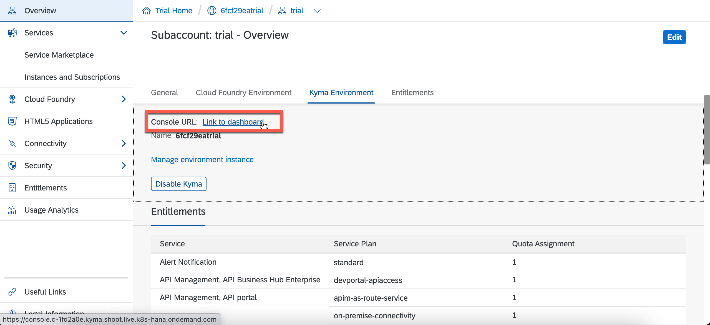

2. Under the "Namespaces" section, click the "Add new namespace" button to create a new namespace. 
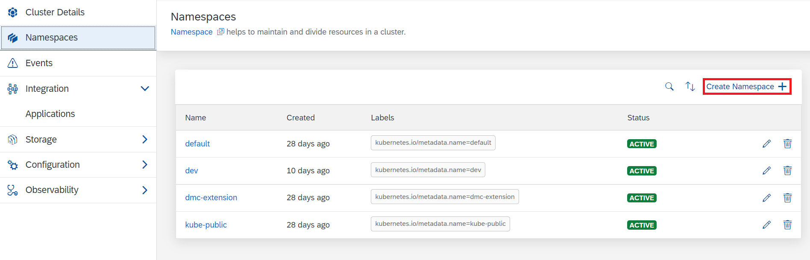

3. Enter the name of your namespace, e.g dmc-extension.
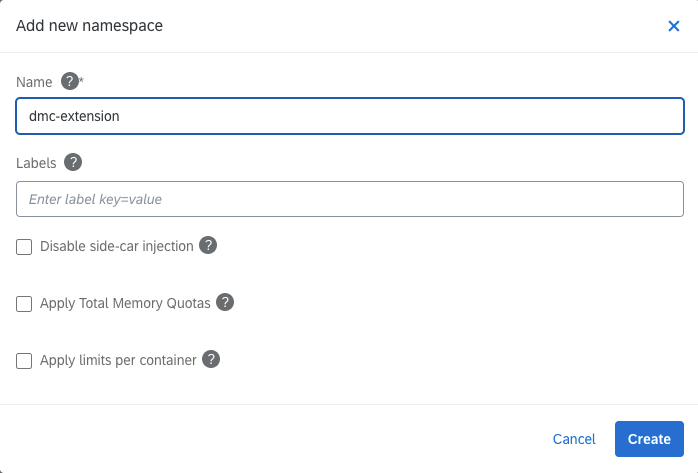

4. Under the "Namespaces" section, select the newly created namespace to access that.
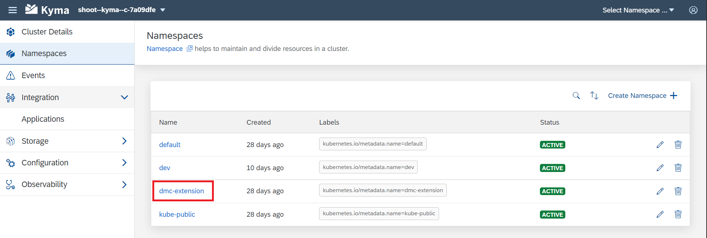

5. Download the sample code from [DMC Extensibility Bootcamp Github Samples](https://github.com/SAP-samples/digital-manufacturing-extension-samples).

6. Open the folder "api-mssql-nodejs" which is under "DMC_ProcessExtensions" in the Visual Studio Code.

 
7. (Optional) Build and push the image to your Docker repository.
	
		docker build -t {your-docker-account}/mssqlnodejs -f docker/Dockerfile .
	
		docker push {your-docker-account}/mssqlnodejs

8. (Optional) Replace the image name with your docker account in the /k8s/deployment.yaml file.
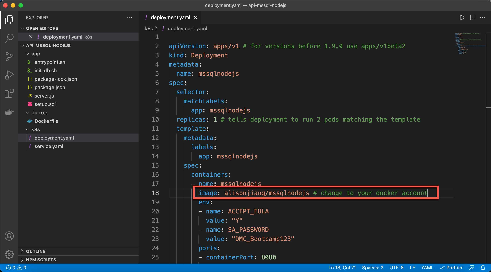

9. Apply the Deployment.

		kubectl -n dmc-extension apply -f ./k8s/deployment.yaml

10. Apply the Service.

		kubectl -n dmc-extension apply -f ./k8s/service.yaml

11. Verify that the Pod is up and running:

		kubectl -n dmc-extension get po

	The expected result shows that the Pod for the `mssqlnodejs mssql` Deployment is running:

	
		NAME                                READY   STATUS    RESTARTS   AGE
		mssqlnodejs-5d4bbb47b5-7hjsr        2/2     Running   0          93s
	
12. In the Kyma Dashboard, go to "Services" and click "mssqlnodejs-service" service. Clicke "Expose Service" button to create API rule for this service.
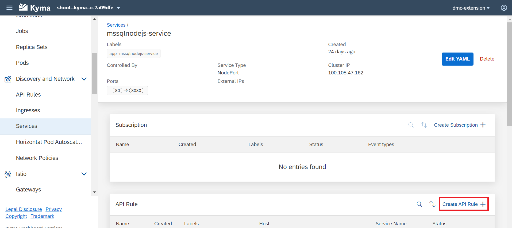

13. Enter the name (e.g dmc-bp-nodejs-api) and hostname (e.g dmc-bp-nodejs-api) to create API rule.
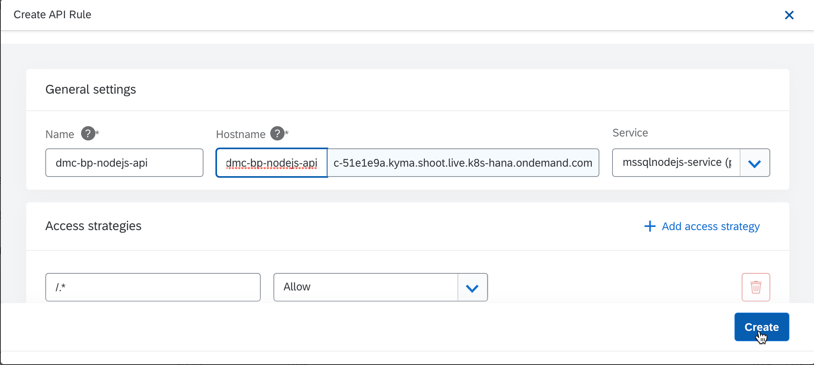

14. To test the API, you can use Postman to send a POST request to `https://<API_URL>:<API_PORT>/api/v1/dcs` with the below sample JSON content in the body.

		{
		    "SFC": "EBC100005",
		    "TorqueLeftValue": 50,
		    "TorqueLeftLowerValue": 40,
		    "TorqueLeftUpperValue": 60,
		    "TorqueRightValue": 60,
		    "TorqueRightLowerValue": 20,
		    "TorqueRightUpperValue": 80
		}

## Step 2: Run the Docker image locally (Optional)

1. To run the Docker image locally.

		docker run -e ACCEPT_EULA=Y -e SA_PASSWORD=DMC_Bootcamp123 -p 1433:1433 -p 8080:8080 --name sql1 -d {docker id}/mssqlnodejs

2. To run the database SQL.
		
		docker exec -it sql1 "bash"
		/opt/mssql-tools/bin/sqlcmd -S localhost -U SA -P DMC_Bootcamp123
		>USE BootcampDB SELECT * FROM DCs
		>GO
	
	You will see two DB records are returned initially.

3. To test the API locally, you can use Postman to send a POST request to [http://localhost:8080/api/v1/dcs](http://localhost:8080/api/v1/dcs) with the below sample JSON content in the body.

		{
		    "SFC": "EBC100005",
		    "TorqueLeftValue": 50,
		    "TorqueLeftLowerValue": 40,
		    "TorqueLeftUpperValue": 60,
		    "TorqueRightValue": 60,
		    "TorqueRightLowerValue": 20,
		    "TorqueRightUpperValue": 80
		}

## Step 3: Create Web Server in SAP DMC

1. Open "Manage Web Servers" App in SAP DMC.

2. Click "Create" Button.
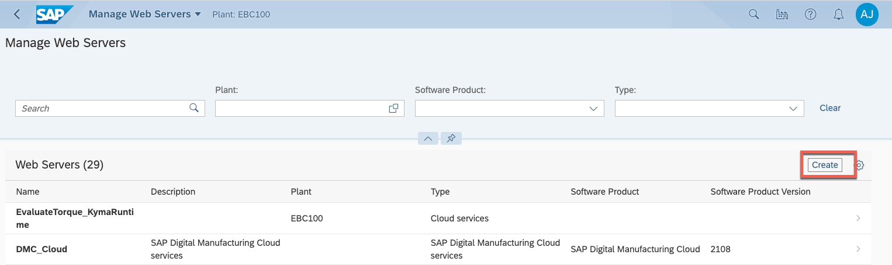

3. Under "Header" tab, enter the Web Server name (e.g. DMC_Bootcamp_EvaluateTorque).

4. Under "Header" tab, select the specific plant (e.g. EBC100).

5. Under "Server Details" tab, select the server type, which is "Cloud services".

6. Under "Server Details" tab, enter the Host URL, which is the API end point in the Kyma.

7. Click the "Create" button.

8. Select the "DMC_Cloud" Web Server in the "Manage Web Servers" app.

9. Under the "Connections" tab, click "Create" Button.
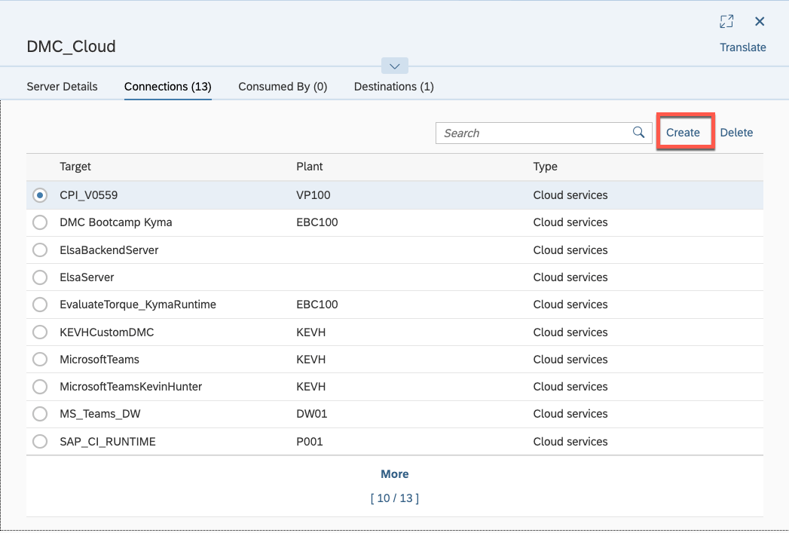

10. Select the "DMC_Bootcamp_EvaluateTorque" Web Server.
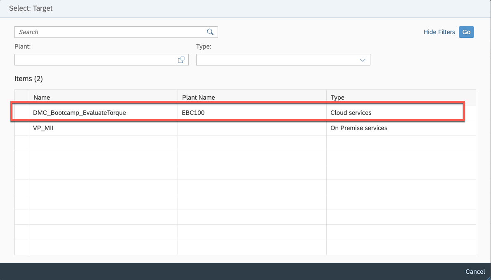

## Step 4: Register your service in SAP DMC
1. Open "Manage service registry" App in SAP DMC.

2. Click "Create" Button.

3. Under "Header" tab, for the "service name" parameter, enter "Ext_Evaluate_Torque".

4. Under "Header" tab, for the "Status" parameter, enable that.

5. Under "Header" tab, for the "Group" parameter, select "BusinessProcessExtensions".
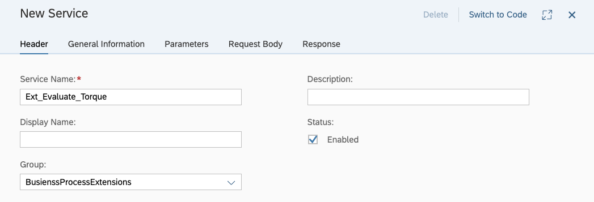

6. Under "General Information" tab, for the "Protocol" parameter, select "REST".

7. Under "General Information" tab, for the "Method" parameter, select "POST".

8. Under "General Information" tab, for the "Web Server" parameter, select "DMC_Bootcamp_EvaluateTorque".

9. Under "General Information" tab, for the "URL / Path" parameter, enter `/api/v1/dcs`.
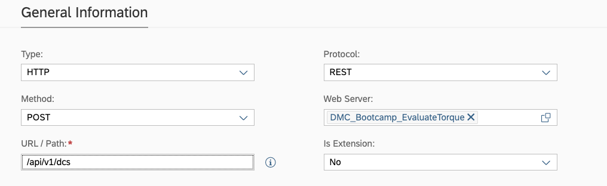

10. Under "Request Body" tab, for the "Request Body" parameter, enable that.

11. Under "Request Body" tab, for the paramter "Required", select "Yes".

12. Under "Request Body" tab, click "Add" button to add "application/json" content type.
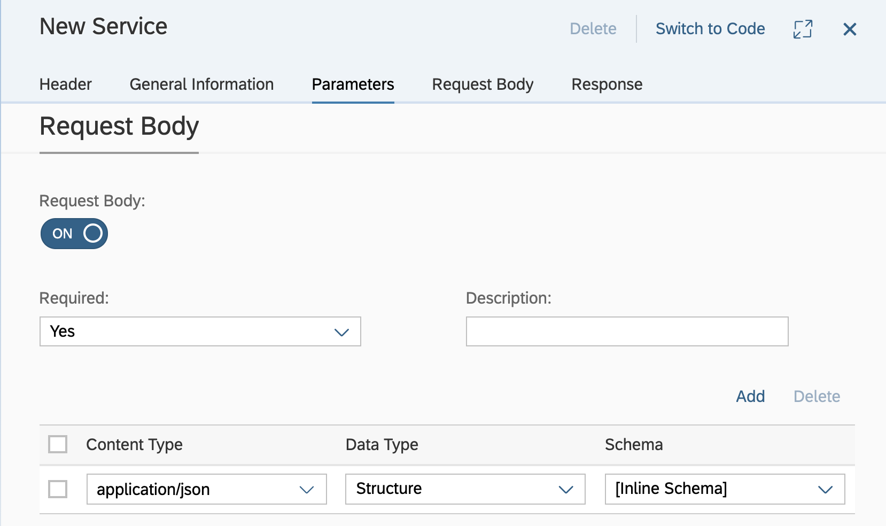

13. Under "Request Body" tab, select the Schema of "application/json" content type and click "Define Inline Schema".

14. Define the inline scheme as following.

		{
		    "type": "object",
		    "required": [
		        "SFC",
		        "TorqueLeftValue",
		        "TorqueLeftLowerValue",
		        "TorqueLeftUpperValue",
		        "TorqueRightValue",
		        "TorqueRightLowerValue",
		        "TorqueRightUpperValue"
		    ],
		    "properties": {
		        "SFC": {
		            "description": "SFC",
		            "type": "string"
		        },
		        "TorqueLeftValue": {
		            "description": "TorqueLeftValue",
		            "type": "number"
		        },
		        "TorqueLeftLowerValue": {
		            "description": "TorqueLeftLowerValue",
		            "type": "number"
		        },
		        "TorqueLeftUpperValue": {
		            "description": "TorqueLeftUpperValue",
		            "type": "number"
		        },
		        "TorqueRightValue": {
		            "description": "TorqueRightValue",
		            "type": "number"
		        },
		        "TorqueRightLowerValue": {
		            "description": "TorqueRightLowerValue",
		            "type": "number"
		        },
		        "TorqueRightUpperValue": {
		            "description": "TorqueRightUpperValue",
		            "type": "number"
		        }
		    }
		}
	
	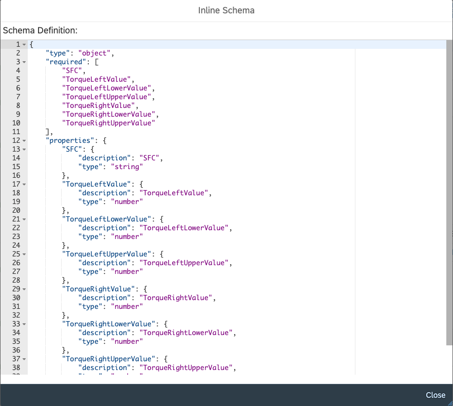

15. Under "Response" tab, select Response Code "200" and click "Edit" button.
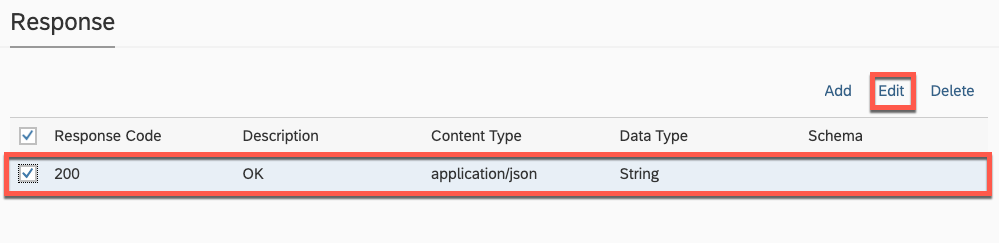

16. For the "Data Type", select "Structure". For the "Schema", select "Inline Schema" and click "Define Inline Schema".
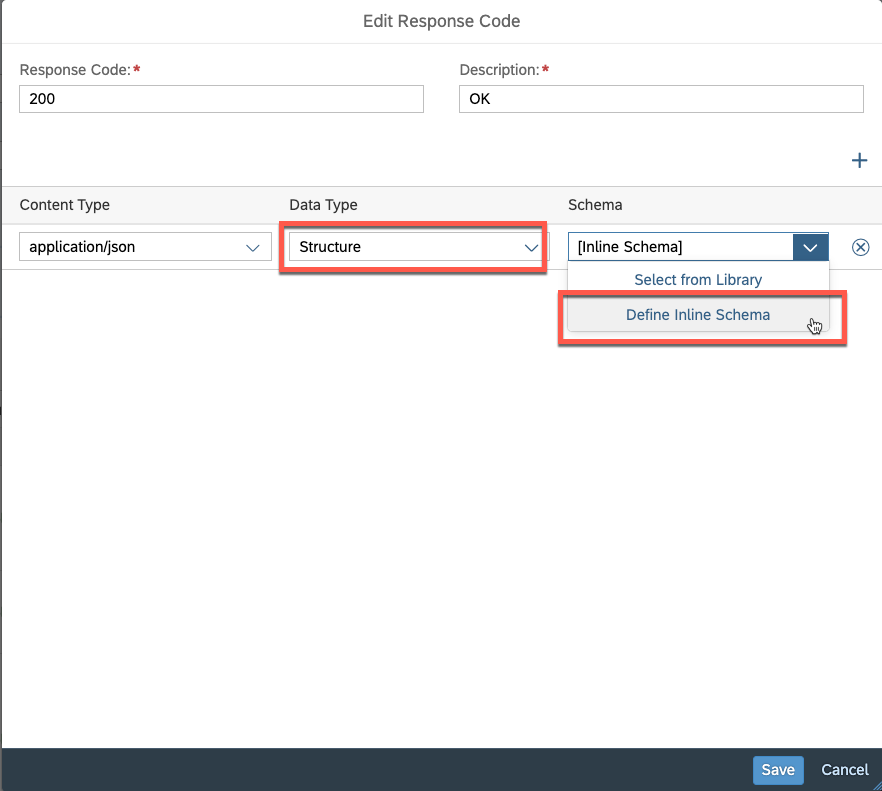

17. Define the schema as following.

		{
		    "type": "object",
		    "required": [
		        "evaluationCurrent",
		        "evaluationHistory"
		    ],
		    "properties": {
		        "evaluationCurrent": {
		            "description": "evaluationCurrent",
		            "type": "integer"
		        },
		        "evaluationHistory": {
		            "description": "evaluationHistory",
		            "type": "integer"
		        }
		    }
		}
	
	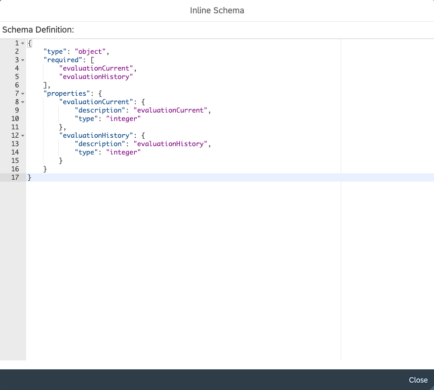
	
18. Click "Save" Button.
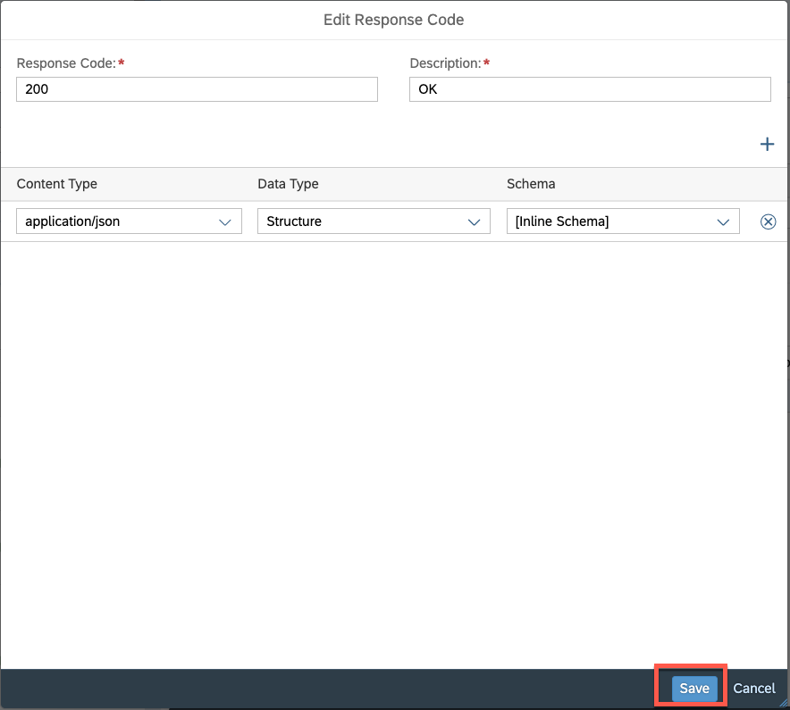

19. Click "Create" Button and your service is registered.

## Step 5: Design your Production Process

1. Open "Design Production Processes" App in SAP DMC.

2. Create a new Production Process Design (e.g. DMC_Bootcamp_EvaluateTorque) and create a new cloud type process (e.g. DMC_Bootcamp_EvaluateTorque) inside.

3. Design the Production Process as following.

4. Add the process variables to define the version of your target Operation and Data Collection Group, the Data Collection Parameters Name and Nonconformance Code Name.

		Name				Default Value 			Type
		InOperationVersion	ERP001					String
		InDcGroupVersion	ERP001					String
		InDCName_Left		TORQUE_LEFT 			String
		InDCName_Right		TORQUE_RIGHT			String
		InNCCode			ASSEMBLY_TORQUE			String

5. For the "Start" control, define the input parameters as following.

	Input Parameter:

		Parameter Name				Value 
		InOperation (String):*		leave it empty
		InPlant (String):*			leave it empty
		InResource (String):*		leave it empty
		InSFC (String):*			leave it empty
		InWorkcenter (String):*		leave it empty

6. For the DMC "Retrieve_SFC_DC_Groups" service, define the input and output parameters as following.

	Input Parameter:

		Parameter Name			Value 
		operation (String):		'InOperation'
		plant (String):*		'InPlant'	
		resource (String):*		'InResource' 
		sfc (String):*			'InSFC'
		stepId (String):		leave it empty
		workCenter (String):	'InWorkcenter'
	
	Output Parameter:		
		
		Parameter Name											Value
		httpResponse (StructureArray / GroupsListResponse):		leave it empty
		
7. For the DMC "Get_Logged_Parameters" service, define the input and output parameters as following.

	Input Parameter:

		Parameter Name					Value 
		dcGroup.name (String):			'Retrieve_SFC_DC_Groups#httpResponse[0]["group"]["group"]'
		dcGroup.version (String):		'InDcGroupVersion'
		operation.name (String):*		'InOperation'
		operation.version (String):*	'InOperationVersion'
		parameterName (String):			leave it empty
		plant (String):*				'InPlant'
		resource (String):*				'InResource'
		sfcs (StringArray):*			'InSFC'
	
	Output Parameter:		
		
		Parameter Name												Value
		httpResponse (StructureArray / LoggedSfcDataResponse):		leave it empty
		
8. For the custom "Get latest collected data by DC Name" Script Task, define the input and output parameters and script as following.

	Input Parameter:

		Parameter Name												Value 
		InDCName_Left (String):*									'InDCName_Left'
		InDCName_Right (String):*									'InDCName_Right'
		InLoggedDCs (StructureArray / LoggedSfcDataResponse):*		'Get_Logged_Parameters#httpResponse'

	Output Parameter:		
		
		Parameter Name				Value
		oDCLeftValue (Double):		leave it empty
		oDCRightValue (Double):		leave it empty
		
	Script:
		
		var dcArray = $input.InLoggedDCs[0].parameters;
		var filterArrayLeft = dcArray.filter(function(e) {
		  return e.measureName == $input.InDCName_Left
		})
		var filterArrayRight = dcArray.filter(function(e) {
		  return e.measureName == $input.InDCName_Right
		})
		var lenLeft = filterArrayLeft.length;
		var lenRight = filterArrayRight.length;
		
		$output.oDCLeftValue = filterArrayLeft[lenLeft-1].actualNumber;
		$output.oDCRightValue = filterArrayRight[lenRight-1].actualNumber;
		
9. For the custom "Get Lower and Upper Value by DC Name" Script Task, define the input and output parameters and script as following.

	Input Parameter:

		Parameter Name											Value 
		InLeftDCName (String):*									'InDCName_Left'
		InRightDCName (String):*								'InDCName_Right'
		InDCGroup (StructureArray / GroupsListResponse):*		'Retrieve_SFC_DC_Groups#httpResponse'

	Output Parameter:		
		
		Parameter Name					Value
		oLeftLowerValue (Double):		leave it empty
		oLeftUpperValue (Double):		leave it empty
		oRightLowerValue (Double):		leave it empty
		oRightUpperValue (Double):		leave it empty
		
	Script:
		
		var dcParameterArray = $input.InDCGroup[0].group.parameters;

		for (var i=0;i<dcParameterArray.length;i++) {
		    if (dcParameterArray[i].parameterName == $input.InLeftDCName) {
		        $output.oLeftLowerValue = dcParameterArray[i].minValue;
		        $output.oLeftUpperValue = dcParameterArray[i].maxValue;
		    } else if (dcParameterArray[i].parameterName == $input.InRightDCName) {
		        $output.oRightLowerValue = dcParameterArray[i].minValue;
		        $output.oRightUpperValue = dcParameterArray[i].maxValue;
		    }
		}
		
10. To use your custom registered in the Step 4, you can click "Select Services" and select your custom Web Server and your custom service. Define the input and output parameters as following.
	
	
	Input Parameter:

		Parameter Name						Value 
		SFC (String):*						'InSFC'
		TorqueLeftLowerValue (Double):*		'ScriptTask_2#oLeftLowerValue'
		TorqueLeftUpperValue (Double):*		'ScriptTask_2#oLeftUpperValue'
		TorqueLeftValue (Double):*			'ScriptTask#oDCLeftValue'
		TorqueRightLowerValue (Double):*	'ScriptTask_2#oRightLowerValue'
		TorqueRightUpperValue (Double):*	'ScriptTask_2#oRightUpperValue'
		TorqueRightValue (Double):*			'ScriptTask#oDCRightValue'

	Output Parameter:		
		
		Parameter Name						Value
		evaluationCurrent (Integer):		leave it empty
		evaluationHistory (Integer):		leave it empty
		
11. For the "Condition" control, define the evaluation expression as following.

	Evaluation Expression:
	
		(1)		'Ext_Evaluate_Torque#evaluationHistory' == 1
		(2)		'Ext_Evaluate_Torque#evaluationHistory' == 0
	
12. For the DMC "Log_Nonconformances" service, define the input parameters as following.

	Input Parameter:

		Parameter Name										Value 
		code (String):*										'InNCCode'
		dataFields (StructureArray / DataField):			leave it empty
		files (StructureArray / LogNonConformanceFile):		leave it empty
		plant (String):*									'InPlant'
		resource (String):									'InResource'
		sfcs (StringArray):*								['InSFC']
		workCenter (String):								'InWorkcenter'
			
13. For the custom "Generate output message" Script Task, define the input and output parameters and script as following.

	Input Parameter:

		Parameter Name						Value 
		InSFC (String):*					'InSFC'
		InWorkCenter (String):*				'InWorkcenter'

	Output Parameter:		
		
		Parameter Name					Value
		oMessage (String):				leave it empty

	Script:
		
		$output.oMessage = "There is an issue for " + $input.InSFC + " at " + $input.InWorkCenter + ".";

14. To test the Production Process directly, you can click the "Run" button and use the following sample data.
	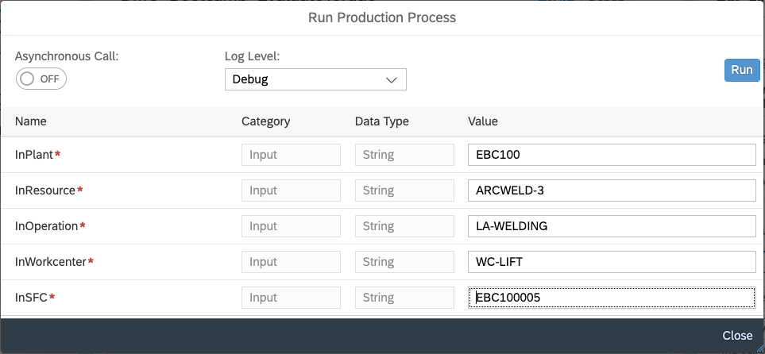
	
15. To check the testing result, you can go to "Monitor Production Processes" App to see the details of running results.
	
	
## Step 6: Assign your Production Process to POD

1. 	Open "POD Designer" App and select your own POD (e.g. DMC_BOOTCAMP_POD).

2. Select the "Validate" button, and click "Configuration" button to show the configuration panel.
	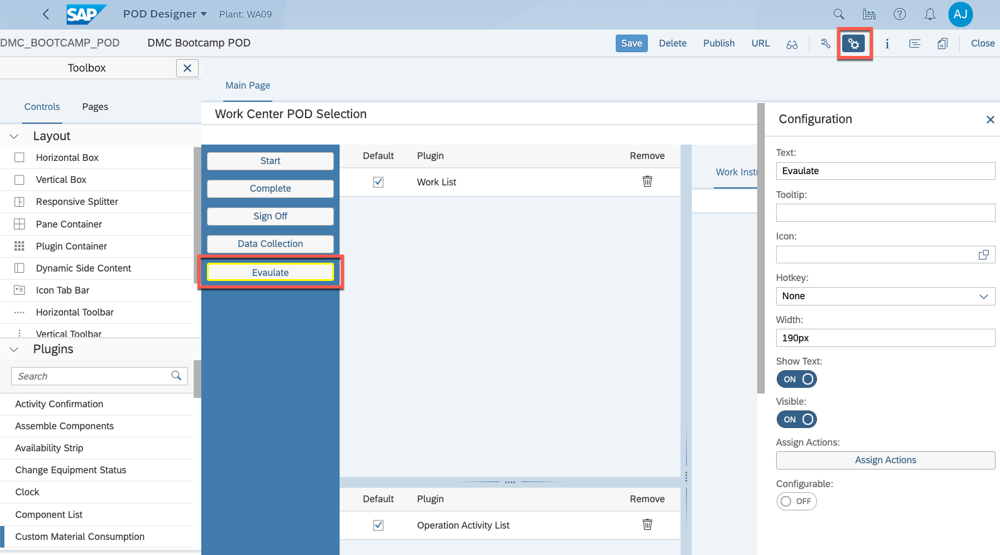

3. Click "Assign Actions" button and click "Add" Button to add the action.
	For the "Type" parameter, select "Production Process".
	For the "Type Definition", select your custom Production Process "P_DMC_Bootcamp_EvaluateTorque_DMC_Bootcamp_EvaluateTorque".
	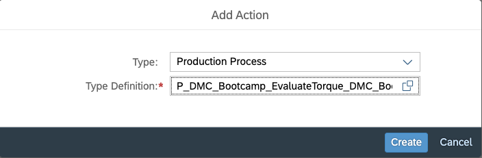
	
4. Click the "Configuration" button and configure the parameters as following.
	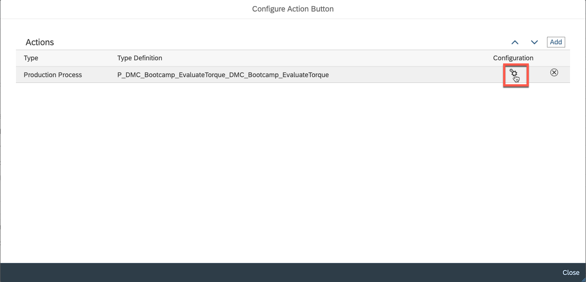
	
	
	
5. Click "Save" button to save the POD.

## Step 7: Test the scenario
1. Open your own POD. You can get POD access URL by clicking the "URL" button in the "POD Designer" App. E.g. [https://DMC_URL/cp.portal/site#DMEWorkCenterPOD-Display?POD_ID=DMC_BOOTCAMP_POD](https://DMC_URL/cp.portal/site#DMEWorkCenterPOD-Display?POD_ID=DMC_BOOTCAMP_POD)

2. Select the SFC (e.g. 78378_030) and select the operation (e.g. 1879683-0-0010/0010). In the "Data Collection List" tab, click "Collect" button.
	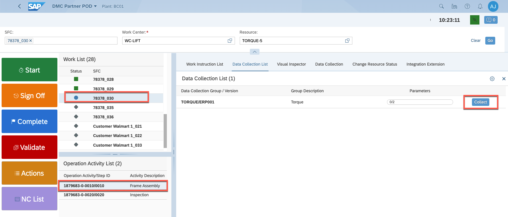
	
3. Enter the Data Collection Value and click "Save" button to perform the data collection.
	
	
4. Click the "Evaluate" button to trigger the evaluation process. 
	
	
5. Go to "Monitor Production Process" App to check the details.
	
	
6. If either left or right torque value exceeds the min and max value consecutively 3 times, it will automatically log the nonconformance code. Perform the step 7.2 to step 7.4 three times with the torque value out of range, and go to "Monitor Production Process" App to check the details.	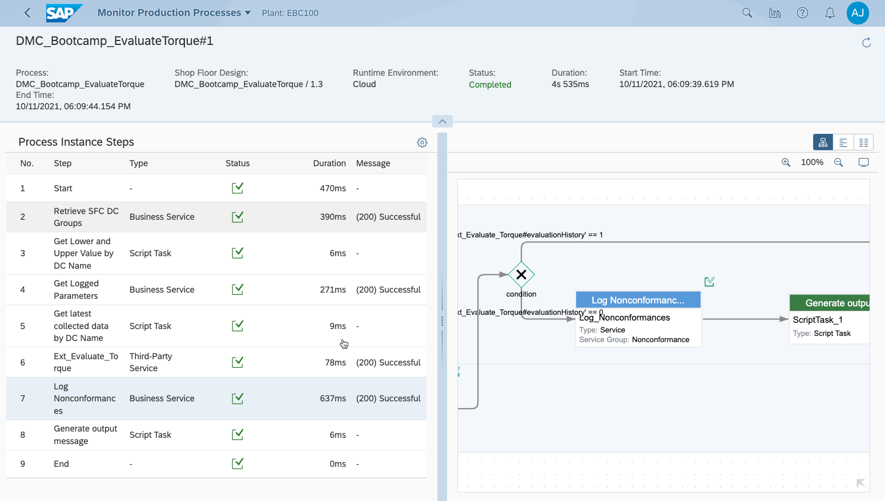

7. Click "NC List" button, you will see the non conformance is automatically logged.
	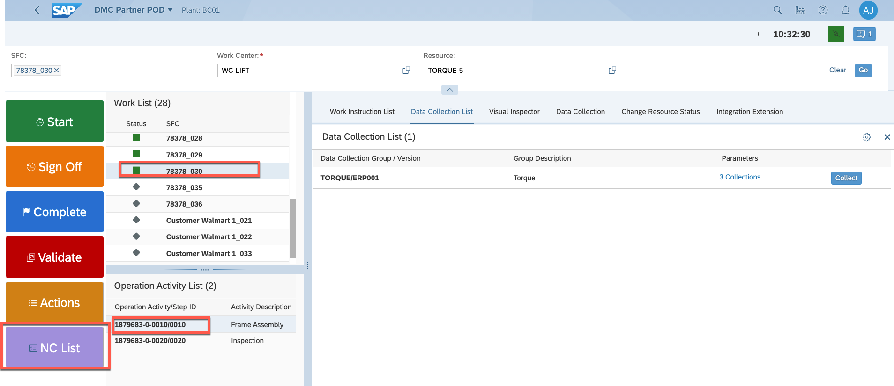
	
	
	
8. To check the MS SQL database table running in Kyma, you can access the URL `https://<API_URL>:<API_PORT>/api/v1/listAll` in the browser to see all the records in the table.
	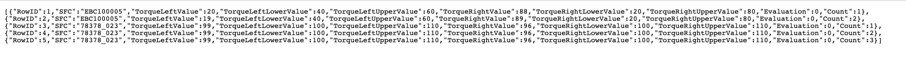