# Exercise 2.2 - Send Alert to MS Teams

## Overview
In this exercise, we would like to show you how to integrate Microsoft Teams with SAP DMC. Based on the production process we've designed in the Exercise 3.1, once the nonconformance  is logged, it will also send an alert to Microsoft Teams immediately.

## Prerequisites

- Microsoft Teams

## Step 1: Create a team in Microsoft Teams
1. Under "Teams" section, click "Join or create a team" at the bottom of your teams list

2. Click "Create a team" and choose "From scratch". You can choose "Private" or "Public" teams.

3. Enter the name of your Team, e.g DMC Extensibility Bootcamp and click "Create" Button.

## Step 2: Add the Incoming Webhook App

1. Click the 3 dots on the right-hand side of the team you created, and select "Manage Team".
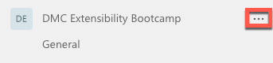
	
2. Navigate to the "Apps" tab and click "More Apps".
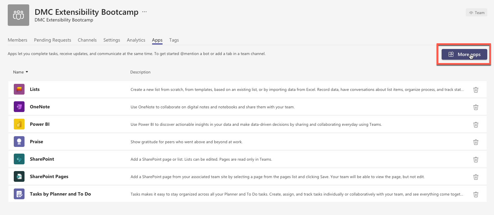
	
3.	Search for "Webhook" and select the "Incoming Webhook" app.
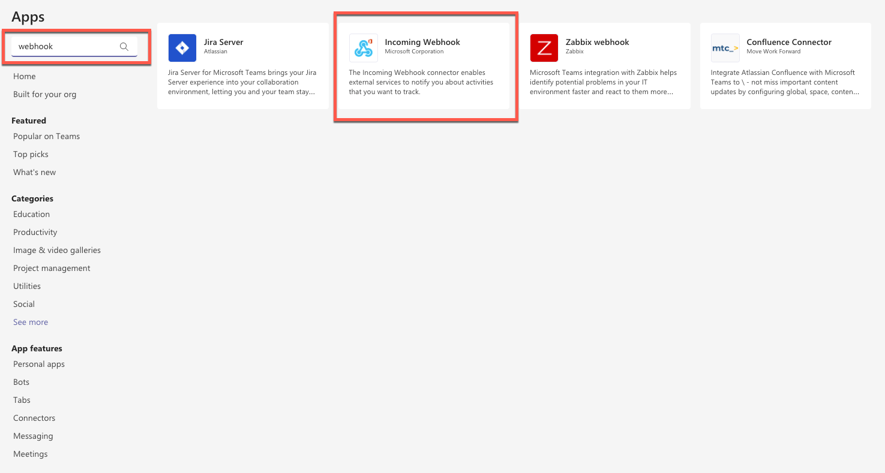

4. Click the "Add to a team" button.

5. Click the "Set up a connector" button.

6. Enter the name, e.g. SAP DMC Bootcamp and click "Create" button.

7. The Webhook is created. Copy the URL and click "Done". 
Example URL: [https://sap.webhook.office.com/webhookb2/20b14fbd-0620-4c4d-889c-e9565a081d5a@42f7676c-f455-423c-82f6-dc2d99791af7/IncomingWebhook/b009f9784511407a847bcff236846a05/e0dbc132-05b7-4f39-a07a-c4cd6294b290](https://sap.webhook.office.com/webhookb2/20b14fbd-0620-4c4d-889c-e9565a081d5a@42f7676c-f455-423c-82f6-dc2d99791af7/IncomingWebhook/b009f9784511407a847bcff236846a05/e0dbc132-05b7-4f39-a07a-c4cd6294b290)
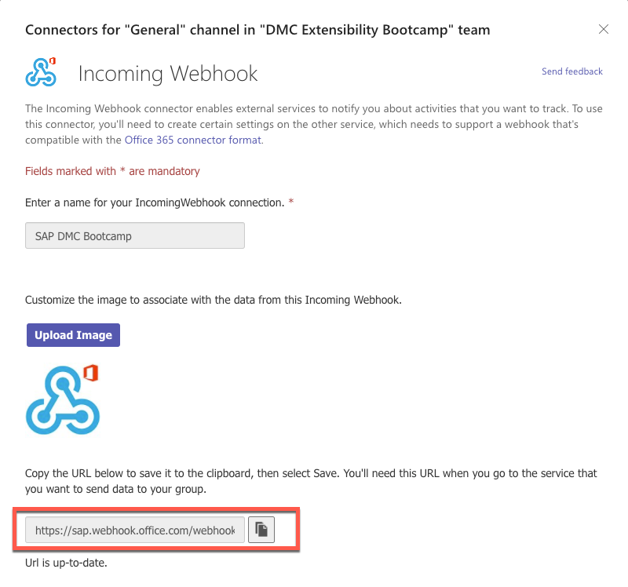

8. You will see a message displayed in your teams channel showing the connector which you've created.
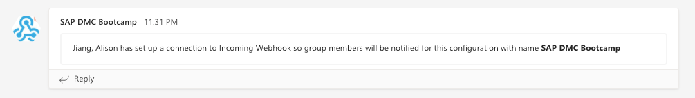

## Step 3: Create the destination in SAP BTP

1. Log into your BTP cockpit and click the "Destinations" section in the left pane.
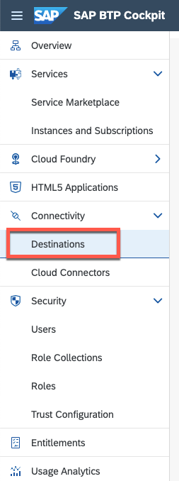

2. Click "New Destination" button. Enter the name of the destination, e.g. MicrosoftTeams. For the "URL", enter the base URL of your Webhook service URL, e.g. [https://sap.webhook.office.com/](https://sap.webhook.office.com/)

## Step 4: Create the Web Server in SAP DMC

1. Log into your DMC and go to "Manage Web Servers" App.

2. Click "Create" button. 
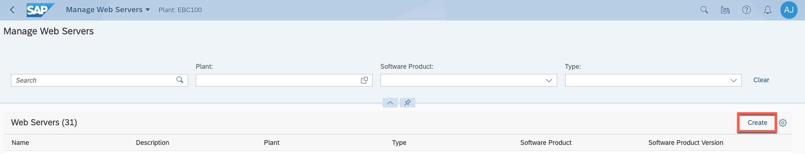

3. Under the "Header" tab, enter the name of the web server, e.g. MicrosoftTeams_DMCBootcamp. Enter the description of the web server, e.g. Microsoft Teams integration for DMC Bootcamp. Select the Plant accordingly.

4. Under the "Server Details" tab, select "Cloud services" as the server type. For the parameter "Host URL", enter the base URL of your Webhook service URL, e.g. [https://sap.webhook.office.com/](https://sap.webhook.office.com/)
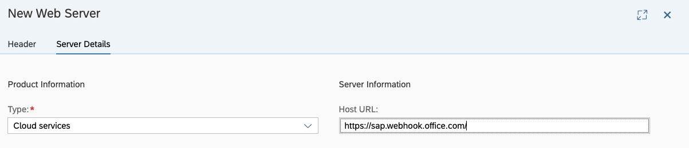

5. Click "Create" button and your destination is created.

6. Under the Destination tab, add the destination which you've defined in the SAP BTP.
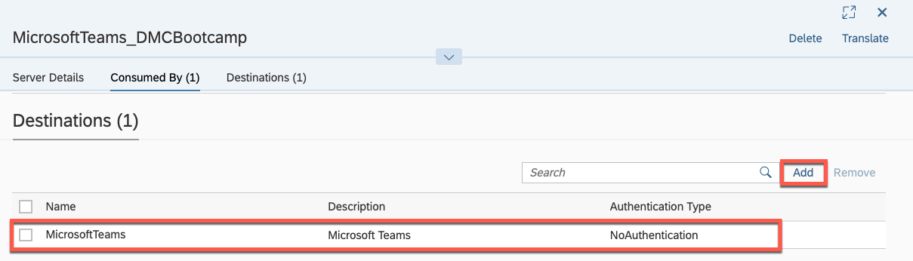

7. Select the "DMC_Cloud" web server, under the "Connection" tab, create the connection with your Web Server.

## Step 5: Register the service in SAP DMC

1. Go to "Manage Service Registry" App.

2. Click "Create" button.
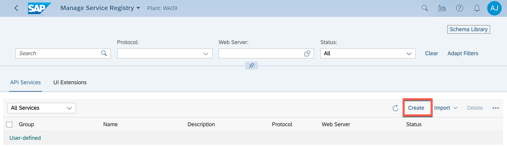

3. Under the "Header" tab, enter the service name, e.g. MicrosoftTeams_DMCBootcamp. For the "Group" parameter, select "BusinessProcessExtensions".
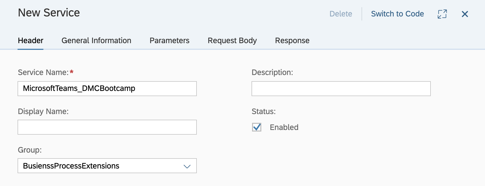

4. Under the "General Information" tab, for the "Method" parameter, select "POST". For the "Web Server" parameter, select the Web Server you've created, e.g. MicrosoftTeams_DMCBootcamp. For the "URL / Path" parameter, enter the path of your Webhook service URL.

5. Under the "Request Body" tab, enable the "Request Body". For the "Required" parameter, select "Yes". Click “Add” button.

6.  For the "Content Type", choose "application/json". For the "Schema", click "Define Inline Schema".
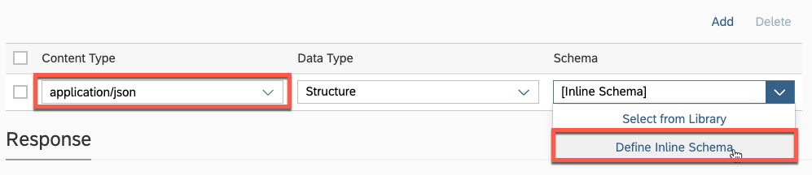

7. Define the Schema as following and click "Save" button.

		{
		    "type": "object",
		    "properties": {
		        "text": {
		            "description": "Message To Be Sent",
		            "type": "string"
		        }
		    },
		    "required": [
		        "text"
		    ]
		}

8. Click "Create" button. Now your service is ready to use.

## Step 6: Design Production Process
1. Go to "Design Production Process" App.

2. Select the Production Process "DMC_Bootcamp_EvaluateTorque" which is created in the exercise 3.1. Click "Edit" button.
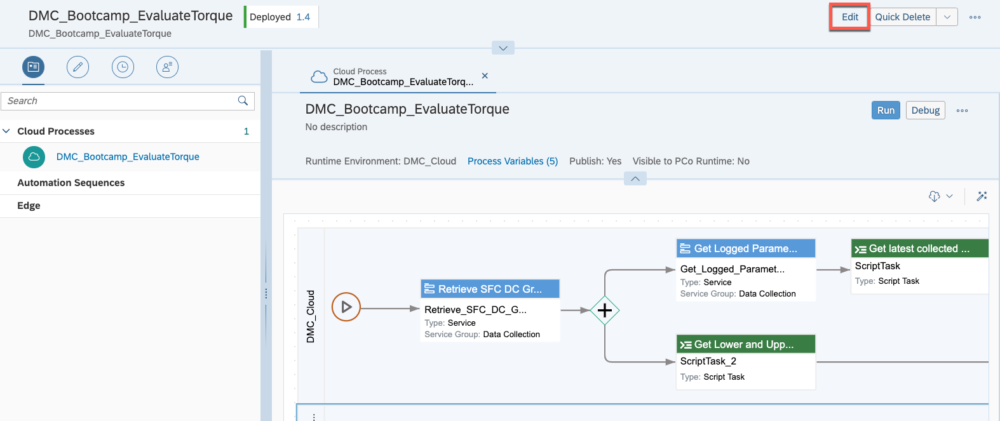

3. Click "Save as New Version".

	

4. In the left pane, click "Select Services" and choose your custom Web Server "
MicrosoftTeams_DMCBootcamp" and custom service "MicrosoftTeams_DMCBootcamp". Click "Save" Button.
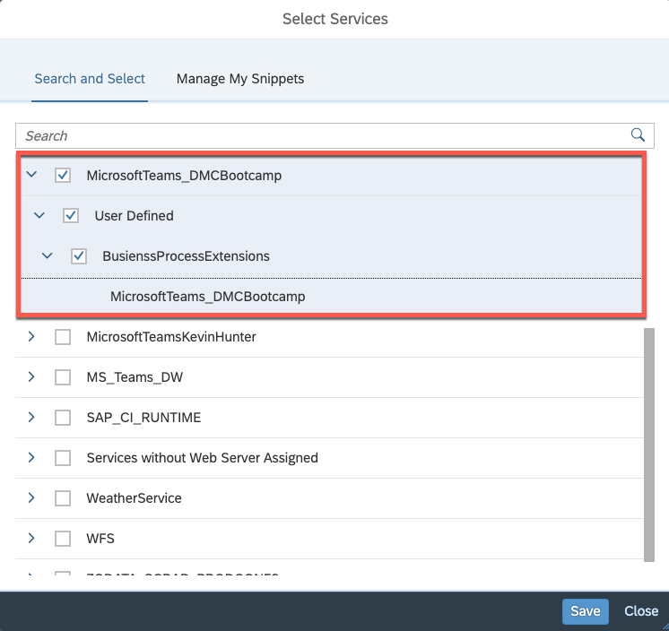

5. Drag and Drop the services into the production process right after the "Generate output message" script.

6. Click "Save All" and click "Quick Deploy" button. Now your Production Process is ready to test.

## Step 7: Test the scenario
1. Open your own POD. You can get POD access URL by clicking the "URL" button in the "POD Designer" App. E.g. [https://DMC_URL/cp.portal/site#DMEWorkCenterPOD-Display?POD_ID=DMC_BOOTCAMP_POD](https://DMC_URL/cp.portal/site#DMEWorkCenterPOD-Display?POD_ID=DMC_BOOTCAMP_POD)

2. Select the SFC (e.g. 78378_030) and select the operation (e.g. 1879683-0-0010/0010). In the "Data Collection List" tab, click "Collect" button.
	
	
3. Enter the Data Collection Value and click "Save" button to perform the data collection. Enter the Torque value which is out of range.
	
	
4. Click the "Evaluate" button to trigger the evaluation process. 
	
	
5. If either left or right torque value exceeds the min and max value consecutively 3 times, it will automatically log the nonconformance code and send the Alert to MS Teams. Thus, perform the step 7.2 to step 7.4 3 times with the torque value out of range consecutively. Go to "Monitor Production Process" App to check the details. You will see the service "MicrosoftTeams_DMCBootcamp" is succesfully triggered.
	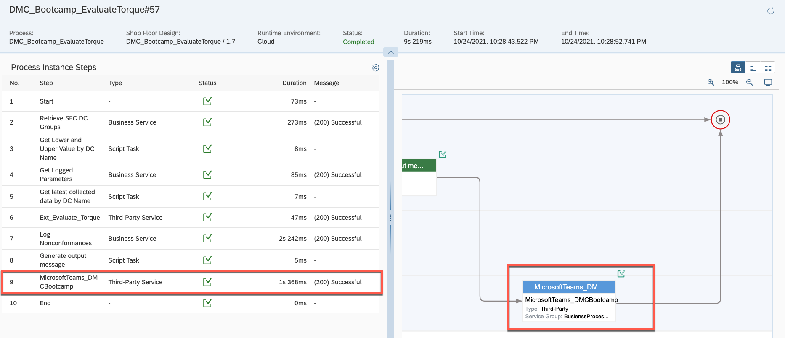
	
6. Check your Microsoft Teams, you will recieve one message which is sent from SAP DMC.
	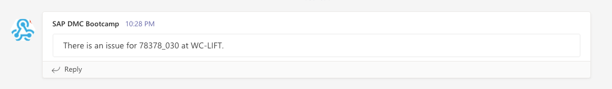
	