# Exercise 3 - Perform Assembly Operation with visual inspection

## Overview
In this exercise, we would like to show an example of Visual inspection during the production process at a specific Operation.
A Machine learning model will be used to process a visual image to determine a successful pass or fail for the inspection.

There are a number of steps required to transact this scenario.Firstly we require to create and train a Machine Learning Model to be able to determine if the assembly image represents a pass or fail. Once the model is created it can than be integrated into DMC.

## Pre-requisites
- [AI/ML Role Management](https://help.sap.com/viewer/48311ee421904ba38d0592e30e2437a1/latest/en-US/d3abdf70b0fe4c64859f3850d56e5b3d.html)
   
## Step 1: Build The Machine Learning Model

There are many tools available to build and train a Machine Learning Model. In this example we will make use of Google's Teachable Machine which is a quick and easy tool to create and train a model. The model will be based on images of a Valve Head assembly.

This will consist of 3 categories of image.

  --SCREW_LEFT (Missing Left Hand side Screw)

  --SCREW_RIGHT (Missing Right Hand side Screw)

  --OK (Acceptable image with no inconsistancy)

- Access Google's Teachable Machine [Teachable_Machine](https://teachablemachine.withgoogle.com/)
   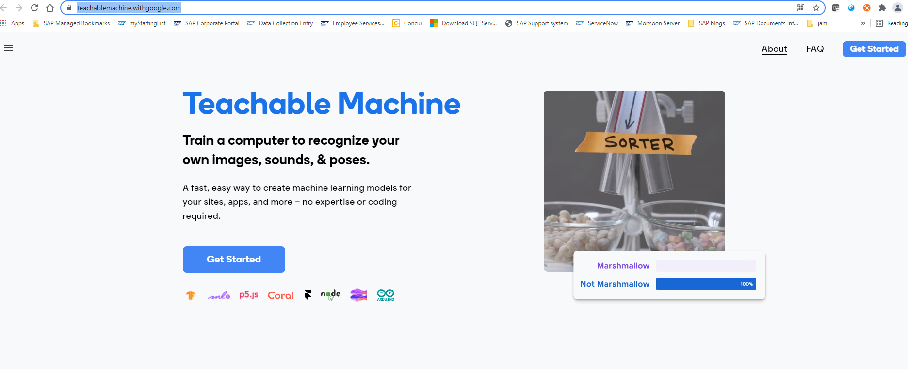
   and click on "Get Started"

 - Create a Model
   Select an "Image Project"

   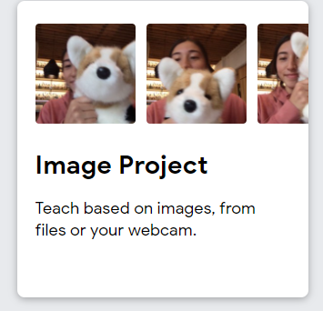

   Select "Standard Image Model"
   
   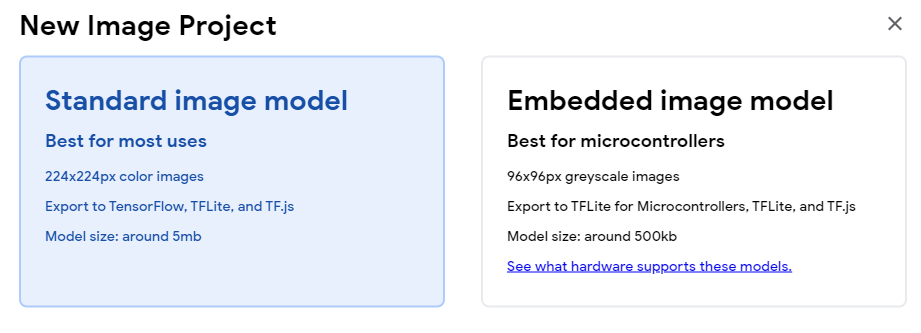 

   The Following will be displayed.

 
   
   The desired classes can now be created. In this case three classes. SCREW_LEFT, SCREW_RIGHT, OK. The third class can be inserted with the "Add Class" button

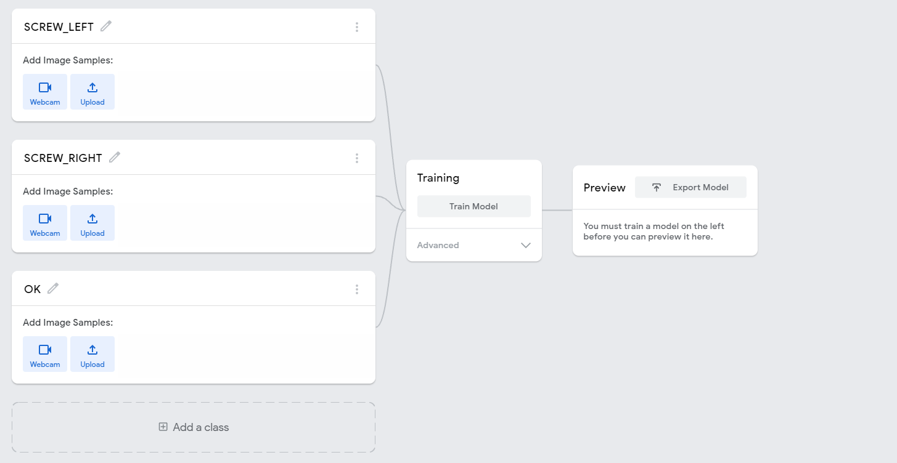 

 - Upload Images

   The sample images relevant to each class can now be uploaded by clicking the "Upload" button within the relevant class.
   
   Upload of the SCREW_LEFT images is shown. This can be achieved by dragging selected images across from a folder repository to the highlighted area.
   
   This must be repeated for each Class defined.
   
   
   
   Once all images have been uploaded to the relevant Classes the result should look something like this.
   
   

 - Train The Model

   We can now Train the Model, by using the uploaded sample images for each class to give intelligence to the Model allowing it to decide if an image supplied to it is good or bad.
   
   This is done by clicking "Train Model"
   
   After a short delay (generally around 30 seconds), the model will display as "Trained".
   
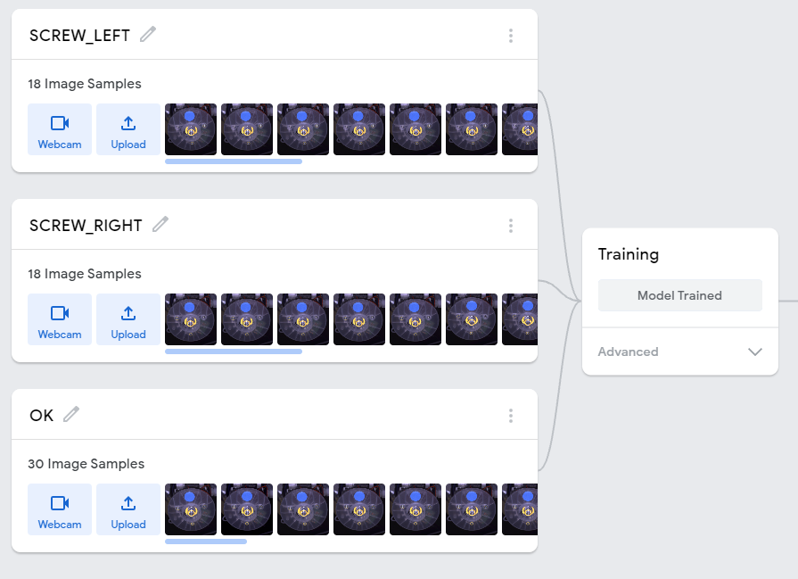   
   
   
 - Export Model

   The model can now be exported by selecting "Export Model"
   
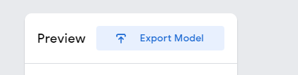 

   and then selecting the "Download" radio button and clicking "Download My Model"
   
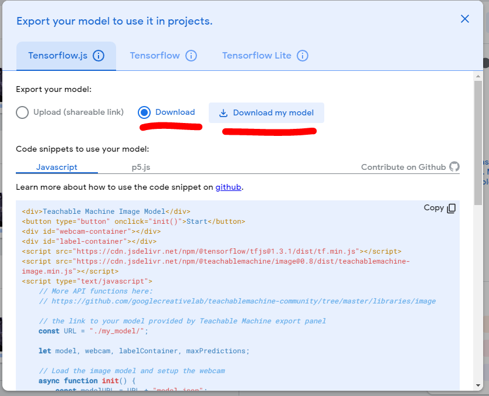 

   This results in a zip file being downloaded which will contain 3 files similar to the following.
   
 
   
   We have now successfully created a Machine Model which we will consume in DMC in a future step.
   
## Step 2: Validate your Non Conformance Code Structure
 
 - Manage Non Conformances

      Within DMC select the "Manage Nonconformance Codes" tile. 
	  
 

   and create two new Non Conformances for "SCREW_LEFT" and "SCREW_RIGHT".
   
   NOTE: These NC codes should match the names of the Classes created within the Machine Model in Step 1.
   
 
 
 
 - Manage Non Conformance Groups

   Within DMC select the "Manage Nonconformance Groups" tile.
   
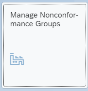 

  and create a new Nconformance Group
  
 
  
  this Non Conformance Group should contain the two Non Conformance codes created previously
  
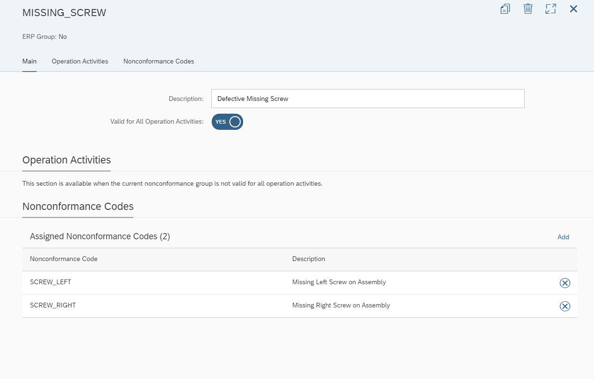  

## Step 3: Manage AI/ML Scenario

 - Create an AI/ML Scenario

   This step will enable us to build the Machine Learning scenario allowing us to associate the previously generated machine model and Non Conformance Code structure.

   Within DMC select the "Manage AI/ML Scenarios" tile, and "Create" a new scenario
   
    

   and select the "Predictive Quality: Visual Inspection" scenario
   
   
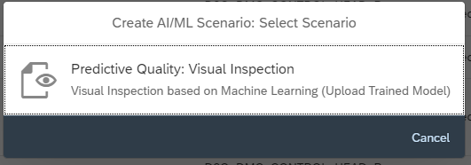  
   
   Enter a name and description for the Scenario, 

     

   Define the Scenario Available Combintation by clicking "define" and associate the associated DMC Objects.

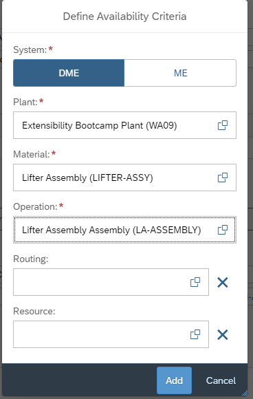     

   Click "Add" and the expected result is as below
   

   
 - Click on Step 2 to Configure the Scenario and populate as shown
  

   Now the files generated for the Machine Learning Model in our initial excercise task need to be added to the scenario.
   Either Click Add to select files, or drag and drop files into the panel area.
   
   Two files require to be added, "weights.bin" and "model.json" 

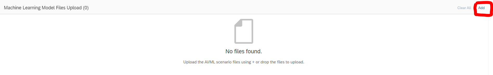
   
   with a result similar to below
   

  Model Input and Preprocessing Steps should be configured as follows
  

 - Clicking Step 3 moves the screen onto "Scenario Deployment" and requires the additon of the Non Conformance Codes that should be considered in the evaluation process in the POD Plugin. 
   These Non Conformance Codes are the codes created previously
  
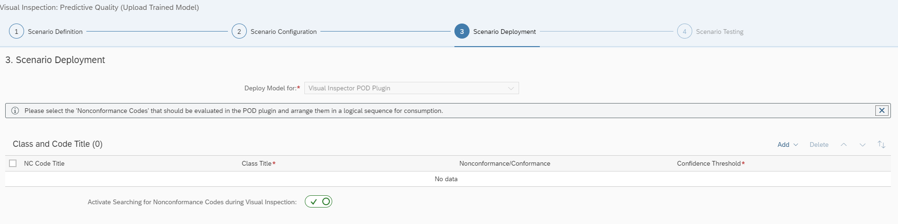

   Firstly add the Non Conformance Group of "MISSING SCREW"
   
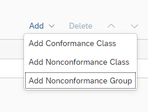
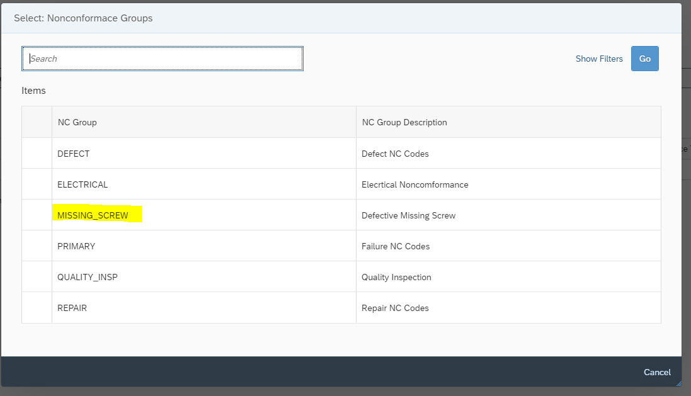

   and then add a Conformance Class
   
   Each Entry requires a Class Title to be entered as below
   
 

 - Clicking Step 4 allows us the option to test the scenario 
   
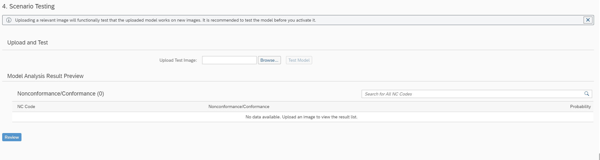 

   By then clicking Review we have the ability to check and review the scenario prior to Deployment.
   
   The model can be deployed by clicking "Save and Activate". The resultant model will then display as "ACTIVATED" on the main AI/ML page
   
 

 

## Step 4: Test and Transact the Scenario

 - Create and Relase and SFC against a Shop order relating to the LIFTER-ASSY material

 - Open the predefined DMC Partner POD

 - Select and Start the desired SFC and Operation.

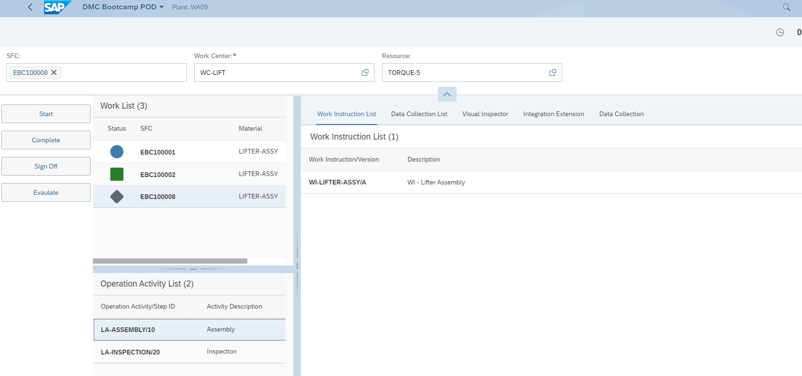 

   Once Started select the Visual Inspector Tab
   
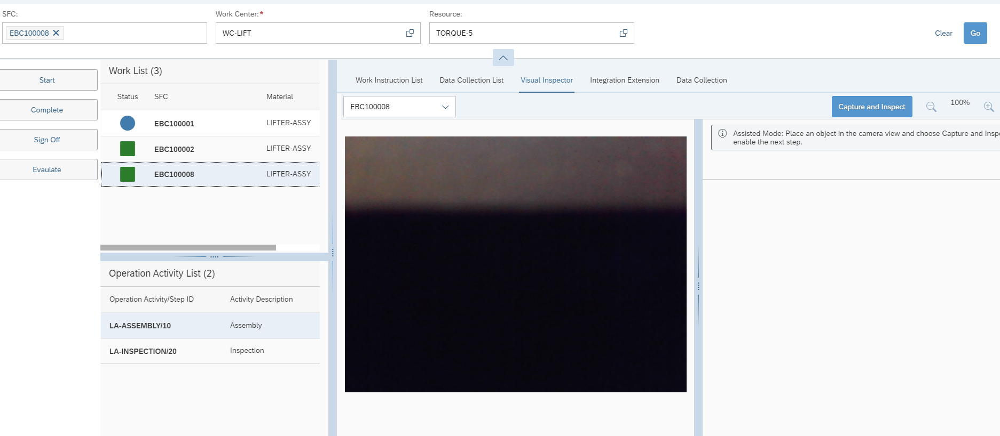 

   The Webcam associated with the PC / Laptop device being used by the operator can be used to capture an image of the assembled product for verification in the POD.
   
   In this example we will force a predetermined image into the POD.
   
   This will be done via a postman postman API call.
   
   In order to achieve this, the image to be passed via the API should be converted to a BASE-64 form. This can be achieved via a tool such as     [Base64 Converter](https://codebeautify.org/image-to-base64-converter)
   
   Within Postman, From the Postman Collection select the POST InspectionLog from the Visual Inspection folder.
    

   The Body should be configured as shown, ensuring all inputs (eg plant, sfc) correspond to required values. The BASE-64 converted file content should also be inserted.
   
    
   
   SEND the API.   
   
   A successful posting will result in the selected image being displayed in the POD, with a calculated result suggesting if the image is either conformant or non conformant to the process.
   In this example the model has calculated probability of the "left screw" being mssing in the assembly is 44%
   
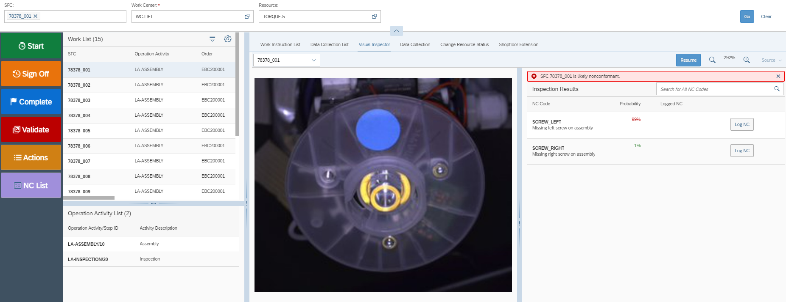