# Exercise 4.3 - Perform Inspection Operation (2/2)

## Create iflow in CPI tenant to processing Personal Number and Variance Reason Code
1. Login to your CPI tenant and navigate to 'Build and develop integraton content'
- Create an new package(optional if you have existing one, edtiable required)
- Navigate into your package, open tab 'Artifacts' and click Edit
- Click Add and select type 'Integration Flow', and fill the mandatory fields
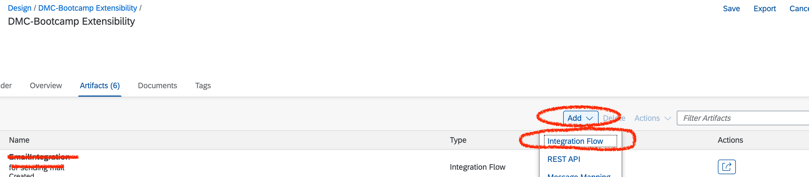
- Choose 'Upload' and browse the iflow zip file downloaded from [Z_PRODORD_CONF_PERS_CODE_FETCH.zip](https://github.com/SAP-samples/digital-manufacturing-extension-samples/tree/main/DMC_IntegrationExtensions), you can skip create iflow yourself.

- Adding the iflow components to meet your requirements
    - Inbound adapter should be ProcessDirect, and the Address you specified will be used in DMC app 'Manage Integration workflows'
    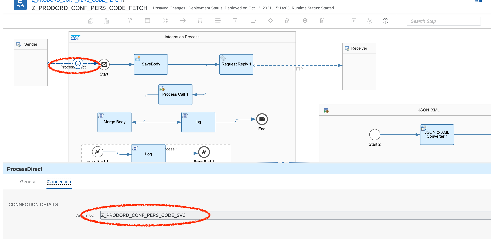
    - SaveBody will save current body as property and Merge Body will restore the body and merge the expect value fetched from the former step Request Reply
    - Config the iflow for external parameters or Edit the default values, Address is the service url you can request the personnel id and variance reason code with parameter pattern 'SFC:sfc#':
    ```
   https://dmc-persno-reason-code.c-51e1e9a.kyma.shoot.live.k8s-hana.ondemand.com
    ```
    
    
    - Import the certificate of your service
        - Open the your kyma service url with firefox 
        - Click the 'lock' icon left side of the broweser address
        
        - Click 'Connection secure' and 'More Information' next
        - Click 'View certificate' and choose 'PEM(cert)'
        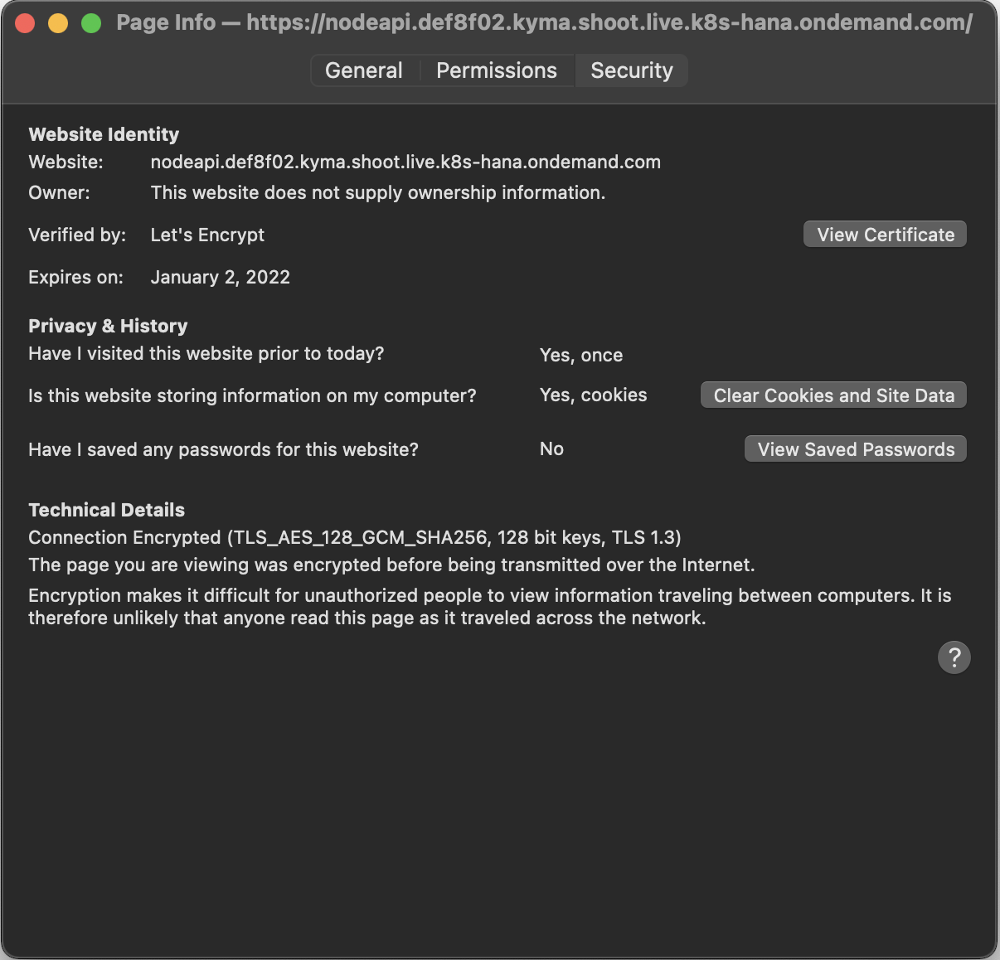
        
        - Go back to CPI tenant->Overview->Manage Keystore, click Add to add certifcate
    
    - Refer [Getting Started with Integration Flow Development](https://help.sap.com/viewer/368c481cd6954bdfa5d0435479fd4eaf/Cloud/en-US/e5724cd84b854719973afe0356ea128b.html) if you don't have ilfow develop experience

- Save and Deploy the iflow
- Navigate to 'Operate and monitor integration scenarios'
- Check that your iflow deployed and started successfully


## Apply your iflow in app 'Manage Integration Workflows'
1. Login to your DMC tenant and open 'Manage Integration Workflows'
- Select Outbound type
- Navigate to item 'Production Order Cofirmation'
- Edit the item and set the address your defined for iflow ProcessDirect adater in 'Custom Pre-XSLT Workflow'
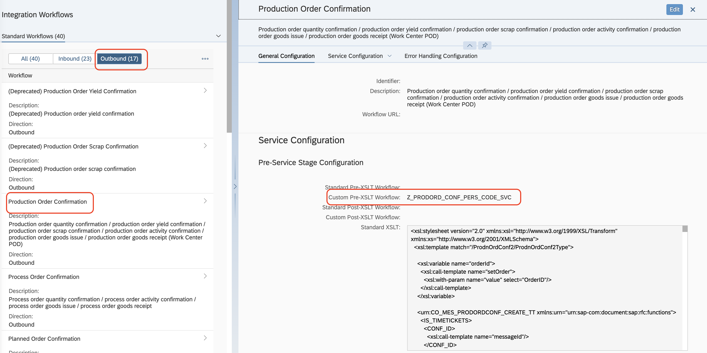
    - The standard XSLT has the mapping to handle Personnel Number and Variance Reason Code, so we don't need do customize on XSLT in this case
- Save it.

## Config the Collaboration links
1. Open app 'Manage Collaboration Links'
- Open 'COLLABORATION_ERP_YIELD_CONFIRMATION'

- Verify that Directive 'ERP_YIELD_CONFIRMATION' is assigned
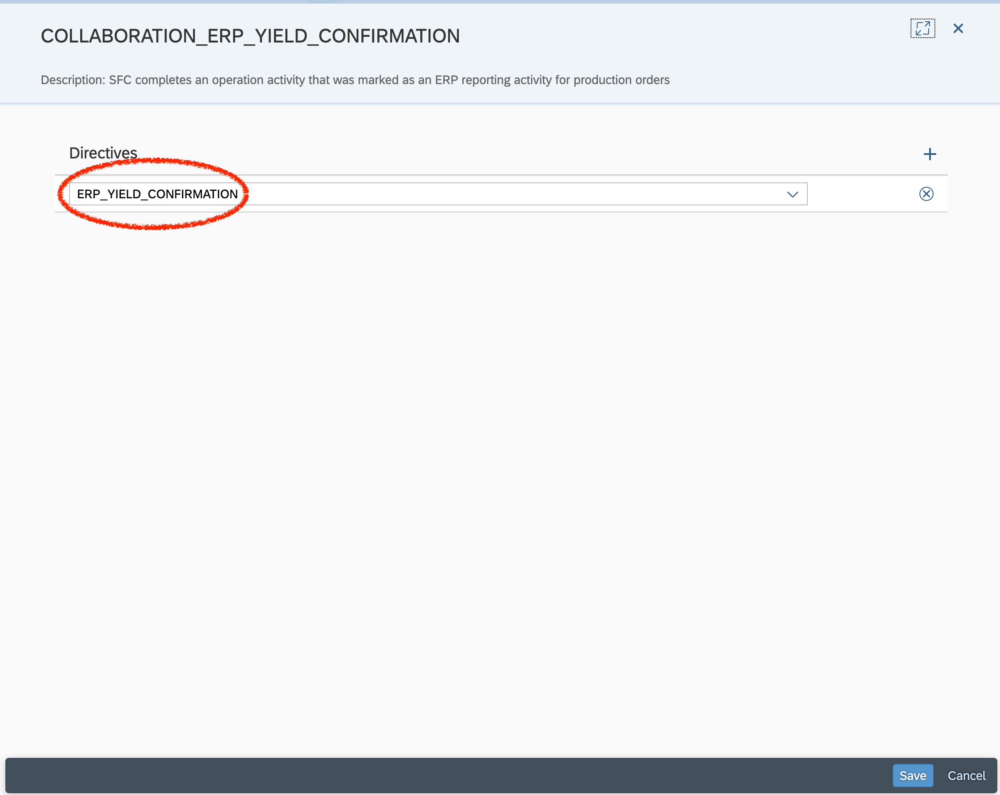
- Assign the directive and save if not assigned
## Manage Plants 
- Open app 'Manage Business Settings' under the plant you are working with
- Select 'Integration' from the left pane
- Select the Integration Mode as 'S/4HANA', select ERP Time Zone, Language
- Set the ERP Destination.(The destination should be the one configured in CPI cockpit)
- Save it
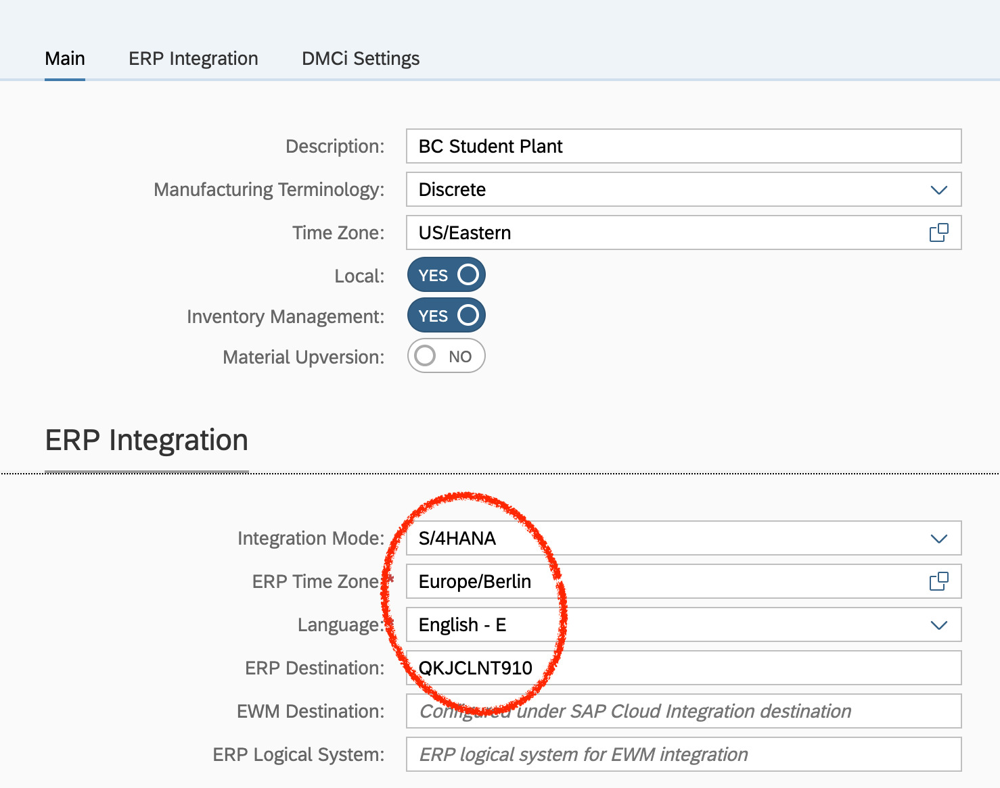

## Manage Materails
- Open app 'Manage Materials' under the plant you are working with
- Select the Material you need to work with
- Set 'Autocomplete and Confirm' to true and save
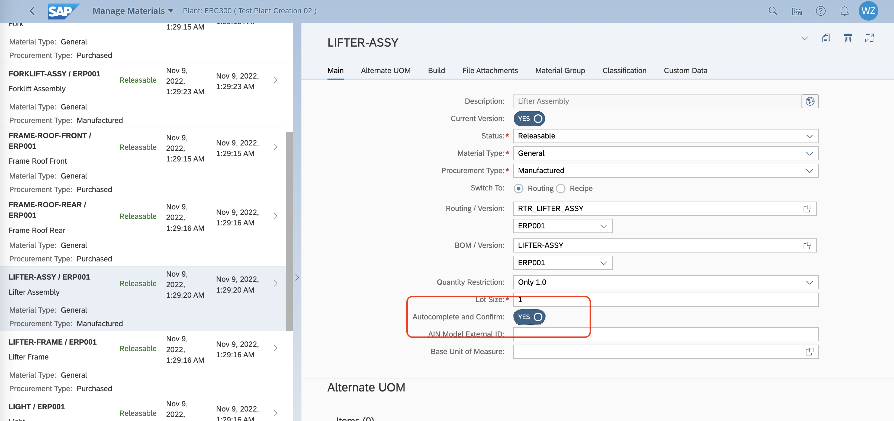

## Yield confirmation with Personal Id and Variance reason code
1. Open POD 'DMC_BOOTCAMP_POD' from POD Designer
- Click the Preview button(you can do from home page if you have published it)
- Click the SFC you want to work with from Work List, then select one operation activity.
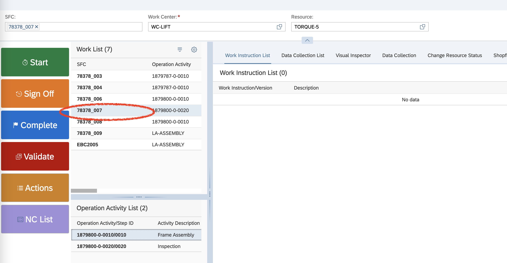
- Click 'Start' and then navigate to 'Integration Extension'
- Set Personal Number, select Variance Reason Code and Click 'Save Context'
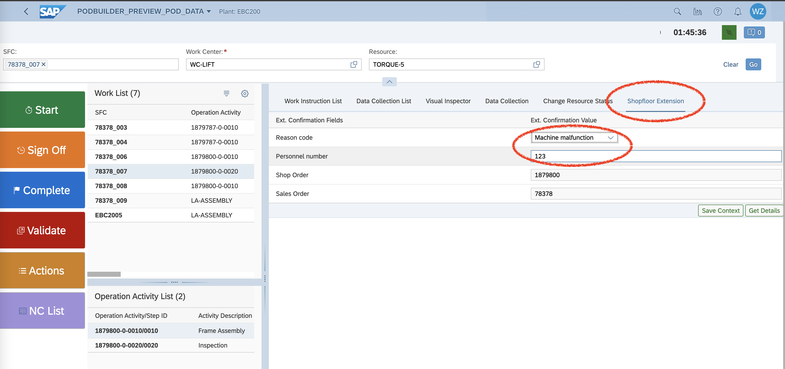
- Click 'Complete' from the left side of page


## Verify the result
1. Open app 'Integration Message Dashboard', you will be able to find a record corresponding to your SFC confirmation with status 'Completed'

- Login into your CPI tenant and navagiate to 'Overview/Monitor Message Processing', you should be able find there was a new message processed with status 'Completed'

- Login into S/4 HANA and execute t-code 'co03', search with your order id
- Click the 'Operations'

- Double Click the Start Date 

- Double Click the Confirmation

- Double click the Postg Date
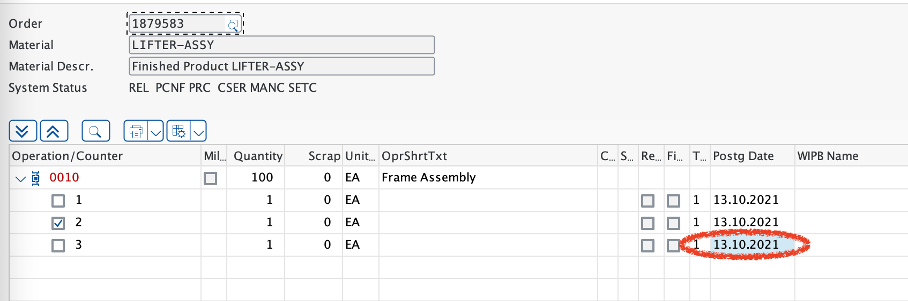
- Verify that the Reason code
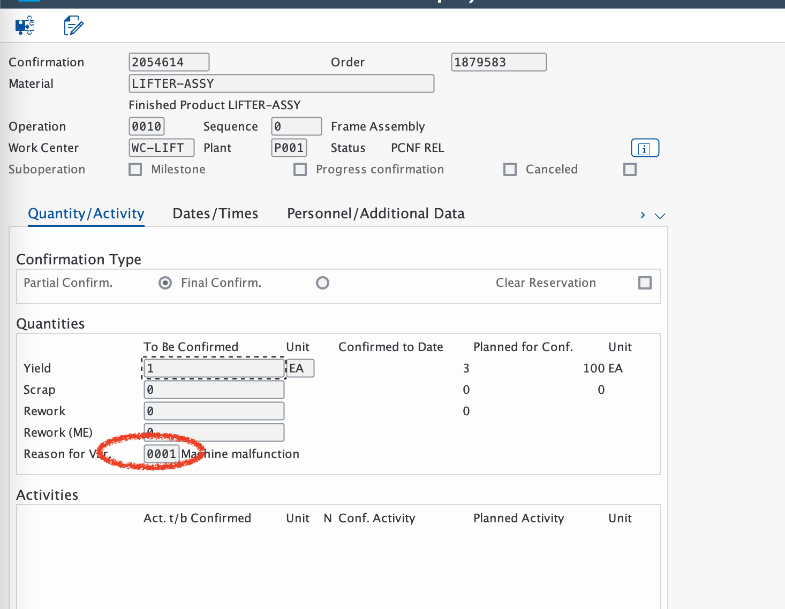
- Verify the personal number from tab 'Personnel/Additional Data', the Confirm. Text should be formated 'SFC:{your sfc no.}'
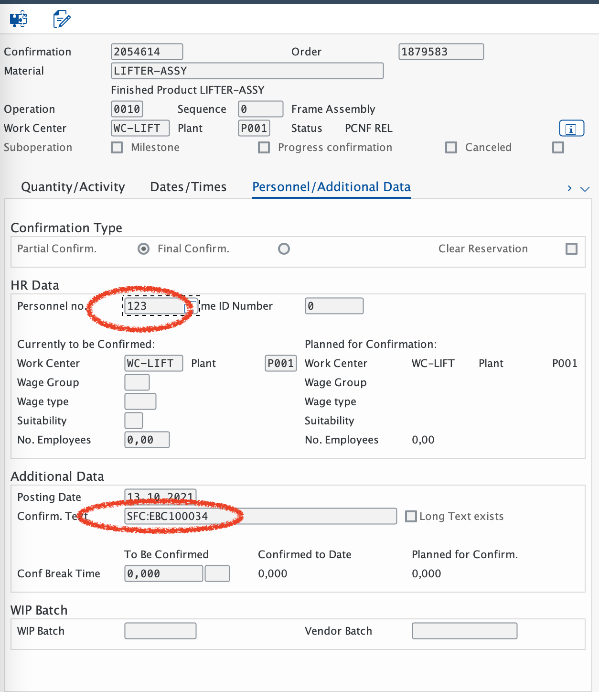