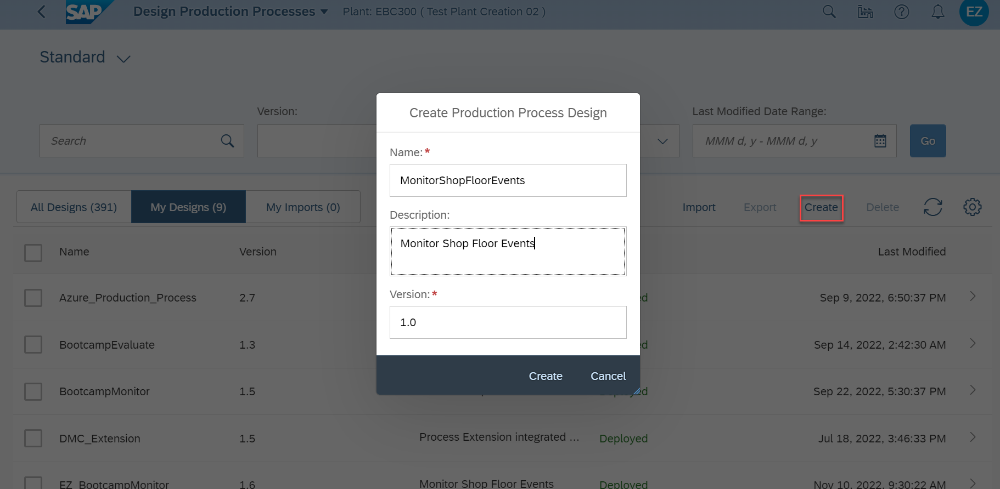
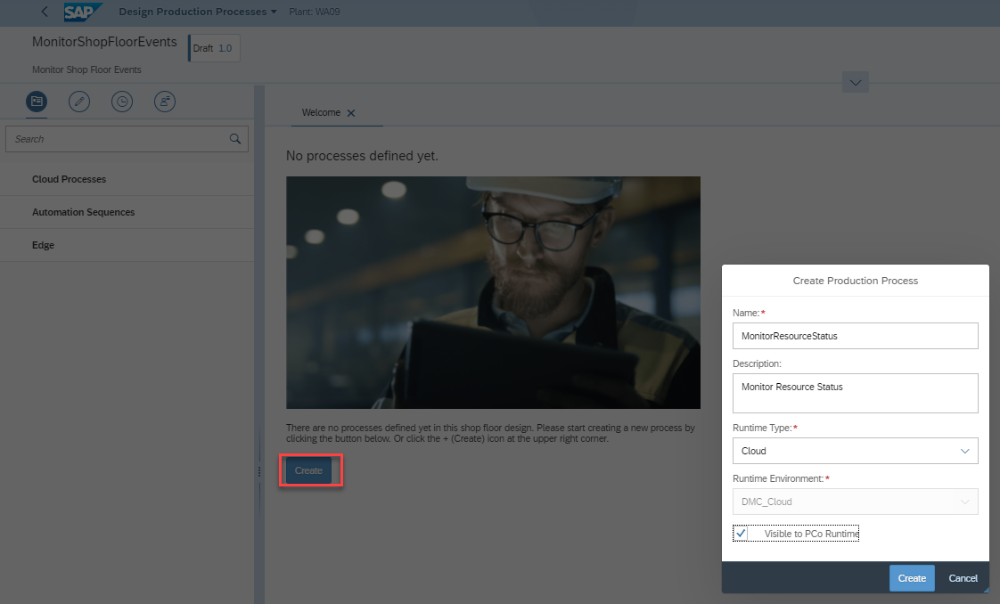
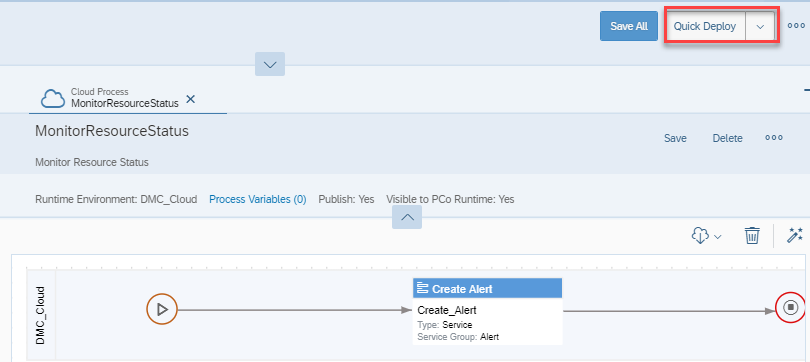
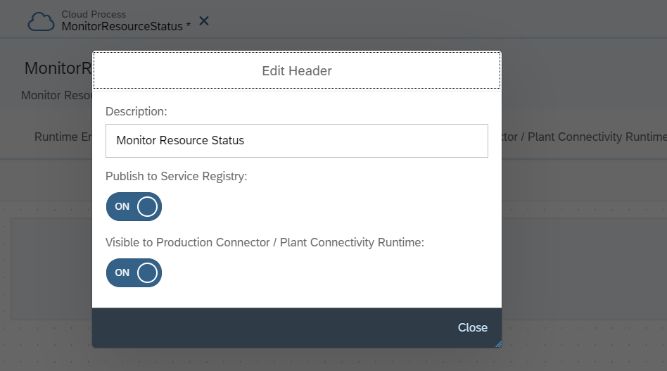
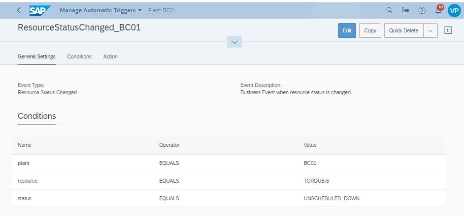
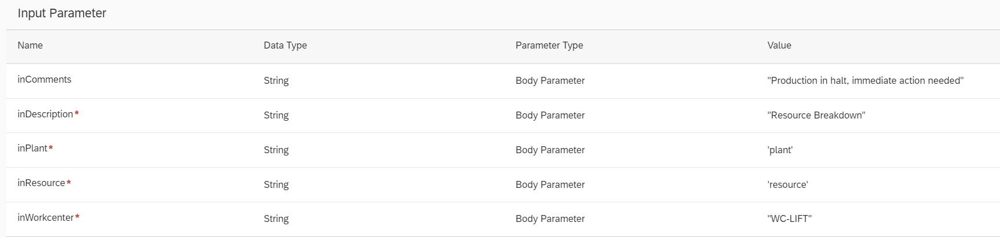
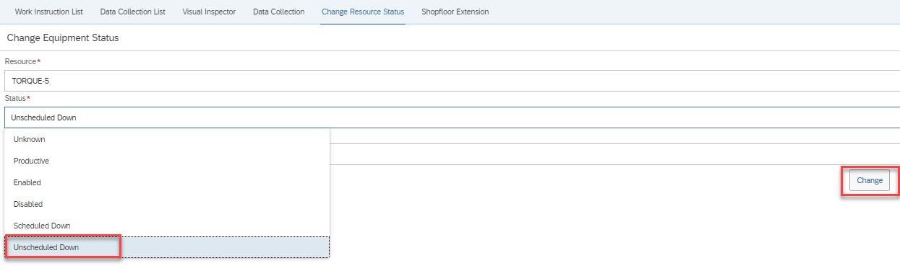
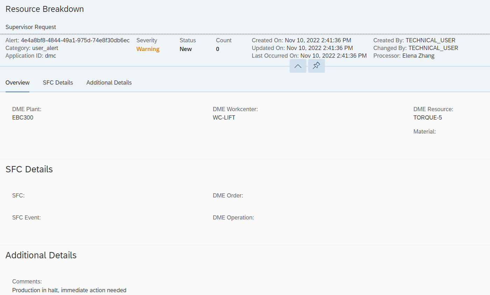

# Exercise 5 - Machine Monitoring

## Overview
In this exercise, we would like show you how you can listen to business events or machine events on the shop floor and trigger necessary action via production process. 

## Step 1: Create Action Trigger for Resource Status Change

1. Create Production Process "MonitorShopFloorEvents"

2. Create Cloud Process "MonitorResourceStatus"

3. Add Start and End Control and "Create Alert" Process

4. Add Input Parameters for Start Control

        {
                inComments (String)
                inPlant (String)
                inResource (String)
                inWorkcenter (String)
                inDescription (String)
        }
        
5. Create context for Alert. Maintain values for the user information as appropriate. 

        {
            alertNotificationType : "alert"
            alertSubscription : [{"subscriptionType":"\"user\"","value":"\"\""}]
            alertTypeId : "Supervisor Request"
            applicationId : "dmc"
            contextData : {"DME_Comments":"'inComments'","DME_Plant":"'inPlant'","DME_Workcenter":"'inWorkcenter'","DME_Resource":"'inResource'"}
            contextId : "DME_Shopfloor"
            createdBy : {"emailId":"\"\"","firstName":"\"\"","lastName":"\"\""}
            description : 'inDescription'
            processor : {"emailId":"\"\"","firstName":"\"\"","lastName":"\"\""}
        }
    
6. Deploy the Production Process

7. Publish production process to Service Registry. 

    

## Step 2: Create Automatic Trigger
1. Navigate to Application "Manage Automatic Triggers" in DMC and open "Business Rules" tab. 

2. Create new Business Rule "ResourceStatusChanged", select Event Type "Resource Status Changed" and add all conditions.

3. Select Cloud Process "MonitorResourceStatus" as action

4. Fill Input params for the action

        {
            "inComments": "Sample Comment for Showcase",
            "inDescription": "Resource Breakdown",
            "inPlant" : 'plant',
            "inResource":  'resource',
            "inWorkcenter": "WC-LIFT",
            "async": <leave blank>,
            "logLevel": <leave blank>
        }
## Step 3: Trigger Resource Change
From the DMC Partner POD, Click on Actions Buttion and change the resource status to "Unscheduled Down". We are simulating a resource down scenario which will essentially be triggered from the shop floor monitoring tags on the equipment. 

## Step 4: Monitor Alerts from Supervisor
Open the "Manage Alerts" application to see the supervisor request that has been created to act on Resource down situation. 

