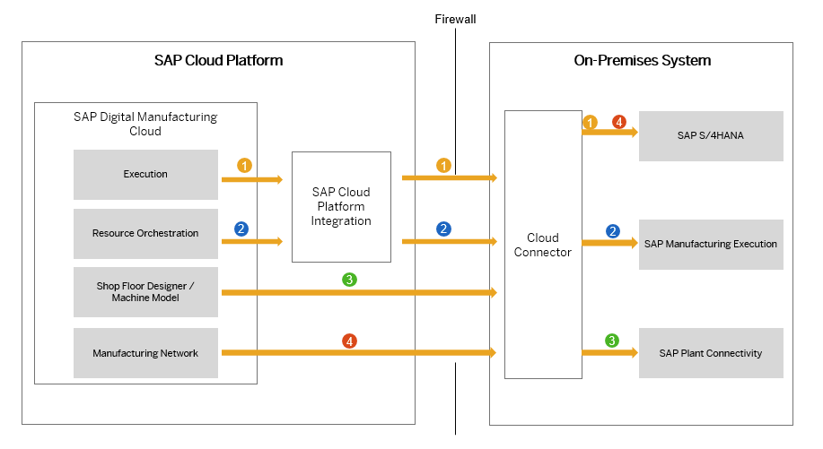
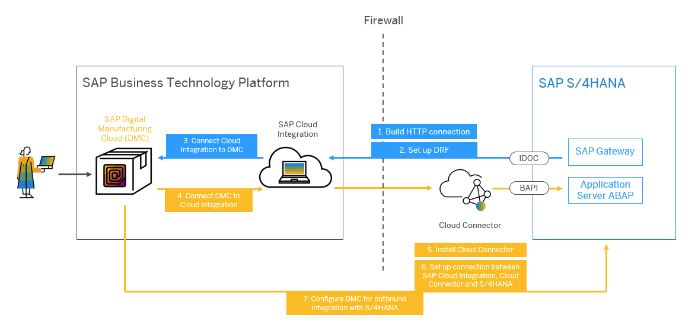

# SAP DMC Exensibility Bootcamp

## Participant Checklist
* Candidates should come to the bootcamp with their own DMC Demo system.
* The exercise guide will be done by the Partner BTP trial accounts. To get started, follow [https://developers.sap.com/tutorials/hcp-create-trial-account.html](https://developers.sap.com/tutorials/hcp-create-trial-account.html)
* Follow the "Prerequisite" section to install the necessary tools.
* Candidates should have preliminary knowledge on NodeJS, SAPUI5 and Business Technology Platform.

## Prerequisite

- `node` ([Node.js](https://nodejs.org/en/download/) version 12.x or 14.x is recommended)
-  `SAP Fiori Tools` [https://www.npmjs.com/package/@sap/generator-fiori]()
- `docker` (for example, [Docker Desktop](https://www.docker.com/products/docker-desktop) for macOS or Windows)
- A source code editor ([Visual Studio Code](https://code.visualstudio.com/) is recommended)
- `bash` or `zsh` shell to run the command snippets on MacOS or Linux, or [Git Bash](https://gitforwindows.org/) for Windows, MinGW, or [Cygwin](https://www.cygwin.com/))
- `kubectl` ([Kubernetes Command Line tool](https://kubernetes.io/docs/tasks/tools/)), see this tutorial how to install it
- `cf` ([Cloud Foundry Command Line Interface (CLI)](https://docs.cloudfoundry.org/cf-cli/install-go-cli.html))
- `mta` ([Multitarget application interface](https://sap.github.io/cloud-mta-build-tool/download/))
- `git` ([Git Downloads](https://git-scm.com/downloads))
- Download [postman tool](https://www.postman.com/downloads/)

### Step 1 - Configure your Trial Account

1. Go to [SAP BTP Cockpit](https://cockpit.eu10.hana.ondemand.com/trial/#/home/trial).
2. Choose **Go To Your Trial Account**.
    - If you don't have a user, you need to [register](https://developers.sap.com/tutorials/hcp-create-trial-account.html) for a free.
    - Wait for the completion of the on-boarding.
5. You should land on the **Subaccounts** page of your **Global Account** on trial.
6. Choose **trial**.
7. From the **Navigation area**, choose Security **Trust Configuration**.
8. Select the default IdP by clicking on the name attribute. The name might be **SAP ID Service** or **Default Identity provider**.
9. Enter the e-mail of the user to whom you want to give permissions.
10. Click **Show Assignments**.
11. Click **Assign Role Collection**.
12. From the Assign Role Collection dropdown list, select the relevant role collection:
    - Select **Business_Application_Studio_Developer** to assign a role collection to a developer.
    - Select **Business_Application_Studio_Administrator** to assign a role collection to an administrator.
    - Select **Business_Application_Studio_Extension_Deployer** to assign a role collection to an extension developer.

### Step 2 - Enable Kyma in Trial Account

You need an SAP BTP Subaccount with consumption-based model (that is, Cloud Credits). 

For this tutorial you have two options:

#### Option 1: Create Your Own SAP BTP Trial Account

1. Go to [SAP BTP Cockpit](https://cockpit.eu10.hana.ondemand.com/trial/#/home/trial).
2. Choose **Go To Your Trial Account**.
5. You should land on the **Subaccounts** page of your **Global Account** on trial.
6. Choose **trial**.
13. Go to **Kyma Environment**.
14. Choose **Enable Kyma**.
15. Provide a **Cluster Name**.
16. Choose **Create**.

This takes a while. You can start the tutorial in the meantime.

#### Option 2: Use Your Existing SAP BTP Subaccount

If you already have an older trial account, then you might not see the **Enable Kyma** button. In that case:

1. Go to **Entitlements**.
2. Choose **Configure Entitlements**.
3. Choose **Add Service Plans**.
4. Search for and select **Kyma runtime**.
5. Check the **trial** (Environment) checkbox.
6. Choose **Add 1 Service Plan**.
7. Choose **Enable Kyma**.
8. Provide a **Cluster Name**.
9. Choose **Create**.
This takes a while. You can start the tutorial in the meantime.

### Step 3 - Assign Kyma Roles to User

SAP BTP’s XSUAA is used to access the Kyma runtime. Please follow the steps to [assign Roles in the Kyma Environment](https://help.sap.com/viewer/65de2977205c403bbc107264b8eccf4b/Cloud/en-US/148ae38b7d6f4e61bbb696bbfb3996b2.html).

### Step 4 - Getting started with Business Application Studio

SAP Business Application Studio is a development environment available on SAP Business Technology Platform. To get started, please follow the link: [https://developers.sap.com/tutorials/appstudio-onboarding.html]()

### Step 5 - Install SAP Plant Connectivity
With SAP Plant Connectivity (PCo), SAP provides a software component that enables the exchange of data between an SAP system and the industry-specific standard data sources of different manufacturers, for example, process control systems, plant Historian systems, and SPC systems.

Follow this link for more details [SAP Plant Connectivity](https://help.sap.com/viewer/c90214be0d934ebdb6f3bce29c63c0ff/15.5.0/en-US/46a00344d44852b7e10000000a155369.html?q=plant%20connectivity)

### Step 6 - Install SAP Cloud Connector
Configure a cloud connector that acts as a reverse invoke proxy between an on-premises network and SAP Business Technology Platform. The cloud connector comes standard as part of the SAP Cloud Integration service and serves as a link between SAP Business Technology Platform and on-premise systems such as SAP S/4HANA.

Follow this link for more details [Setting Up the Cloud Connector](https://help.sap.com/viewer/c86ca4026fae4cb3ba66ed751866175b/latest/en-US/ef206b74c1dd416caf1e0fa555a2441f.html#c89cabe21cee42b2be3380bb887a9c3a.html)

### Step 7 - Configure Machine Model in DMC
SAP Plant Connectivity is the connectivity layer between SAP Digital Manufacturing Cloud and the shop floor. As SAP Plant Connectivity is installed on the customer's premises, a cloud connector is required for the communication from SAP Digital Manufacturing Cloud to SAP Plant Connectivity. In addition, the communication needs to be secured by valid certificates.

Follow this link for more details [Integrate with SAP Plant Connectivity](https://help.sap.com/viewer/c86ca4026fae4cb3ba66ed751866175b/latest/en-US/2aaac1f5ed104ffb850ede5942d7031d.html?q=plant%20connectivity)

### Step 8 - Integration with SAP ERP or SAP S/4HANA (Optional)
SAP Digital Manufacturing Cloud for execution uses SAP Cloud Integration to communicate with external SAP ERP or SAP S/4HANA systems. You can connect various ERP systems, for example one system per plant or country. The global SAP Digital Manufacturing Cloud for execution system is used across all plants.

Follow this link for more details [Integration with SAP ERP or SAP S/4HANA](https://help.sap.com/viewer/c86ca4026fae4cb3ba66ed751866175b/latest/en-US/351c4ef7bb4c4c4a8d7f9562988575c5.html)

### Step 9 - Load DMC Demo Data to be done by SAP team
We will be loading the basic data that will be needed for bootcamp excercise and for this we need create key Digital manufacturing instance and you can follow this [link](https://help.sap.com/viewer/34f67db3b755405e8145c578221f012c/latest/en-US/29d18581dab1438c92a79f28adcc8142.html#loio29d18581dab1438c92a79f28adcc8142__subsection-im5) to get or create the key as needed.

### Step 10 - Postman collection for DMC

This is the collection from [SAP API Hub](https://api.sap.com/package/SAPDigitalManufacturingCloud/rest), you can also download the below collection to work with postman.

[Download postman collection](./assets/collection.json)

[Download postman environment]()

***************************need to add details to show the one flow.***********************

Import collection in Postman

## BTP Services for DMC Extensions
* SAP Business Application Studio

    SAP Business Application Studio is a development environment available on SAP Business Technology Platform. Follow this link for more details [https://discovery-center.cloud.sap/serviceCatalog/business-application-studio?region=all](https://discovery-center.cloud.sap/serviceCatalog/business-application-studio?region=all)

* Kyma Runtime

    SAP BTP, Kyma runtime is a fully managed Kubernetes runtime based on the open-source project "Kyma". This cloud-native solution allows the developers to extend SAP solutions with serverless Functions and combine them with containerized microservices. The offered functionality ensures smooth consumption of SAP and non-SAP applications, running workloads in a highly scalable environment, and building event- and API-based extensions. Follow this link for more details [https://discovery-center.cloud.sap/missiondetail/3252/3281/](https://discovery-center.cloud.sap/missiondetail/3252/3281/)
    
* Cloud Foundary Runtime

    The SAP BTP, Cloud Foundry runtime lets you develop polyglot cloud-native applications and run them on the SAP BTP Cloud Foundry environment. Follow this link for more details [https://discovery-center.cloud.sap/serviceCatalog/cloud-foundry-runtime?region=all](https://discovery-center.cloud.sap/serviceCatalog/cloud-foundry-runtime?region=all)

* HTML5 Application Repository

    The HTML5 Application Repository service for SAP BTP enables central storage of HTML5 applications on SAP BTP. The service allows application developers to manage the lifecycle of their HTML5 applications. In runtime, the service enables the consuming application, typically the application router, to access HTML5 application static content in a secure and efficient manner. Follow this link for more details [https://discovery-center.cloud.sap/serviceCatalog/html5-application-repository-service?region=all](https://discovery-center.cloud.sap/serviceCatalog/html5-application-repository-service?region=all)

* Destination Service 

    The Destination service lets you retrieve the backend destination details you need to configure applications in the Cloud Foundry environment. Follow this link for more details [https://discovery-center.cloud.sap/serviceCatalog/destination?service_plan=lite&region=all](https://discovery-center.cloud.sap/serviceCatalog/destination?service_plan=lite&region=all)

* SAP Integration Suite (CPI)

    SAP Integration Suite connects and contextualizes processes and data while enabling new content-rich applications to be assembled faster with less dependence on IT. Pre-built integration packs along with existing investments can be composed to deliver new outcomes with less involvement by integration experts. Follow this link for more details [https://discovery-center.cloud.sap/serviceCatalog/integration-suite?region=all](https://discovery-center.cloud.sap/serviceCatalog/integration-suite?region=all)

## References
* DMC Extensibility Webinar -Digital Manufacturing Cloud Extensibility Overview - [PDF](https://d.dam.sap.com/a/QAGDuqa) | [Recording](https://wiki.scn.sap.com/wiki/display/SCM/Events+and+Webinars+for+SAP+Digital+Manufacturing+Cloud#:~:text=Extensibility%20Overview%20PDF%20%7C-,Recording,-15%20June%202021)
* SAP Extension Suite Learning Journey - [https://learning.sap.com/learning-journey/building-extensions-with-sap-extension-suite](https://learning.sap.com/learning-journey/building-extensions-with-sap-extension-suite)
* Getting ready for Extensions - [https://blogs.sap.com/2020/04/16/sap-digital-manufacturing-cloud-ready-for-extensions/ ]()
* Sample Code - [https://github.com/SAP-samples/digital-manufacturing-extension-samples]()
* DMC Business API Hub - [https://api.sap.com/package/SAPDigitalManufacturingCloud?section=Artifacts ]()
* DMC Integration Extensions 
    - [https://blogs.sap.com/2021/08/24/sap-digital-manufacturing-cloud-integration-extension]() 
    - [https://blogs.sap.com/2020/04/16/sap-digital-manufacturing-cloud-ready-for-extensions]()
* Integrating MS Teams - [https://blogs.sap.com/2021/09/17/integrating-microsoft-teams-with-sap-digital-manufacturing-cloud]()
* AI/ML Solution for Visual Inspection - [https://blogs.sap.com/2020/12/14/ai-ml-solution-for-visual-inspection-overview-how-to-close-the-production-gap-for-machine-learning]()
* DMC Roadmap Explorer - [https://roadmaps.sap.com/board?PRODUCT=73555000100800001492&range=CURRENT-LAST#Q4%202021](https://roadmaps.sap.com/board?PRODUCT=73555000100800001492&range=CURRENT-LAST#Q4%202021)
